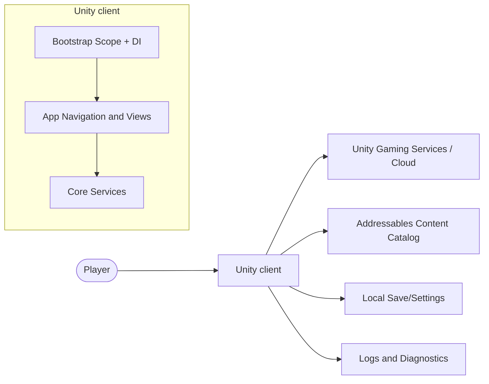
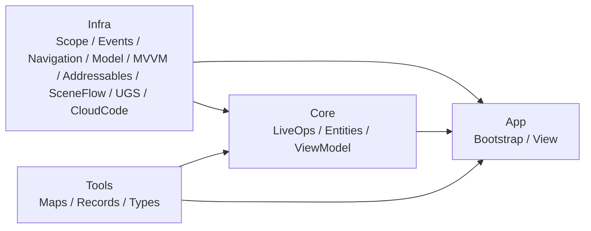
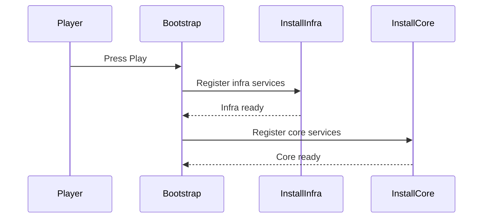

# Architecture

This document is the architecture entrypoint for this Unity repository. It describes the current module boundaries, runtime flow, and verification loop used to keep architecture rules enforceable.

## TL;DR

- The host project is a modular Unity tree with explicit assembly boundaries: first-party modules live under `Assets/Packages/com.scaffold.*/` (UPM-style folders with `package.json`) and compile as project assets in the holder.
- The **`Core/`** script folder groups shared gameplay foundations; it is **not** a guarantee that every assembly under it is Unity-free. Some Core assemblies use `UnityEngine` on purpose (for example **`Scaffold.Entities`**: ScriptableObjects, `MonoBehaviour` health and lifecycle hooks). Other modules may set `noEngineReferences: true` in `.asmdef` when they are intentionally engine-agnostic.
- UI and app-specific presentation stay in App/Infra; keep cross-module dependencies explicit and avoid leaking view concerns into unrelated modules.
- Architecture enforcement is layered: docs standards, `.asmdef` dependency boundaries, and custom Roslyn analyzers.
- Startup composition in this tree is intentionally minimal: **asset preload → infra (events, navigation, UGS, cloud code, scene flow) → core (LiveOps)**. Add layers only when you introduce matching modules.
- Current state reflects the repository.

## Architectural Drivers

- Keep module boundaries explicit and mechanically enforceable.
- Prefer plain C# and narrow surfaces where it helps.
- Keep startup predictable and diagnosable with deterministic scope initialization.
- Make quality checks repeatable through repository scripts and analyzer diagnostics.

## Project Summary

This repository is a modular Unity project with architecture controls enforced through:

- A written record of what was trimmed from the upstream game project: [`Docs/REFERENCE_DECISIONS.md`](Docs/REFERENCE_DECISIONS.md).
- Documentation standards under `Docs/Standards/` (when present).
- Explicit assembly boundaries under `Assets/Packages/com.scaffold.*/**/*.asmdef` (and any remaining roots you add under `Assets/`).
- Custom Roslyn analyzers under `Analyzers/Scaffold/Scaffold.Analyzers`.
- Repository validation scripts under `.agents/scripts/`.

## Constraints and Invariants

- **Core packages** (for example `com.scaffold.entities`) are not “Unity-free by definition.” Whether an assembly references `UnityEngine` is determined per `.asmdef` (for example `Scaffold.Entities` uses the engine; some other assemblies use `noEngineReferences: true` where they stay agnostic).
- MonoBehaviour usage is allowed in Core when the module owns engine-facing gameplay building blocks (again, `Scaffold.Entities` is the canonical example). Prefer keeping UI-specific MonoBehaviours in App/Infra presentation layers.
- All cross-module dependencies must be declared in `.asmdef` files; no hidden references.
- Bootstrap/composition root owns concrete wiring; runtime modules consume contracts/interfaces.

## Tech Stack

- Engine: Unity `6000.3.x` (see `ProjectSettings/ProjectVersion.txt` for the active editor version).
- Language: C#
- Architecture: MVVM
- Dependency Injection: VContainer (`jp.hadashikick.vcontainer`)
- Rendering: Universal Render Pipeline (URP)
- Core Packages: Addressables, AI Navigation, Cinemachine, TextMeshPro, Unity Test Framework, Scaffold Schemas (`com.scaffold.schemas` in `Assets/Packages/com.scaffold.schemas/`)
- Code Quality: Roslyn analyzers (`Analyzers/Scaffold/Scaffold.Analyzers`)

## System Context

Intent: show how external actors/systems interact with this Unity client at runtime.

Source of truth: your bootstrap scene and composition wiring under `Assets/Packages/com.scaffold.bootstrap/` (no fixed scene path is documented here).

Update trigger: changes to startup sequence, external service integrations, or root scene flow.

System context diagram:

## Container/Module View

Intent: show static module groups in **this** repository.

Source of truth: `Assets/Packages/com.scaffold.*/**/*.asmdef`, and the Unity-generated solution (`.sln`) at the repository root when present (name follows the project folder; often gitignored alongside `*.csproj`).

Update trigger: add/rename/remove assemblies or change `.asmdef` references.

Container/module dependency diagram (trimmed extract):

Current module documentation map (see `Docs/`):

- `Docs/App/Bootstrap.md`, `Docs/App/View.md`
- `Docs/Core/ViewModel.md`, `Docs/Core/LiveOps.md`, `Docs/Core/Entities.md`
- `Docs/Infra/Addressables.md`, `Docs/Infra/MVVM.md`, `Docs/Infra/Events.md`, `Docs/Infra/Model.md`, `Docs/Infra/Navigation.md`, `Docs/Infra/Scope.md`, `Docs/Infra/SceneFlow.md`
- `Docs/Tools/Maps.md`, `Docs/Tools/Records.md`, `Docs/Tools/Types.md`
- `Docs/ConsumingScaffoldPackages.md` (UPM consumer `manifest.json` patterns for Git subpath and `file:`)
- `Docs/Analyzers/Analyzers.md`, `Docs/Testing/Testing.md`, `Docs/AutomatedTesting.md`

## Runtime Flows

Intent: describe bootstrap startup in this tree.

Update trigger: any change to startup ordering or navigation.

Startup sequence (current wiring):

## Dependency Rules

Allowed:

- Explicit `.asmdef` references between modules.
- Domain and gameplay logic in Core modules, with or without `UnityEngine` per assembly choice.
- Framework dependencies (`VContainer`, navigation/event adapters) in infra/bootstrap modules.

Forbidden:

- Hidden dependencies that bypass declared assembly references.
- Putting App/UI or scene-specific presentation concerns into modules that are not meant to own them (keep boundaries intentional).
- Direct production runtime coupling to analyzer implementation projects.

## Quality Attributes and Tradeoffs

- Modularity over convenience:
  - Pros: safer edits, stronger boundaries, analyzable dependency graph.
  - Tradeoff: more interfaces/contracts and composition wiring.
- Deterministic startup over implicit registration:
  - Pros: predictable initialization and easier fault isolation.
  - Tradeoff: phase ordering must be maintained intentionally.
- Clear module ownership over ad-hoc coupling:
  - Pros: testable contracts and predictable dependencies.
  - Tradeoff: adapter layers and explicit `.asmdef` edges when mixing engine and non-engine code.
- Scripted validation over ad-hoc checks:
  - Pros: repeatable quality gate for contributors and agents.
  - Tradeoff: longer feedback loop than compile-only checks.

## Verification

Run from repository root. For **how** scripts invoke Unity and `dotnet` safely when the repo path contains spaces (Windows PowerShell 5.x), see `Docs/Testing/Testing.md` → "Implementation notes".

- Full gate (optional: skip automated Unity tests with `-SkipTests`):
  - `powershell -NoProfile -ExecutionPolicy Bypass -File ".\.agents\scripts\validate-changes.ps1" -SkipTests`
  - or `& ".\.agents\scripts\validate-changes.cmd" -SkipTests`
- Analyzer diagnostics:
  - `powershell -NoProfile -ExecutionPolicy Bypass -File ".\.agents\scripts\check-analyzers.ps1"`
- EditMode tests (when you add tests again):
  - `powershell -NoProfile -ExecutionPolicy Bypass -File ".\.agents\scripts\run-editmode-tests.ps1"`
- PlayMode tests (when you add tests again):
  - `powershell -NoProfile -ExecutionPolicy Bypass -File ".\.agents\scripts\run-playmode-tests.ps1"`

Architecture controls and policy files:

- Analyzer source: `Analyzers/Scaffold/Scaffold.Analyzers` (`Rules/CategoryNN-*/` per disposition, `Support/` for shared config)
- Analyzer tests: `Analyzers/Scaffold/Scaffold.Analyzers.Tests` (SCA); MVVM analyzer tests: `Generators/Scaffold.Mvvm.Analyzers.Tests`
- Analyzer output: `Analyzers/Output/Scaffold.Analyzers.dll` (and `Scaffold.Mvvm.Analyzers.dll` from `Generators/Scaffold.Mvvm.Analyzers`)
- Assembly boundaries: `Assets/Packages/com.scaffold.*/**/*.asmdef` (first-party packages in the holder)
- Operational docs: `AGENTS.md`, `PLANS.md`, `MILESTONE.md`

## Operational policy

- Primary agent operating policy: `AGENTS.md`.
- ExecPlan authoring/execution policy: `PLANS.md`.
- Milestone plan policy: `MILESTONE.md`.
- Quality gate: `validate-changes.ps1` (use `-SkipTests` while Unity Edit/PlayMode tests are not maintained).
- Analyzer diagnostics workflow: `.agents/workflows/check-analyzers.md`.
- Module creation workflow: `.agents/workflows/create-module.md`.
- Custom analyzer workflow: `.agents/workflows/create-custom-analyzer.md`.

## Change Log

- First-party modules moved to UPM-style roots under `Assets/Packages/com.scaffold.*/` (holder compiles them as assets; see `Docs/ConsumingScaffoldPackages.md`).
- Documented that Core script folders may include Unity-engine references (notably `Scaffold.Entities`); removed the outdated invariant that all Core/domain assemblies must be Unity-free.
- Reorganized the document to match architecture documentation standard; added system context, module dependency, startup/battle/runtime state diagrams, invariants, and quality-tradeoff sections.
- Synced docs map with current module docs and aligned startup/runtime language with research flow documents.
- Trimmed extract: removed references to external research documents, specific scene asset paths, and battle/main-menu flows not present in this repository; documented minimal bootstrap layering.
