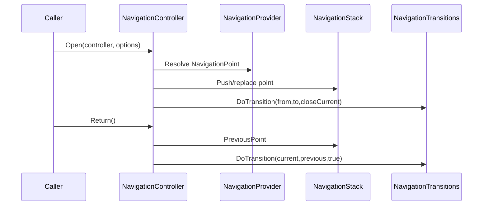

# com.scaffold.navigation

# Scaffold Infra Navigation

## TL;DR

- Purpose: manage view-controller navigation stack and transitions.
- Location: `Assets/Packages/com.scaffold.navigation/Runtime/` (boundary types under `Runtime/Contracts/`).
- Depends on: `Scaffold.AppFlow` (container: `ILayerResolver` for view-model injection), `Scaffold.Events`, `Scaffold.Types`, `Scaffold.Records`, `Scaffold.Addressables`, container abstractions.
- Used by: app screens and MVVM presentation flow.
- Runtime/Editor: runtime, optional `ViewConfig` inspector (`Scaffold.Navigation.Editor`), and container integration.
- Keywords: navigation stack, transitions, view config, middleware.

## Responsibilities

- Owns navigation contract (`INavigation`) and runtime implementation (`NavigationController`).
- Owns view-controller stack behavior (`NavigationStack`, `NavigationPoint`).
- Owns transition orchestration (`NavigationTransitions` and schemas).
- Owns DI integration (`NavigationInstaller`, `NavigationInjection`).
- Provides `Providers.NavigationAssetProvider` for Addressables preload of `NavigationSettings` during startup (see [Docs/App/AppStartup.md](../../../Docs/App/AppStartup.md)).
- Owns non-context view materialization: Addressables (via `IAddressablesGateway`, resident handle buffering) or a **direct prefab** on `ViewConfig` (no Addressables load for that path), plus addressable handle lifecycle.
- Does not own app-specific business decisions or domain mutation logic.

## Public API

| Symbol | Purpose | Inputs | Outputs | Failure behavior |
|---|---|---|---|---|
| `INavigation.Open(...)` | Open target controller/view | controller + `NavigationOptions` (see `NavigationStackPolicy`) | active navigation point | invalid config/path is ignored or guarded by provider checks |
| `INavigation.PrepareDependencies(...)` | Run the same dependency injection pass as root opens | child `IViewController` | n/a | uses `IViewControllerDependencyInjector` (default: `NavigationInjection` registered with the installer) |
| `NavigationStackPolicy` | Declarative stack mutation (`Push`, `ReplaceCurrent`, `ClearBelowCurrentAndPush`, `ClearAllAndPush`) | `NavigationOptions.StackPolicy` | stack updates before transition | legacy `CloseAllViews` still honored when policy is `Push` |
| `INavigation.Close(...)` | Close a controller/view | controller | removed point or return transition | no-op when point not found |
| `INavigation.Return()` | Return to previous point | none | previous controller | guarded behavior when no previous point |
| `IViewController` | Controller lifecycle contract | `Bind(INavigation)` etc. | bound controller behavior | n/a |
| `IView` | View lifecycle contract | bind/open/hide/focus/close/order | runtime view behavior | state-specific operations may no-op |
| `NavigationInstaller` | Registers navigation services; optional `NavigationSettings` ctor param calls `RegisterInstance` when non-null | `Transform` view holder + optional `NavigationSettings` | navigation runtime wiring | fails when required contracts are unavailable |
| `ViewConfig` | `ViewAssetSource` (`Addressables` or `DirectPrefab`); in Addressables mode, `ViewConfig.Asset` loads the prefab; in Direct mode, a project `GameObject` prefab reference is used | mode + `Asset` or `DirectPrefab` | view prefab for non-context | invalid/missing ref fails at open time |

## Setup / Integration

1. Reference `Scaffold.Navigation` for contracts and implementation/container wiring.
2. Configure `NavigationSettings` with controller/view mappings and one `ViewConfig` asset per screen (or equivalent list); for each, set `View asset source` to Addressables and assign an addressable, or to Direct and assign a prefab that implements `IView`.
3. Register `NavigationInstaller` in composition root: `new NavigationInstaller(viewHolder)` or `new NavigationInstaller(viewHolder, navigationSettings)` when you already hold a `NavigationSettings` instance; otherwise register settings through your publisher/parent scope and use the single-argument ctor.
4. Open controllers through `INavigation`.

## How to Use

1. Implement controller type (`IViewController` or MVVM `ViewModel` descendant).
2. Implement view type (`IView` or MVVM view base).
3. Add `ViewConfig` mapping for controller/view and set Addressables or Direct prefab as in step 2.
4. Open/close/return with `INavigation`.

## Behavior Contracts

| Operation | Stack behavior | Transition behavior |
|---|---|---|
| `Open(controller, closeCurrent:false)` or `options.StackPolicy = Push` | current remains; new point appended and becomes current | previous point is typically hidden, then target opens/focuses |
| `Open(controller, closeCurrent:true)` or `options.StackPolicy = ReplaceCurrent` | current removed before/while activating target | close sequence runs before target open |
| `options.StackPolicy = ClearBelowCurrentAndPush` | clears stacked points below the current top, then pushes | close sweep for back stack, then target open |
| `options.StackPolicy = ClearAllAndPush` | clears below current and removes current, then pushes | full close sweep, then target open |
| `Open(..., options.CloseAllViews=true)` (legacy, when `StackPolicy` is `Push`) | same as clear-below | target activation occurs after close sweep |
| `Close(current)` | equivalent to return to previous point | transition goes from current to previous |
| `Close(non-current)` | target point removed in place; current unchanged | close applies to removed point only |
| `Return()` | target is previous point; current removed | `GoTo(previous, closeCurrent:true, ...)` semantics |

- `NavigationTransitions.DoTransition(from, to, closeCurrent)` enqueues transitions and executes them serially.
- Default ordering is: close or hide `from` first, then open/focus `to`.
- `ViewConfig` resolution uses `NavigationSettings` mapping and may reuse context views under `viewHolder` before non-context view instantiation.
- Non-context Addressables flow treats loaded addressable as prefab source, not persistent instance. Direct-prefab flow instantiates the assigned `GameObject` under the view holder (no `IAddressablesGateway` call for that config).
- Prefab handles are loaded once per config and kept resident for navigation lifetime flow.
- Closed non-context view instances are returned to an internal instance buffer/cache and reused on next open when available.
- Transition processing waits for target point readiness before open/focus sequences run.
- Schema handlers:
- `TransitionViewSchema.Handler=Default` uses built-in close/hide/open flow.
- `TransitionViewSchema.Handler=Code` calls `IViewTransitionHandler.DoTransition(...)`.
- `AnimationViewSchema.Handler=Animator` plays configured state and waits for completion.
- `AnimationViewSchema.Handler=Code` calls `IViewAnimationHandler.AnimateView(...)`.

## Examples

### Open/Return Flow



### Minimal

```csharp
INavigation navigation = resolver.Resolve<INavigation>();
navigation.Open(new MainMenuViewController());
navigation.Return();
```

## Best Practices

- Keep navigation decisions in controllers/app orchestration.
- Prefer `NavigationOptions.StackPolicy` for stack intent; use `Scaffold.Navigation.Utility.NavigationExtensions` (`OpenReplace`, `OpenClearBelowAndPush`, `OpenClearAllAndPush`) for common cases. Legacy `CloseAllViews` on `NavigationOptions` still works when `StackPolicy` is `Push`.
- Use `INavigation.PrepareDependencies` (or `BindChildViewModel` on `ViewModel`) so child view-models receive the same injection pass as root controllers.
- Keep `ViewConfig` mappings complete and validated.
- Keep middleware focused on cross-cutting open behavior.

## Anti-Patterns

- Instantiating and toggling views directly outside navigation.
- Putting preload policy in navigation/container wiring.
- Treating loaded prefab handle as live UI instance state.
- Hiding navigation side effects in unrelated service layers.
- Mixing domain business rules into transition handlers.

## Testing

- Test assembly: `Scaffold.Navigation.Tests`.
- Run from repo root:

```powershell
& ".\.agents\scripts\run-editmode-tests.ps1" -AssemblyNames "Scaffold.Navigation.Tests"
```

- Expected: all tests pass with zero failures.
- Addressable path coverage: tests verify context path no-load behavior, delayed readiness handling, and non-context view instance reuse from buffer/cache.
- Bugfix rule: add/update regression test first, verify fail-before/fix/pass-after.

## AI Agent Context

- Invariants:
  - stack order and current/previous semantics are preserved.
  - transitions maintain close/hide/open ordering.
  - controller-to-view mapping resolves through `ViewConfig`.
- Allowed Dependencies:
  - `Scaffold.Events`, `Scaffold.Types`, `Scaffold.Records`, `Scaffold.Addressables`, container abstractions.
- Forbidden Dependencies:
  - module-specific gameplay logic in navigation runtime.
- Change Checklist:
  - verify open/close/return tests.
  - verify options behavior tests.
  - verify transition event behavior.
- Known Tricky Areas:
  - legacy `closeCurrent` + `CloseAllViews` vs explicit `NavigationStackPolicy` (non-`Push` policy overrides the `closeCurrent` parameter for stack mutation).

## Related

- `../../../Architecture.md`
- `../com.scaffold.model/README.md`
- `../com.scaffold.viewmodel/README.md`
- `../com.scaffold.view/README.md`
- `../com.scaffold.events/README.md`

## Changelog

- Rewritten to AI-first standard with navigation sequence diagram.
- Recovered stack semantics and transition/schema execution contracts.

- Added constructor null-guard coverage and single-point `Return()` behavior verification.
- Consolidated `Scaffold.Navigation.Contracts` + `Scaffold.Navigation.Runtime` into `Scaffold.Navigation` and moved boundary types to `Runtime/Contracts/`.
- Migrated non-context view loading to `IAddressablesGateway`, added preload registration in installer, and documented handle-release lifecycle.
- Refactored to remove navigation-owned preload registration, added resident prefab store + instance buffer/cache, and documented readiness-aware transition flow with unchanged `INavigation` API.
- Added `NavigationStackPolicy`, `INavigation.PrepareDependencies`, `IViewControllerDependencyInjector`, and stack-resolution tests (`NavigationStackResolverTests`).
- `NavigationInstaller(Transform, NavigationSettings settings = null)` optionally registers settings; `NavigationInjection` implements `IViewControllerDependencyInjector` so hosts do not register a separate no-op injector.
