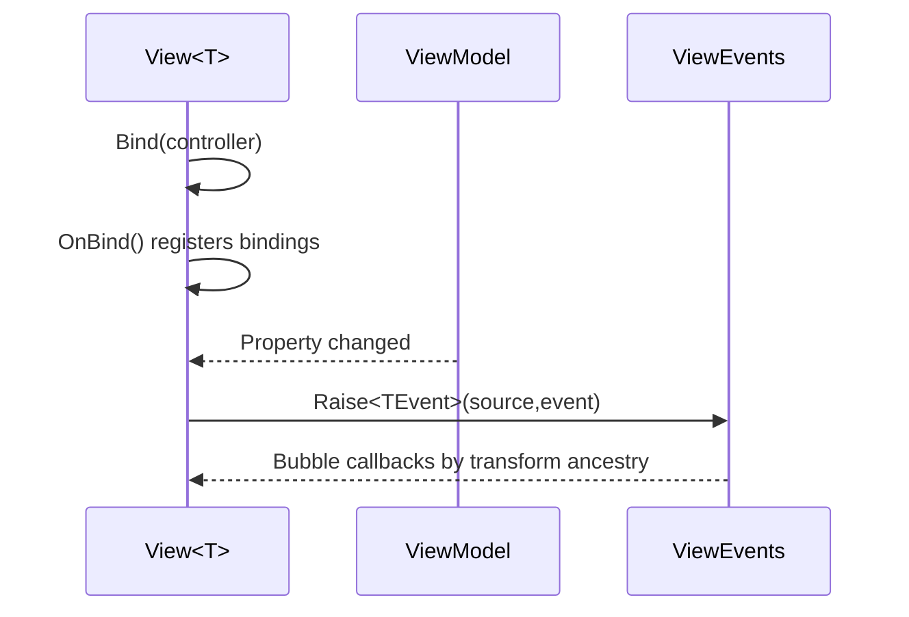

# com.scaffold.view

# Scaffold.MVVM.View

## TL;DR

- Purpose: Unity-facing MVVM view layer for typed view binding and view-event routing.
- Location: `Assets/Packages/com.scaffold.view/`.
- Depends on: `Scaffold.MVVM.ViewModel`, `Scaffold.MVVM`, `Scaffold.Navigation`, `Scaffold.Types`.
- Used by: app presentation modules and screen implementations.
- Runtime/Editor: runtime + samples + EditMode tests.

## Responsibilities

- Owns Unity-facing view contracts and base classes (`IView`, `View<T>`, `ViewElement`, `UIView<T>`, `ViewComponent<T>`).
- Owns view event routing (`ViewEvent`, `ViewEvents`, `EventLedger<T>` and options).
- Owns typed view/viewmodel pairing and bind-time lifecycle entry in views.
- Does not own domain rules or navigation stack internals.

## Public API

| Symbol | Purpose | Inputs | Outputs | Failure behavior |
|---|---|---|---|---|
| `IView` | View lifecycle contract | bind/open/hide/focus/close/order calls | consistent view behavior | repeated lifecycle calls may no-op |
| `View<T>` / `ViewElement<T>` | Typed MVVM view bases | viewmodel/controller bind events | binding registration and lifecycle handling | mismatched controller type can throw |
| `UIView<T>` / `ViewComponent<T>` | Unity component-oriented helper bases | Unity lifecycle + typed controller | structured view composition | misuse can bypass expected bind flow |
| `ViewEvents` | Static typed event bus by transform hierarchy | `Raise<TEvent>()`, register/unregister | bubbled callbacks by event type/tree | no listeners is safe no-op |
| `EventLedger<T>` + options | Per-type routing/dispatch behavior | listeners + `Raise` | callback invocation pipeline | callback exceptions follow active exception mode |

## Setup / Integration

1. Add reference to `Scaffold.MVVM.View` in view assemblies.
2. Inherit view implementations from typed base classes (`View<T>` or `ViewElement<T>`).
3. Register bindings in `OnBind()` and rely on framework bind lifecycle.
4. Raise/listen to typed `ViewEvent` when component-level bubbling is required.

Common setup mistakes:
- Binding against the wrong viewmodel type.
- Manually wiring property notification instead of bind APIs.

Fast checks:
- View tests should pass for bind safety, typed pairing, and event bubbling behavior.

## How to Use

1. Implement typed views and bind UI targets in `OnBind()`.
2. Let view lifecycle methods handle bind/reset flow.
3. Use `ViewEvents.Raise<TEvent>(...)` for local tree-scoped UI events.
4. Configure event ledger exception mode only when behavior differs from default reporting mode.

## Examples

### Minimal

```csharp
public sealed class InventoryView : View<InventoryViewModel>
{
    protected override void OnBind()
    {
        Bind(() => viewModel.Value, value => valueLabel.text = value.ToString());
    }
}
```

### Realistic



### Guard / Error path

```csharp
// Type mismatch should fail fast to protect view/controller contracts.
view.Bind(new DifferentViewModel());
```

## Best Practices

- Keep UI mapping and rendering logic in views; keep business rules elsewhere.
- Use typed view/viewmodel pairs to prevent runtime ambiguity.
- Keep bind expressions concise and explicit.
- Keep event payload types specific and domain-meaningful.
- Preserve default event exception handling unless a flow needs stricter behavior.

## Anti-Patterns

- Updating UI through ad-hoc manual notification wiring in MVVM descendants.
- Embedding game/domain mutation rules directly in view components.
- Using generic/untyped view events that hide intent.

## Testing

- Test assembly: `Scaffold.MVVM.View.Tests`.
- Run:

```powershell
& ".\.agents\scripts\run-editmode-tests.ps1" -AssemblyNames "Scaffold.MVVM.View.Tests"
```

- Expected: all tests pass, zero failures.
- Bugfix rule: add/update regression test first, verify fail-before/fix/pass-after.

## AI Agent Context

- Invariants:
  - typed view/viewmodel pairing must remain enforced.
  - bind lifecycle clears stale view bindings on rebind.
  - `ViewEvents` bubbling is type-specific and transform-ancestry based.
- Allowed Dependencies:
  - `Scaffold.MVVM.ViewModel`, `Scaffold.MVVM.Model`, `Scaffold.Navigation`, `Scaffold.Types`.
- Forbidden Dependencies:
  - feature-specific app/domain business rules in view runtime base classes.
- Change Checklist:
  - verify `Scaffold.MVVM.View.Tests` passes.
  - verify view bind lifecycle and mismatch-guard tests.
  - verify event bubbling and exception-mode behavior.
- Known Tricky Areas:
  - partial unbind/disposal behavior during rapid view lifecycle transitions.
  - event callback exception policy (`ReportAndContinue` vs `ThrowAfterDispatch`).

## Related

- `../../../Architecture.md`
- `../com.scaffold.model/README.md`
- `../com.scaffold.viewmodel/README.md`
- `../com.scaffold.navigation/README.md`
- `../com.scaffold.events/README.md`

## Changelog

- Added split module file.
- Reorganized from legacy combined MVVM doc and expanded to module standard.

- Added targeted event-ledger negative-path coverage for null transform registration input.
- Consolidated `Scaffold.MVVM.View.Contracts` into `Scaffold.MVVM.View` and moved boundary types to `Runtime/Contracts/`.
