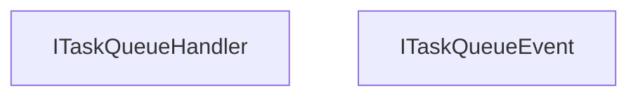

<!-- hash: 7d9f0d6b49fb8e5e32b5b132e0fb7559 -->
# Abstraction Documentation

This document details the purpose and relations of the components in `/Runtime/Abstraction`.

## Component Overview

### `ITaskQueueHandler` (interface)
- **Description**: Defines the execution and management contract for a queue of awaitable tasks. The main goal is to provide controls for registering, pausing, and awaiting batched asynchronous operations. It is used by service managers that orchestrate operations, ensuring tasks are processed serially or reliably.
- **Namespace**: `Scaffold.AwaitableQueue`

### `ITaskQueueEvent` (interface)
- **Description**: Represents an awaitable event that supports subscribing and unsubscribing asynchronous callbacks. The main goal is to standardize the event signature for multi-subscriber task queues. It is used across modules to handle decoupled event broadcasting where listeners perform asynchronous work.
- **Namespace**: `Scaffold.AwaitableQueue`

## Dependency & Behavior Schema

[Back to Parent](../RuntimeRead.md)
