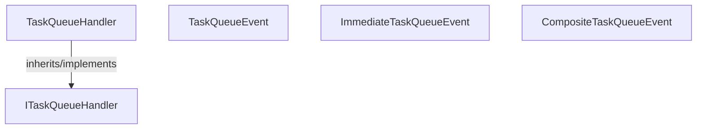

<!-- hash: 2b5347194c57d1fda02beef53bf4e8a5 -->
# Runtime Documentation

This document details the purpose and relations of the components in `/Runtime`.

## Sub-Modules

- [Abstraction](Abstraction/AbstractionRead.md)

## Component Overview

### `TaskQueueHandler` (class)
- **Description**: Executes registered awaitable tasks back-to-back safely. The main goal is to maintain internal lists of tasks and history and play them sequentially, pausing if required. It is used natively locally and remotely whenever data consistency across steps is structurally required.
- **Namespace**: `Scaffold.AwaitableQueue`
- **Inherits/Implements**: `ITaskQueueHandler`
- **Properties**: `HasHistory`, `IsExecuting`
- **Methods**: `ClearTasks`, `RegisterTask`, `Resume`, `RegisterTasks`, `Pause`

### `TaskQueueEvent` (class)
- **Description**: Implements an event handler that registers subscriber actions onto a managed queue handler. The main goal is to ensure all event reactions are pipelined sequentially without causing race conditions. It is used closely with the TaskQueueHandler to handle heavy event payloads systematically.
- **Namespace**: `Scaffold.AwaitableQueue`
- **Methods**: `Subscribe`, `Invoke`, `Unsubscribe`

### `ImmediateTaskQueueEvent` (class)
- **Description**: Implements an event handler that triggers asynchronous subscriber actions instantly without queueing. The main goal is to loop over subscribers and begin their execution routines in-place on the same frame. It is used for real-time reactivity when event delivery has a higher priority than orderly processing.
- **Namespace**: `Scaffold.AwaitableQueue`
- **Methods**: `Subscribe`, `Unsubscribe`

### `CompositeTaskQueueEvent` (class)
- **Description**: Combines immediate and queued event invocation behaviors into a single wrapper. The main goal is to allow subscribers to choose between receiving events immediately or enqueued securely. It is used natively by services like Cloud Code when broad response distribution needs flexible timing.
- **Namespace**: `Scaffold.AwaitableQueue`
- **Methods**: `Subscribe`, `Unsubscribe`

## Dependency & Behavior Schema

[Back to Parent](../AwaitableQueueRead.md)
