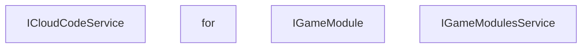

<!-- hash: 2a5f07006a917f305a994a482c594d5e -->
# Abstraction Documentation

This document details the purpose and relations of the components in `/Runtime/Abstraction`.

## Component Overview

### `ICloudCodeService` (interface)
- **Description**: Represents the core contract for interacting with remote Cloud Code execution. The main goal is to provide a unified API capable of submitting requests, managing retries, and broadcasting responses. It is used by game modules and services whenever they need to communicate with backend logic dynamically.
- **Namespace**: `Scaffold.CloudModules`
- **Properties**: `RequestError`, `OnResponseReceived`

### `for` (class)
- **Description**: No description provided.
- **Namespace**: `Scaffold.CloudModules`
- **Properties**: `Data`, `DataModule`
- **Methods**: `UpdateData`, `OnUpdateData`, `OnInitialize`

### `IGameModule` (interface)
- **Description**: Defines the baseline behavior for a generic game module in the application. The main goal is to enforce an initialization and data update structure for isolated systems. It is used by the GameModulesService to manage module lifecycles in an agnostic way.
- **Namespace**: `Scaffold.CloudModules`
- **Properties**: `DataModule`
- **Methods**: `UpdateData`, `Initialize`

### `IGameModulesService` (interface)
- **Description**: Serves as the service contract for initializing and orchestrating all game modules. The main goal is to abstract the centralized loading and orchestration of multi-module setups. It is used during the game bootstrap phase to prepare necessary logical modules sequentially or in parallel.
- **Namespace**: `Scaffold.CloudModules`
- **Methods**: `FetchModuleData`, `InitializeModules`

## Dependency & Behavior Schema

[Back to Parent](../RuntimeRead.md)
