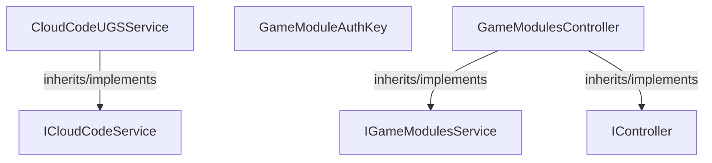

<!-- hash: e281d180c66a93248853ceb1bd5005f8 -->
# CloudCode Documentation

This document details the purpose and relations of the components in `/Runtime/Implementation/CloudCode`.

## Component Overview

### `CloudCodeUGSService` (class)
- **Description**: An implementation of the Cloud Code service bridging the Unity Gaming Services (UGS) backend. The main goal is to securely route endpoint requests across the network, applying intelligent retries upon failures. It is used by client modules to dispatch payloads and wait for remote computations and responses.
- **Namespace**: `Scaffold.CloudModules`
- **Inherits/Implements**: `ICloudCodeService`
- **Properties**: `RequestError`, `OnResponseReceived`
- **Methods**: `IsRetryableError`

### `GameModuleAuthKey` (class)
- **Description**: Stores the authentication keys required to bypass or validate module interactions. The main goal is to hold static references to access identifiers used by backend services. It is used during the network handshake or API queries to assert the client's authority.
- **Namespace**: `Scaffold.CloudModules`

### `GameModulesController` (class)
- **Description**: Controls the lifecycle and initialization of all registered game modules using Cloud Code requests. The main goal is to orchestrate the backend fetching and localized data injection for each system. It is used primarily by the application's root controller to initialize systems sequentially.
- **Namespace**: `Scaffold.CloudModules`
- **Inherits/Implements**: `IGameModulesService`, `IController`
- **Properties**: `GameData`, `Modules`, `CloudCodeService`
- **Methods**: `Dispose`

## Dependency & Behavior Schema

[Back to Parent](../ImplementationRead.md)
