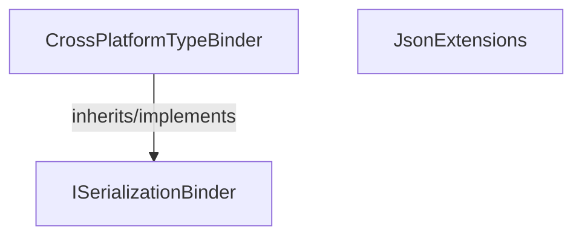

<!-- hash: d57738952b1a2d47bab531e4a906ac1f -->
# Json Documentation

This document details the purpose and relations of the components in `/Runtime/Implementation/Core/Json`.

## Component Overview

### `CrossPlatformTypeBinder` (class)
- **Description**: Client-Side Binder for Newtonsoft JSON Deserialization/Serialization. The main goal is to convert assembly types between Backend (mscorlib) and Unity (CoreLib). It is used by the JSON serializer whenever types are shared across the client/server boundary to ensure smooth parsing.
- **Namespace**: `Scaffold.CloudModules`
- **Inherits/Implements**: `ISerializationBinder`
- **Methods**: `BindToName`, `BindToType`

### `JsonExtensions` (class)
- **Description**: Provides extension methods for JSON serialization and deserialization. The main goal is to securely try to parse arbitrary strings into JSON using cross-platform capabilities. It is used heavily by the Cloud Code Service when passing messages and structured data payloads.
- **Namespace**: `Scaffold.CloudModules`
- **Methods**: `ToSimpleJson`, `ToJson`

## Dependency & Behavior Schema

[Back to Parent](../CoreRead.md)
