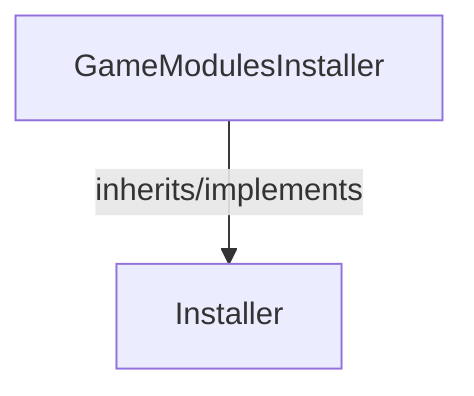

<!-- hash: 06ec01e7477cdaaa0f5f530873cfc60d -->
# Installer Documentation

This document details the purpose and relations of the components in `/Runtime/Installer`.

## Component Overview

### `GameModulesInstaller` (class)
- **Description**: Handles the dependency injection bindings for the Cloud Module layer. The main goal is to register services like the CloudCodeService and GameModulesController. It is used by the application's composition root during bootstrap to instantiate and connect backend components.
- **Namespace**: `Scaffold.CloudModules`
- **Inherits/Implements**: `Installer`
- **Methods**: `Install`

## Dependency & Behavior Schema

[Back to Parent](../RuntimeRead.md)
