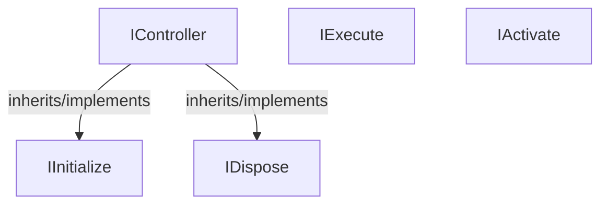

<!-- hash: 4e4749c415b0ce0b77625f9ed1105c58 -->
# Runtime Documentation

This document details the purpose and relations of the components in `/Runtime`.

## Component Overview

### `IController` (interface)
- **Description**: Serves as the base contract for system controllers that require both initialization and disposal capabilities. The main goal is to unify the <see cref="IInitialize"/> and <see cref="IDispose"/> interfaces into a single controller type. It is used primarily by modules that need structured instantiation and cleanup processes managed by the game loop.
- **Namespace**: `Scaffold.LifeCycle`
- **Inherits/Implements**: `IInitialize`, `IDispose`

### `IExecute` (interface)
- **Description**: Represents the execution phase of a lifecycle component. The main goal is to provide an awaitable contract for running a system's core logic. It is used by the main game loop or task queues to periodically process operations within modules.
- **Namespace**: `Scaffold.LifeCycle`
- **Methods**: `Execute`

### `IInitialize` (interface)
- **Description**: Represents the initialization phase of a lifecycle component. The main goal is to provide an awaitable contract for setting up a module before it begins operating. It is used when bootstrapping game systems to ensure all asynchronous dependencies and preparations are complete.
- **Namespace**: `Scaffold.LifeCycle`
- **Methods**: `Initialize`

### `IDispose` (interface)
- **Description**: Represents the disposal phase of a lifecycle component. The main goal is to provide an awaitable contract for releasing resources or tearing down a module. It is used by game systems to ensure proper cleanup, preventing memory leaks and dangling references.
- **Namespace**: `Scaffold.LifeCycle`
- **Methods**: `Dispose`

### `IActivate` (interface)
- **Description**: Represents the activation phase of a lifecycle component. The main goal is to provide a standardized contract for enabling or activating a module. It is used across the architecture to ensure uniform activation logic for game systems.
- **Namespace**: `Scaffold.LifeCycle`

## Dependency & Behavior Schema

[Back to Parent](../LifeCycleRead.md)
