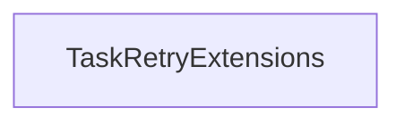

<!-- hash: 0abd222a6bcbba28bd5b9b56ac1ccea2 -->
# Runtime Documentation

This document details the purpose and relations of the components in `/Runtime`.

## Component Overview

### `TaskRetryExtensions` (class)
- **Description**: Provides extension methods for adding retry logic to Task and Task<T> delegates. The main goal is to convert standard functions into configurable RetryTaskBuilders easily. It is used across various asynchronous game systems, notably Cloud Code, to wrap volatile routines with resilient retries.
- **Namespace**: `Scaffold.AwaitableRetry`
- **Methods**: `OnRetry`, `WithCondition`, `Retry`, `WithDelay`

## Dependency & Behavior Schema

[Back to Parent](../AwaitableRetryRead.md)
