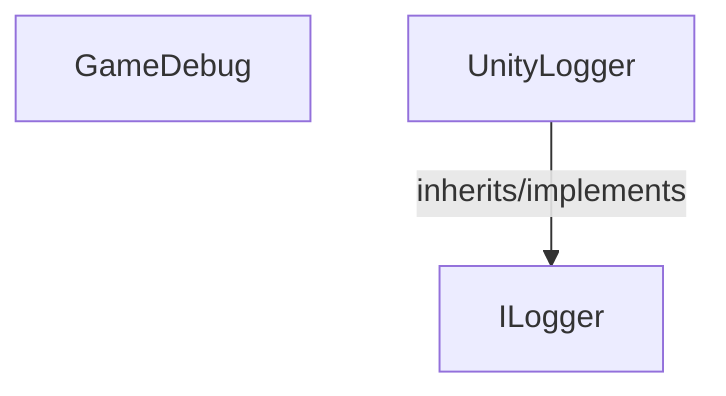

<!-- hash: b4510aff7bbfe96ce6b589ffe08c1e01 -->
# Runtime Documentation

This document details the purpose and relations of the components in `/Runtime`.

## Sub-Modules

- [Enum](Enum/EnumRead.md)

## Component Overview

### `ILogger` (interface)
- **Description**: Declares the contract for emitting diagnostic strings across varying environments. The main goal is to decouple the GameDebug facade from explicit endpoints like Unity Console. It is used strictly internally by the framework's logging subsystem to route traffic flexibly.
- **Namespace**: `Scaffold.Logging`

### `GameDebug` (class)
- **Description**: Central logging facade used across Client, Server and Shared code. Handles environment tagging, log levels and key/value-style context.
- **Namespace**: `Scaffold.Logging`
- **Properties**: `IsServer`
- **Methods**: `LogServerException`, `Log`, `LogClient`, `LogClientStarting`, `LogError`, `FormatKeys`, `LogInitialized`, `LogClientInitialized`, `Initialize`, `LogServerError`, `LogServerWarning`, `LogStarting`, `FormatMessage`, `AssertFail`, `LogException`, `LogClientWarning`, `LogServer`, `AssertThat`, `LogWarning`, `LogWithImplicitKey`, `FormatValue`, `LogClientError`

### `UnityLogger` (class)
- **Description**: Implements standard Unity Console integration for the agnostic debug interface. The main goal is to map custom internal levels appropriately into UnityEngine.Debug methodologies. It is used as the default sink out-of-the-box by the shared logging facade.
- **Namespace**: `Scaffold.Logging`
- **Inherits/Implements**: `ILogger`
- **Methods**: `Log`

## Dependency & Behavior Schema

[Back to Parent](../LoggingRead.md)
