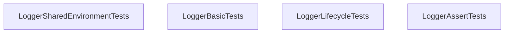

<!-- hash: 1131a4073c7596bf13499ccf1c3f436a -->
# Tests Documentation

This document details the purpose and relations of the components in `/Tests`.

## Component Overview

### `LoggerSharedEnvironmentTests` (class)
- **Description**: No description provided.
- **Namespace**: `Scaffold.Tests.Logging`
- **Methods**: `LogShared_WhenClient_UsesClientEnvironment`, `LogShared_WhenServer_UsesServerEnvironment`

### `LoggerBasicTests` (class)
- **Description**: No description provided.
- **Namespace**: `Scaffold.Tests.Logging`
- **Methods**: `LogClient_WithKeys_FormatsKeysCorrectly`, `LogClient_NullMessage_IsHandled`, `LogClient_BasicMessage_FormatsCorrectly`, `Setup`

### `LoggerLifecycleTests` (class)
- **Description**: No description provided.
- **Namespace**: `Scaffold.Tests.Logging`
- **Methods**: `LogClientStarting_AddsStartingKey`, `LogClientInitialized_OnlyImplicitKey`, `Setup`

### `LoggerAssertTests` (class)
- **Description**: No description provided.
- **Namespace**: `Scaffold.Tests.Logging`
- **Methods**: `AssertThat_WhenConditionFalse_ThrowsException`, `AssertThat_WhenConditionTrue_DoesNotThrow`, `Setup`

## Dependency & Behavior Schema

[Back to Parent](../LoggingRead.md)
