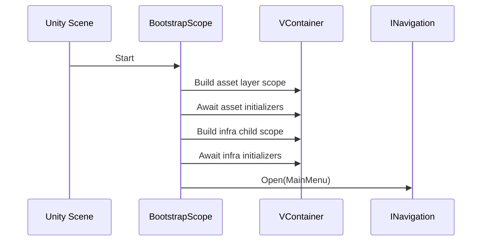

# Scaffold App Bootstrap

## TL;DR

- Purpose: compose runtime scopes and open the first app screen.
- Location: `Assets/Scripts/App/Bootstrap/Runtime/`.
- Depends on: `Scaffold.Navigation`, `Scaffold.Navigation.Container`, `Scaffold.Events.Container`, `Scaffold.Scope`, `Scaffold.MVVM.Model`, `Scaffold.MVVM.ViewModel`, `VContainer`, `Scaffold.Addressables.Container`.
- Used by: scene startup.

## Responsibilities

- Implements project-specific bootstrap policy on top of Infra `LayeredScope`.
- Builds a single root installer tree (`asset -> infra`) through `BuildLayerTree()`.
- Opens the first screen only after startup finishes.

## Public API

| Symbol | Purpose | Inputs | Outputs | Failure behavior |
|---|---|---|---|---|
| `BootstrapScope` | Runtime composition root for this project. | Serialized scene fields + installer tree. | Final initialized scope and first screen open. | Throws on missing serialized references or startup failures. |
| `LoadingView` | Optional standalone transition loading UI (Show/Hide/IsVisible/SetProgress). | Scene placement; not registered in DI. | Visibility state. | Callers orchestrate when to show; not coupled to SceneFlow. |

## Setup / Integration

1. Add `BootstrapScope` to the startup scene.
2. Assign `navigationSettings` and `viewHolder` in inspector.
3. Ensure required asmdef references remain present.
4. Press Play and confirm main menu opens after startup completes.

## How to Use

1. Keep `BootstrapScope` as the concrete `LayeredScope` implementation.
2. Build tree in `BuildLayerTree()` and keep it deterministic.
3. Open initial screen through `INavigation` from `OnBootstrapCompleted(...)`.

## Example Startup Flow



## Best Practices

- Keep reusable startup behavior in `Scaffold.Scope`.
- Keep project-specific composition in bootstrap installers.
- Keep startup deterministic and idempotent.
- Fail fast on missing serialized configuration.

## Testing

- Test assemblies:
  - `Scaffold.Bootstrap.Tests`
  - `Scaffold.Bootstrap.PlayModeTests`
- Run from repo root:

```powershell
& ".\.agents\scripts\run-editmode-tests.ps1" -AssemblyNames "Scaffold.Bootstrap.Tests"
& ".\.agents\scripts\run-playmode-tests.ps1" -AssemblyNames "Scaffold.Bootstrap.PlayModeTests"
```

## Related

- `Architecture.md`
- `Docs/Testing.md`
- `Docs/Infra/Scope.md`

## Changelog

- Added standalone `LoadingView` for caller-owned transition UI; infra installers use `LayerInstallerBase.Install(builder, IInstaller)`; removed default `Scaffold.SceneFlow` registration from `BootstrapInfraInstaller`.
- Migrated bootstrap composition to single-tree `LayerInstallerBase` flow and updated startup sequence documentation.
- Introduced asset-first startup layer (`BootstrapAssetInstaller`) before infra and documented Addressables preload availability for downstream scopes.
- Refactored Bootstrap to project-specific composition only; moved generic layered startup orchestration to `Scaffold.Scope`.
