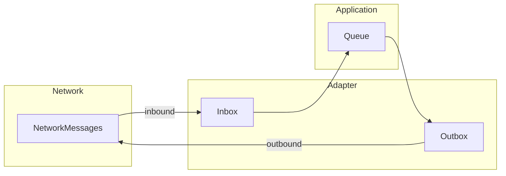
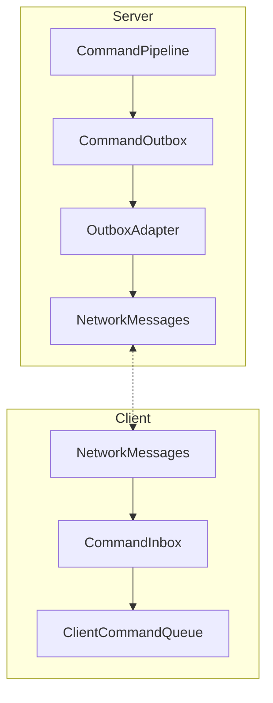
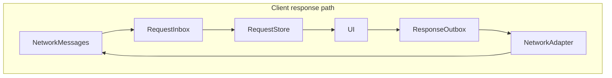

# Reactive Network & Queue Architecture

This document describes the recommended **reactive, decoupled** design for networked commands and responses: use two reactive pipes on both client and server so **Network** stays reactive and **Queue** stays pure (no transport knowledge). The Queue emits and consumes domain events or messages via interfaces; the network adapter subscribes to those interfaces and is the only component that knows about transport.

---

## 1. Overview and recommendation

Use two reactive pipes on both client and server so that **NetworkMessages** remains reactive (push-based) while the **Application/Queue** layer stays pure and transport-agnostic. The core rule: the Queue emits and consumes domain events or messages via interfaces; the network adapter subscribes to the outbound side and pushes inbound messages into the Queue’s inbox. Gameplay code never depends on the transport.

---

## 2. Two reactive pipes

- **Inbound pipe:** `NetworkMessages -> Inbox -> Application/Queue`
- **Outbound pipe:** `Application -> Outbox -> NetworkMessages`

If the Queue knew the Network, gameplay flow would become transport-coupled and harder to test or reuse. The preferred approach is for the Queue to expose domain-only interfaces (e.g. outbox as an observable or sink); the network adapter subscribes to the outbox and sends serialized messages, and pushes received bytes into the inbox, which the Queue consumes. The Queue has no reference to NetworkMessages.

---

## 3. Client-side responses (no handler-per-type)

Responses can be made reactive in the same way as commands, without a handler per message type:

1. The client receives a **DecisionRequest** (or equivalent) on the inbound stream.
2. **RequestStore** exposes something like `IObservable<ActiveRequest>`; the UI binds to it.
3. The user selects an option; a **DecisionResponse** (or equivalent) is written to **ResponseOutbox**.
4. The network adapter subscribes to ResponseOutbox and sends the serialized message.

No manual handler switch is required in gameplay code; the same reactive pattern used for commands applies to requests and responses.

---

## 4. Serialization: surrogates and generated registry

- **Domain type:** e.g. `PlayCardCommand` (behavior, `ExecuteAsync`, business logic).
- **Wire type:** generated, e.g. `PlayCardCommand.Serializable` or `PlayCardCommandNet`.

A generator produces:

- `ToSerializable()` / `FromSerializable()` (or equivalent mapping) between domain and wire types.
- A message type ID for each wire type.
- Registration in a **GeneratedMessageRegistry**.

**NetworkMessages** only deals with an **Envelope**: `{ TypeId, PayloadBytes/Struct, CorrelationId, Sequence }`. Decoding uses the registry to resolve TypeId to a concrete wire type and deserializer.

Result: domain command behavior stays local; the wire format is generated; there is no hand-written handler registration per command.

---

## 5. Concrete flow (server and client)

### Server

1. The command pipeline runs authoritative business logic.
2. After commit, the domain command is published to **CommandOutbox**.
3. The outbox adapter converts Command -> Command.Serializable.
4. The network sends it as something like `NetworkMessage<Command.Serializable>`.

### Client (commands)

1. The network receives an envelope and decodes it via the generated registry.
2. The decoded Command.Serializable is emitted to **CommandInbox**.
3. The inbox maps to the client command object (or directly to executor input).
4. **ClientCommandQueue** runs `await ExecuteAsync` (or equivalent) sequentially.

### Client (responses)

1. The network receives `DecisionRequest.Serializable` and feeds it into **RequestInbox**.
2. RequestStore is updated; the UI binds to it (e.g. `IObservable<ActiveRequest>`).
3. The user chooses an option; **DecisionResponse.Serializable** is written to **ResponseOutbox**.
4. The network adapter subscribes to ResponseOutbox and sends the message to the server.

---

## 6. Key separation rules

| Layer | Responsibility |
|-------|----------------|
| **NetworkMessages** | Transport, reliability, ordering only. |
| **Protocol (shared)** | Serializable DTO contracts only. |
| **Commands (domain/app)** | Behavior and queueing only. |
| **Bridge/Adapter** | Mapping between domain command and serializable contract. |

---

## 7. See also

- [BlackBoxSimulation.md](BlackBoxSimulation.md) — simulation/command separation and unidirectional flow.
- [.cursor/context/project-context.md](../../.cursor/context/project-context.md) and [.cursor/context/sampleturn-module.md](../../.cursor/context/sampleturn-module.md) — Store and orchestration context for gameplay modules.
- [Card Game Architecture Research.md](../Research/Card%20Game%20Architecture%20Research.md) — client/server and action-queue inspiration (e.g. MTG Arena GRE, Hearthstone PowerTaskList).
