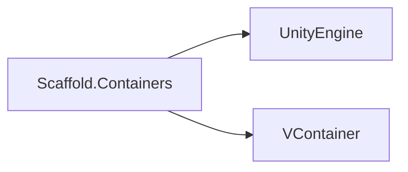
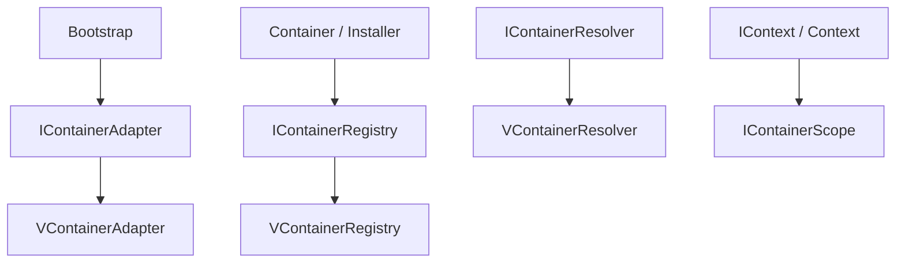

# Containers Module

## Summary

The Containers module defines Scaffold's dependency-injection boundary and lifecycle orchestration API. Its main effect is consistent object composition across modules: features can register services with explicit lifetimes, resolve dependencies through a stable abstraction, and build nested container contexts without binding application code directly to a specific DI library.

Internally, this module uses adapter implementations over VContainer so runtime code depends on Scaffold contracts while infrastructure remains swappable.

## Bird's Eye View

Module layout (`Assets/Scripts/Infra/Containers/`):

- `Runtime/Contracts/`: public DI abstractions (`IContainerRegistry`, `IContainerResolver`, `Container`, `Installer`, lifetimes, context APIs).
- `Runtime/Implementation/`: VContainer-backed adapter implementations (`VContainerRegistry`, `VContainerResolver`, scopes/builders).
- `Samples/`: usage examples for container/build/install flow (`ContainersUseCases.cs`).
- `Tests/`: EditMode tests validating override behavior and lifetime enum semantics (`ContainersTests.cs`).

External dependency graph:



Internal dependency graph:



## Architecture and key behaviors

### 1) Container composition entrypoint

`Container` is the extensibility base for graph composition; modules override `Build(...)` to register dependencies.

```csharp
public abstract class Container
{
    public virtual void Build(IContainerRegistry registry, Transform holder)
    {
    }
}
```

### 2) Installer composition contract

`Installer` enforces explicit install behavior through an abstract method.

```csharp
public abstract class Installer
{
    public abstract void Install(IContainerRegistry registry, Transform holder);
}
```

### 3) Registry abstraction with lifetime and factories

`IContainerRegistry` provides registration APIs for type, service-implementation pair, factory, entry point, and build callbacks.

```csharp
IRegistrationBuilder<T> Register<T>(ContainerLifetime lifetime);
IRegistrationBuilder<TService> Register<TService, TImpl>(ContainerLifetime lifetime)
    where TImpl : TService;
IRegistrationBuilder<T> Register<T>(Func<IContainerResolver, T> factory, ContainerLifetime lifetime);
```

### 4) Adapter-backed implementation over VContainer

`VContainerRegistry` converts Scaffold lifetimes and resolver abstractions into VContainer runtime behavior.

```csharp
private static Lifetime ToVContainerLifetime(ContainerLifetime lifetime)
{
    return lifetime switch
    {
        ContainerLifetime.Singleton => Lifetime.Singleton,
        ContainerLifetime.Scoped    => Lifetime.Scoped,
        ContainerLifetime.Transient => Lifetime.Transient,
        _                           => Lifetime.Transient
    };
}
```

## How to use

Use Containers through public contracts (`Container`, `Installer`, `IContainerRegistry`, `ContainerLifetime`) and register dependencies in `Build`/`Install`:

```csharp
private class AppContainer : Container
{
    public override void Build(IContainerRegistry registry, UnityEngine.Transform holder)
    {
        registry.Register<AppContainer>(ContainerLifetime.Singleton);
    }
}

private class AppInstaller : Installer
{
    public override void Install(IContainerRegistry registry, UnityEngine.Transform holder)
    {
        registry.Register<AppInstaller>(ContainerLifetime.Singleton);
    }
}
```

When bootstrapping scenes, derive from `Bootstrap` and implement `Build(IContext context)` to compose child containers through context APIs.

Reference sample: `Assets/Scripts/Infra/Containers/Samples/ContainersUseCases.cs`.

## Internal Services

### VContainer adapter layer

- Main types: `VContainerAdapter`, `VContainerRegistry`, `VContainerResolver`, `VContainerScope`, `VContainerRegistrationBuilder`.
- Responsibility: bridge Scaffold interfaces (`IContainerRegistry`, `IContainerResolver`) to VContainer builder/resolver APIs.
- Scope: infrastructure-only internals; application code should target Scaffold contracts.

### Context/scope orchestration

- Main types: `Context`, `IContext`, `IContainerScope`.
- Responsibility: build nested composition scopes (append/change/add child container flows).
- Scope: orchestration internals for multi-container composition patterns.

## Public api

- `Container` (`Assets/Scripts/Infra/Containers/Runtime/Contracts/Container.cs`): base class for module-level service graph composition.
- `Installer` (`Assets/Scripts/Infra/Containers/Runtime/Contracts/Installer.cs`): abstract install contract for explicit registry-based wiring.
- `Bootstrap` (`Assets/Scripts/Infra/Containers/Runtime/Contracts/Bootstrap.cs`): MonoBehaviour entrypoint that runs container composition at startup.
- `IContainerRegistry` (`Assets/Scripts/Infra/Containers/Runtime/Contracts/IContainerRegistry.cs`): registration API for services, factories, entry points, and build callbacks.
- `IContainerResolver` (`Assets/Scripts/Infra/Containers/Runtime/Contracts/IContainerResolver.cs`): resolution/injection API used by runtime code and factories.
- `IRegistrationBuilder<T>` (`Assets/Scripts/Infra/Containers/Runtime/Contracts/IRegistrationBuilder.cs`): fluent registration configuration API (`WithParameter`, `AsImplementedInterfaces`).
- `ContainerLifetime` (`Assets/Scripts/Infra/Containers/Runtime/Contracts/ContainerLifetime.cs`): lifetime policy enum (`Singleton`, `Scoped`, `Transient`).
- `IContext` (`Assets/Scripts/Infra/Containers/Runtime/Contracts/IContext.cs`): API for composing/chaining container contexts.
- `IContainerAdapter` (`Assets/Scripts/Infra/Containers/Runtime/Contracts/IContainerAdapter.cs`): runtime adapter contract for launching container builds.

## How to test

From Unity Editor:

1. Open `Window > General > Test Runner`.
2. Run EditMode tests for `Scaffold.Containers.Tests`.
3. Expected result: `ContainersTests` passes, confirming `Container.Build`/`Installer.Install` overrides execute and `ContainerLifetime` exposes expected values.

From Unity CLI (headless pattern):

```powershell
# Run from repository root; adjust Unity executable path for your machine.
Unity.exe -batchmode -quit -projectPath "C:\Users\user\Documents\Unity\Scaffold" -runTests -testPlatform EditMode -testResults "Logs\Containers-TestResults.xml"
```

Expected result: run completes successfully and test results include passing `Scaffold.Containers.Tests` cases.

## Related docs and modules

- `Architecture.md`
- `Docs/MVVM.md` (MVVM installers and module composition)
- `Docs/Events.md` (event infrastructure often installed through container)
- `Docs/Navigation.md` (navigation services and installers)
- `Docs/NetworkMessages.md` (dispatcher registration patterns)
