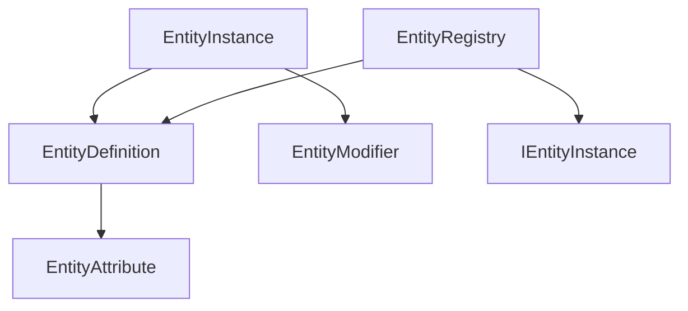

# Entities Module

## Summary

The Entities module defines the core game entity model using Unity-independent serializable classes. It provides entity definitions, generic instances, attribute key-value data, polymorphic modifiers, and a global registry for id-based lookup.

The module enables a consistent flow: register definitions, register instances, and resolve instance attributes with optional modifier behavior.

## Bird's Eye View

Module layout (`Assets/Scripts/Core/Entities/`):

- `Runtime/`: core entity model and registry.
- `Samples/`: simple end-to-end usage (`EntitiesUseCases.cs`).
- `Tests/`: EditMode behavior tests (`EntitiesTests.cs`).

Internal dependency graph:



## Architecture and key behaviors

### 1) Base definitions and key-value attributes

`EntityDefinition` stores base attributes and exposes key lookup.

```csharp
public bool TryGetBaseAttributeValue(string key, out double value)
{
    value = default;
    EntityAttribute attribute = FindAttribute(key);
    if (attribute == null) { return false; }
    value = attribute.Value;
    return true;
}
```

### 2) Generic instance-definition relationship

`EntityInstance<TDefinition>` binds an instance to a concrete definition type instead of id-only coupling.

```csharp
public sealed class EntityInstance<TDefinition> : IEntityInstance where TDefinition : EntityDefinition
{
    public string Id;
    public TDefinition Definition;
    public string DefinitionId;
}
```

### 3) Modifier behavior through polymorphism

Modifiers are abstract behavior objects with concrete implementations.

```csharp
public abstract class EntityModifier
{
    public abstract double Apply(double currentValue);
}
```

### 4) Attribute resolution flow

Instance lookup applies modifiers only when relevant modifiers exist for the target key.

```csharp
bool hasModifier = HasModifierForKey(key);
if (!hasModifier) { value = baseValue; return true; }
value = ApplyModifiers(key, baseValue);
```

### 5) Global registry and uniqueness

`EntityRegistry` enforces global id uniqueness across definitions and instances.

```csharp
if (!TryRegisterId(instanceId)) { return false; }
instances[instanceId] = instance;
return true;
```

## How to use

```csharp
EntityDefinition definition = new EntityDefinition();
definition.Id = "orc_definition";
definition.Attributes["Strength"] = new EntityAttribute { Key = "Strength", Value = 5d };

EntityInstance<EntityDefinition> instance = new EntityInstance<EntityDefinition>();
instance.Id = "orc_instance";
instance.Definition = definition;
instance.AddModifier("Strength", new AddAttributeModifier { Amount = 1d });

EntityRegistry registry = new EntityRegistry();
registry.RegisterDefinition(definition);
registry.RegisterInstance(instance);

bool found = instance.TryGetAttributeValue("Strength", out double value);
```

Expected result for the sample above: `found == true` and `value == 6`.

## Internal Services

### Modifier grouping per attribute key

Instances keep modifiers in a private dictionary keyed by attribute name, while each modifier only transforms a value.

### Registry id gate

`EntityRegistry` uses a shared id set so definition ids and instance ids cannot collide.

### Definition reference validation

Instance registration validates that `instance.Definition` exists and is already registered.

## Public api

- `EntityAttribute` (`Assets/Scripts/Core/Entities/Runtime/EntityAttribute.cs`): serializable key-value attribute.
- `EntityDefinition` (`Assets/Scripts/Core/Entities/Runtime/EntityDefinition.cs`): base entity recipe and base attribute lookup.
- `EntityModifier` + concrete modifiers (`Assets/Scripts/Core/Entities/Runtime/*.cs`): temporary behavior-based attribute changes.
- `IEntityInstance` (`Assets/Scripts/Core/Entities/Runtime/IEntityInstance.cs`): non-generic instance contract for registry usage.
- `EntityInstance<TDefinition>` (`Assets/Scripts/Core/Entities/Runtime/EntityInstance.cs`): generic instance linked to a definition type.
- `IEntityRegistry` / `EntityRegistry` (`Assets/Scripts/Core/Entities/Runtime/IEntityRegistry.cs`, `Assets/Scripts/Core/Entities/Runtime/EntityRegistry.cs`): central registration and id-based lookup.

## How to test

Run from repository root:

```powershell
& ".\.agents\scripts\run-editmode-tests.ps1"
& ".\.agents\scripts\check-analyzers.ps1"
```

Focused check:

```powershell
dotnet test ".\Scaffold.Entities.Tests.csproj" --no-build
```

Expected behavior: entity tests pass and analyzer script reports no blockers/diagnostics for new files.

## Related docs and modules

- `Architecture.md`
- `PLANS.md`
- `Docs/Presentation/Entities.md`
- `Plans/entity-system-execplan.md`
