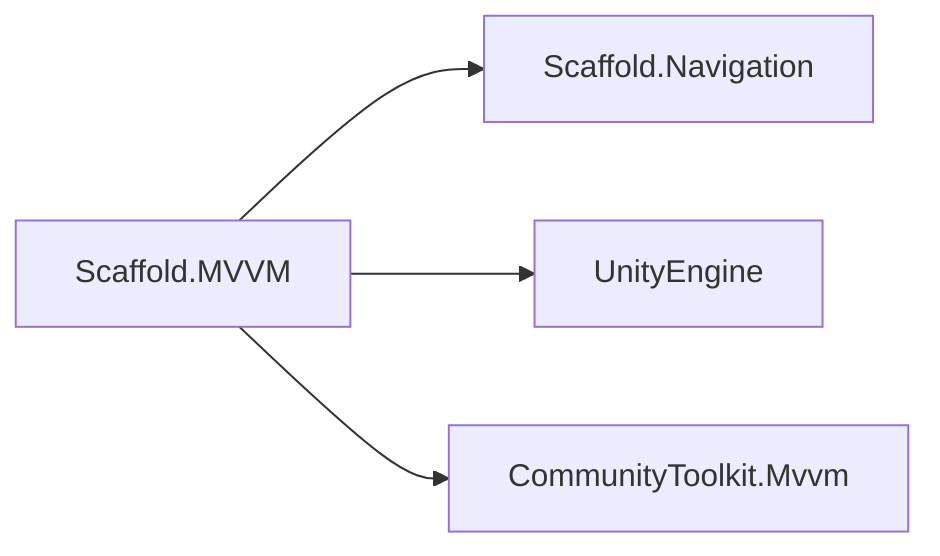
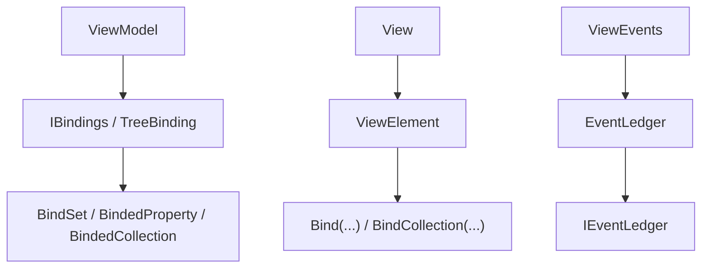

# MVVM Module

## Summary

The MVVM module defines how Scaffold connects user interface state to application behavior through views and view models. Its main effect is predictable UI updates and navigation interactions with less manual glue code: view models expose observable state, views bind to that state, and updates propagate through a consistent lifecycle.

Internally, this module implements a binding pipeline and a view-event bubbling system so teams can scale UI complexity without tightly coupling rendering objects to business logic.

## Bird's Eye View

Module layout (`Assets/Scripts/Core/MVVM/`):

- `Runtime/`: core contracts and implementations (`ViewModel`, `View<T>`, binding contracts, event ledger).
- `Container/`: DI integration point (`MVVMInstaller`).
- `Samples/`: usage examples (`MVVMUseCases.cs`).
- `Tests/`: EditMode tests (`MVVMTests.cs`).

External dependency graph:



Internal dependency graph:



## Architecture and key behaviors

### 1) ViewModel lifecycle and navigation binding

`ViewModel` is the default controller base. It receives navigation context with `Bind(INavigation)` and updates binds when observable properties change.

```csharp
public abstract partial class ViewModel : ObservableObject, IViewModel
{
    protected INavigation navigation;
    protected IBindings binder = new TreeBinding();

    public void Bind(INavigation navigation)
    {
        binder.Unbind();
        this.navigation = navigation;
        Initialize();
    }
}
```

### 2) Typed view binding via `ViewElement<T>`

`ViewElement<T>` ensures views bind to the expected viewmodel type and wires property-change propagation.

```csharp
public sealed override void Bind(IViewController viewController)
{
    var vm = GetViewModelOrDefault(viewController);
    Unbind();
    this.viewModel = vm;
    RegisterViewModel(vm);
    OnBind();
}
```

### 3) Public bind utility in views

Views use `Bind(...)` to connect viewmodel expressions to UI targets through the binding pipeline.

```csharp
protected IBindedProperty<TSource, TTarget> Bind<TSource, TTarget>(
    Expression<Func<TSource>> source,
    Action<TTarget> target)
{
    return bindings.RegisterBind(source, target);
}
```

### 4) View-event bubbling

`ViewEvents` dispatches events by type and routes through typed ledgers.

```csharp
public static void Raise<TEvent>(Transform source, TEvent evt) where TEvent : ViewEvent
{
    var ledger = GetLedger<TEvent>(false);
    ledger?.Raise(source, evt);
}
```

## How to use

Use MVVM through its public view/viewmodel contracts and bind lifecycle:

1. Create a view model by extending `ViewModel` (or implementing `IViewModel` when needed).
2. Create a view by extending `View<TViewModel>`.
3. In the view, use `Bind(...)` and `BindCollection(...)` helpers (from `ViewElement`) in `OnBind()`.
4. Bind navigation into the view model via `ViewModel.Bind(INavigation)` when the controller lifecycle starts.

Minimal usage flow:

```csharp
public class InventoryViewModel : ViewModel
{
    public string Title { get; private set; } = "Inventory";
}

public class InventoryView : View<InventoryViewModel>
{
    protected override void OnBind()
    {
        Bind(() => viewModel.Title, text => UnityEngine.Debug.Log(text));
    }
}
```

This section intentionally focuses on consumer-facing APIs (`ViewModel`, `View<T>`, `Bind(...)`) rather than internal binding implementation details.

## Internal Services

### Binding subsystem

- Main types: `IBindings`, `TreeBinding`, `BindSet<TSource, TTarget>`, `BindedProperty<TSource, TTarget>`, `BindedCollection<TSource, TTarget>`, `BindingPath`.
- Responsibility: register source-target relationships, apply conversion/adaptation rules, and update bindings by key.
- Note: this subsystem powers `Bind(...)` but should not replace public-API usage guidance.

### ViewEvents subsystem

- Main types: `ViewEvent`, `ViewEvents`, `EventLedger<T>`.
- Responsibility: register callbacks by transform and bubble events up the transform hierarchy until consumed.
- Note: use when you need decoupled view-level event routing across UI hierarchy.

## Public api

- `IViewModel` (`Assets/Scripts/Core/MVVM/Runtime/Contracts/IViewModel.cs`): public contract for MVVM controllers used by views and navigation.
- `IView` (`Assets/Scripts/Core/MVVM/Runtime/Contracts/IView.cs`): public view contract that bridges MVVM views to navigation view lifecycle.
- `IEventLedger` (`Assets/Scripts/Core/MVVM/Runtime/Contracts/IEventLedger.cs`): public abstraction for register/raise/unregister event routing.
- `IBind<TSource>` (`Assets/Scripts/Core/MVVM/Runtime/Binding/Contracts/IBind.cs`): public update contract used by bind pipeline participants.
- `IBindings` (`Assets/Scripts/Core/MVVM/Runtime/Binding/Contracts/IBindings.cs`): public binding registry/update surface used by views/viewmodels.
- `IBindSet<TSource, TTarget>` (`Assets/Scripts/Core/MVVM/Runtime/Binding/Contracts/IBindSet.cs`): public converter/adapter registration contract for typed binding sets.
- `IBindedProperty<TSource, TTarget>` (`Assets/Scripts/Core/MVVM/Runtime/Binding/Contracts/IBindedProperty.cs`): public fluent API to attach converter/adapter behavior to property bindings.
- `IBindedCollection<TSource, TTarget>` (`Assets/Scripts/Core/MVVM/Runtime/Binding/Contracts/IBindedCollection.cs`): public collection-binding handle with lifecycle/disposal behavior.
- `ViewModel` (`Assets/Scripts/Core/MVVM/Runtime/Implementation/ViewModel.cs`): default observable view model base with navigation and bind lifecycle hooks.
- `View<T>` (`Assets/Scripts/Core/MVVM/Runtime/Implementation/View.cs`): generic view base that implements navigation-driven open/close/focus/hide behavior.
- `ViewElement` / `ViewElement<T>` (`Assets/Scripts/Core/MVVM/Runtime/Implementation/ViewElement.cs`): base MonoBehaviour utility that exposes `Bind(...)`, `BindCollection(...)`, and typed viewmodel binding.
- `ViewEvents` (`Assets/Scripts/Core/MVVM/Runtime/Implementation/ViewEvents.cs`): static public gateway for raising and subscribing to `ViewEvent` channels.
- `ViewEvent` (`Assets/Scripts/Core/MVVM/Runtime/Implementation/ViewEvent.cs`): base event payload class with consume/history metadata.
- `MVVMInstaller` (`Assets/Scripts/Core/MVVM/Container/MVVMInstaller.cs`): container installation entrypoint for MVVM module integration.

## How to test

From Unity Editor:

1. Open `Window > General > Test Runner`.
2. Run EditMode tests for `Scaffold.MVVM.Tests`.
3. Expected result: all tests in `MVVMTests` pass, including conversion (`int -> string`) and path creation checks.

From Unity CLI (headless pattern):

```powershell
# Run from repository root; adjust Unity executable path for your machine.
Unity.exe -batchmode -quit -projectPath "C:\Users\user\Documents\Unity\Scaffold" -runTests -testPlatform EditMode -testResults "Logs\MVVM-TestResults.xml"
```

Expected result: test run completes successfully and result XML reports all MVVM EditMode tests as passed.

## Related docs and modules

- `Architecture.md`
- `Docs/Infra/Containers.md` (DI integration layer for installers)
- `Docs/Infra/Navigation.md` (MVVM contracts extend navigation contracts)
- `Docs/Infra/Events.md` (event-driven coordination patterns)
- `Docs/Generators/AutoPacker.md` (generator-based model packaging used by adjacent systems)
