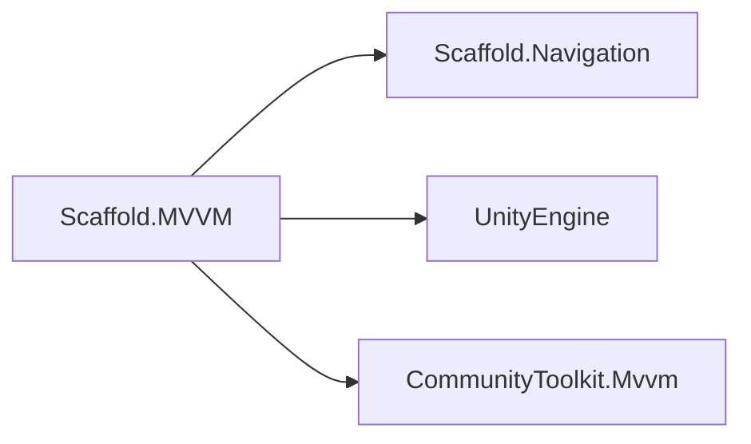
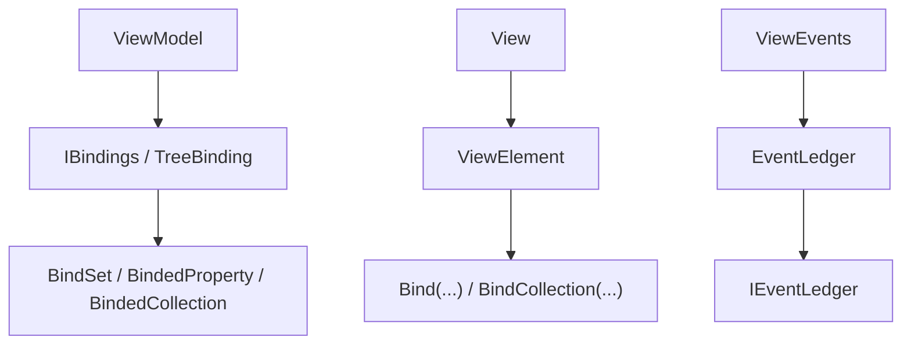

# MVVM Module

## Summary

The MVVM module defines how Scaffold connects user interface state to application behavior through views and view models. Its main effect is predictable UI updates and navigation interactions with less manual glue code: view models expose observable state, views bind to that state, and updates propagate through a consistent lifecycle.

Internally, this module implements a binding pipeline and a view-event bubbling system so teams can scale UI complexity without tightly coupling rendering objects to business logic.

## Bird's Eye View

Module layout (`Assets/Scripts/Core/MVVM/`):

- `Runtime/`: core contracts and implementations (`ViewModel`, `View<T>`, binding contracts, event ledger).
- `Container/`: DI integration point (`MVVMInstaller`).
- `Samples/`: usage examples (`MVVMUseCases.cs`).
- `Tests/`: EditMode tests (`MVVMTests.cs`).

External dependency graph:



Internal dependency graph:



## Architecture and key behaviors

### 1) ViewModel lifecycle and navigation binding

`Model` is the domain-state base. Use it for observable business/domain data objects that must notify changes but do not own navigation or screen lifecycle behavior.

```csharp
public partial class PlayerModel : Model
{
    [ObservableProperty]
    private int health;
}
```

### 2) ViewModel lifecycle and navigation binding

`ViewModel` is the default controller base. It receives navigation context with `Bind(INavigation)`, clears prior bindings, and updates binds when observable properties change.

```csharp
public abstract partial class ViewModel : ObservableObject, IViewModel
{
    protected INavigation navigation;

    public void Bind(INavigation navigation)
    {
        ClearBindings();
        this.navigation = navigation;
        Initialize();
    }
}
```

### 3) Typed view binding via `ViewElement<T>`

`ViewElement<T>` ensures views bind to the expected viewmodel type and wires property-change propagation.

```csharp
public sealed override void Bind(IViewController viewController)
{
    var vm = GetViewModelOrDefault(viewController);
    Unbind();
    this.viewModel = vm;
    RegisterViewModel(vm);
    OnBind();
}
```

### 4) Generated bind utility in View and ViewModel

`ViewElement` and `ViewModel` share bind utility methods through source generation with `[BindSource(typeof(TreeBinding))]`. Any class annotated with `BindSource` automatically implements `IBindSource`, so you do not manually add that interface on the class declaration.

```csharp
[BindSource(typeof(TreeBinding))]
public abstract partial class ViewElement : MonoBehaviour
{
public IBindedProperty<TSource, TTarget> Bind<TSource, TTarget>(
    Expression<Func<TSource>> source,
    Action<TTarget> target,
    BindingOptions options = null)
{
    return bindings.RegisterBind(source, target, options);
}
}
```

### 5) Binding options and bind lifetimes

`BindingOptions` controls first-evaluation behavior:

- default strict mode evaluates source expressions at registration time.
- `BindingOptions.Lazy` defers first evaluation until `UpdateBinding(...)` runs.
- lazy mode suppresses only `NullReferenceException` from unresolved deferred chains (for example a null intermediate object) and retries on later updates.

Property and collection bind calls now return disposable handles:

- `IBindedProperty<TSource, TTarget> : IDisposable`
- `IBindedCollection<TSource, TTarget> : IDisposable`

Disposing one handle detaches only that binding, while `ClearBindings()` still performs full teardown.

Nested reference replacement behavior is generator-driven:

- when a nested `[ObservableProperty]` instance is replaced (for example `Player = new PlayerModel()`), generated code re-attaches nested change listeners to the new instance automatically.
- old replaced instances are detached, so stale nested notifications no longer propagate through the parent path.
- you should not need manual `RegisterChildProperty(...)` calls for standard `[ObservableProperty]` replacement flows.

### 5) View-event bubbling

`ViewEvents` dispatches events by type and routes through typed ledgers.

```csharp
public static void Raise<TEvent>(Transform source, TEvent evt) where TEvent : ViewEvent
{
    var ledger = GetLedger<TEvent>(false);
    ledger?.Raise(source, evt);
}
```

## How to use

Use MVVM through `Model`, `ViewModel`, and `View`:

1. Create a `Model` when you need observable domain state.
2. Create a `ViewModel` when you need screen/application orchestration, navigation, and model-to-view mapping.
3. Create a `View<TViewModel>` (or `ViewElement<TViewModel>`) for UI binding in `OnBind()`.
4. Use generated `Bind(...)` helpers in both view and viewmodel base classes.
5. Bind navigation via `ViewModel.Bind(INavigation)` when lifecycle starts.
6. Store returned bind handles when you need selective teardown; dispose an individual handle to stop only that binding.

When to use `Model` vs `ViewModel`:

- Use `Model` for domain objects with observable properties (inventory item, player stats, mission state), even when there are no view events.
- Use `ViewModel` for screen composition, navigation, and translating domain state into UI-focused properties.

Minimal usage flow:

```csharp
public partial class InventoryModel : Model
{
    [ObservableProperty]
    private int itemCount;
}

public partial class InventoryViewModel : ViewModel
{
    [ObservableProperty]
    private InventoryModel model = new InventoryModel();

    [ObservableProperty]
    private string title = "Inventory";

    protected override void Initialize()
    {
        Bind(() => Model.ItemCount, () => Title, BindingOptions.Lazy);
    }
}

public class InventoryView : View<InventoryViewModel>
{
    protected override void OnBind()
    {
        Bind(() => viewModel.Title, text => UnityEngine.Debug.Log(text));
    }
}
```

Selective teardown example:

```csharp
private IBindedProperty<int, string> titleBind;

protected override void OnBind()
{
    titleBind = Bind(() => viewModel.Model.ItemCount, text => label.text = text.ToString());
}

protected override void OnUnbind()
{
    titleBind?.Dispose();
}
```

This section intentionally focuses on consumer-facing APIs (`Model`, `ViewModel`, `View<T>`, and generated `Bind(...)`) rather than low-level binding internals.

## Internal Services

### Binding subsystem

- Main types: `IBindings`, `TreeBinding`, `IBindSource`, and generated bind helpers from `BindSourceAttribute`.
- Responsibility: register source-target relationships, apply conversion/adaptation rules, and update bindings by key.
- Note: concrete low-level classes such as `BindSet` and `BindedProperty` are internal implementation details and not intended feature-level API.

### ViewEvents subsystem

- Main types: `ViewEvent`, `ViewEvents`, `EventLedger<T>`.
- Responsibility: register callbacks by transform and bubble events up the transform hierarchy until consumed.
- Note: use when you need decoupled view-level event routing across UI hierarchy.

## Public api

- `IViewModel` (`Assets/Scripts/Core/MVVM/Runtime/Contracts/IViewModel.cs`): public contract for MVVM controllers used by views and navigation.
- `IView` (`Assets/Scripts/Core/MVVM/Runtime/Contracts/IView.cs`): public view contract that bridges MVVM views to navigation view lifecycle.
- `IEventLedger` (`Assets/Scripts/Core/MVVM/Runtime/Contracts/IEventLedger.cs`): public abstraction for register/raise/unregister event routing.
- `Model` (`Assets/Scripts/Core/MVVM/Runtime/Implementation/Model.cs`): base class for observable domain objects.
- `ViewModel` (`Assets/Scripts/Core/MVVM/Runtime/Implementation/ViewModel.cs`): default observable view model base with navigation and bind lifecycle hooks.
- `View<T>` (`Assets/Scripts/Core/MVVM/Runtime/Implementation/View.cs`): generic view base that implements navigation-driven open/close/focus/hide behavior.
- `ViewElement` / `ViewElement<T>` (`Assets/Scripts/Core/MVVM/Runtime/Implementation/ViewElement.cs`): base MonoBehaviour utility that exposes `Bind(...)`, `BindCollection(...)`, and typed viewmodel binding.
- `ViewEvents` (`Assets/Scripts/Core/MVVM/Runtime/Implementation/ViewEvents.cs`): static public gateway for raising and subscribing to `ViewEvent` channels.
- `ViewEvent` (`Assets/Scripts/Core/MVVM/Runtime/Implementation/ViewEvent.cs`): base event payload class with consume/history metadata.
- `MVVMInstaller` (`Assets/Scripts/Core/MVVM/Container/MVVMInstaller.cs`): container installation entrypoint for MVVM module integration.

## How to test

From Unity Editor:

1. Open `Window > General > Test Runner`.
2. Run EditMode tests for `Scaffold.MVVM.Tests`.
3. Expected result: all tests in `MVVMTests` pass, including model-to-viewmodel propagation, view bind updates, view lifecycle transitions, event bubbling/consume behavior, and `TreeBinding` path update coverage.

From Unity CLI (headless pattern):

```powershell
# Run from repository root (recommended script path).
powershell -ExecutionPolicy Bypass -File ".\.agents\scripts\run-editmode-tests.ps1" -AssemblyNames "Scaffold.MVVM.Tests"
```

Expected result: terminal report shows all MVVM EditMode tests passed with zero failures.

## Related docs and modules

- `Architecture.md`
- `Docs/Infra/Containers.md` (DI integration layer for installers)
- `Docs/Infra/Navigation.md` (MVVM contracts extend navigation contracts)
- `Docs/Infra/Events.md` (event-driven coordination patterns)
- `Docs/Generators/AutoPacker.md` (generator-based model packaging used by adjacent systems)
