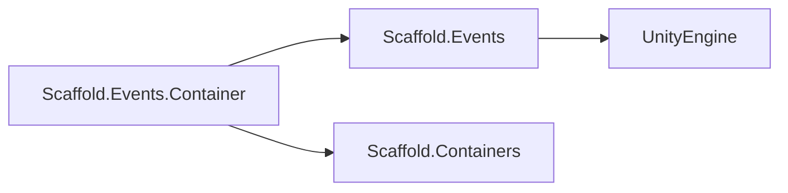
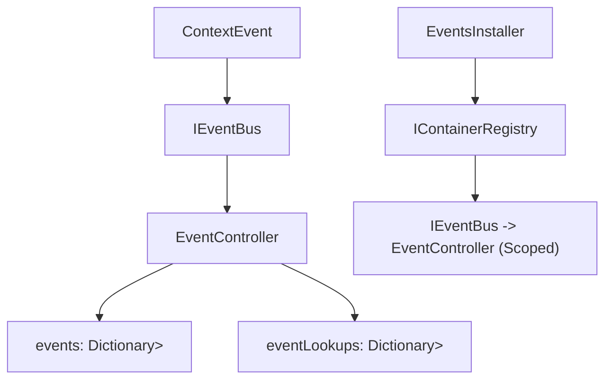

# Events Module

## Summary

The Events module provides Scaffold's in-process event bus for decoupled communication between systems. Its main effect is that modules can publish and listen for strongly typed events (`ContextEvent` derivatives) without direct references to each other, reducing coupling and simplifying feature composition.

Internally, the module maintains listener lookup structures and type-indexed callback routing so `AddListener`/`RemoveListener`/`Raise` operations stay consistent and predictable. The contracts also include request and middleware extension points used by the replacement bus milestones.

## Bird's Eye View

Module layout (`Assets/Scripts/Infra/Events/`):

- `Runtime/Contracts/`: event/request/middleware contracts (`ContextEvent`, `ContextRequest<TResponse>`, `IEventBus`, `IRequestBus`, `IEventMiddleware`, `IRequestMiddleware`).
- `Runtime/Implementation/`: concrete bus implementation (`EventController`).
- `Container/`: DI integration (`EventsInstaller`).
- `Samples/`: publish/subscribe examples (`EventsUseCases.cs`).
- `Tests/`: EditMode NUnit coverage (`EventsTests.cs`).

External dependency graph:



Internal dependency graph:



## Architecture and key behaviors

### 1) Strongly typed event contract

All domain events in this module derive from `ContextEvent`.

```csharp
public abstract record ContextEvent;
```

### 2) Typed listener registration

`EventController` supports generic listener registration while internally adapting to a shared `ContextEvent` callback signature.

```csharp
public void AddListener<T>(Action<T> evt) where T : ContextEvent
{
    if (eventLookups.ContainsKey(evt)) return;

    Action<ContextEvent> newAction = (e) => evt((T)e);
    eventLookups[evt] = newAction;
    AddListener(typeof(T), newAction);
}
```

### 3) Listener removal and dictionary cleanup

When removing listeners, the implementation updates the delegate chain and removes empty event entries.

```csharp
private void ApplyOrRemoveAction(Type type, Action<ContextEvent> tempAction)
{
    if (tempAction == null)
    {
        events.Remove(type);
    }
    else
    {
        events[type] = tempAction;
    }
}
```

### 4) Scoped DI registration

`EventsInstaller` binds `IEventBus` to `EventController` as scoped lifetime in container composition.

```csharp
public override void Install(IContainerRegistry registry, Transform holder)
{
    registry.Register<IEventBus, EventController>(ContainerLifetime.Scoped);
}
```

## How to use

Use `IEventBus`/`EventController` by defining a `ContextEvent` type, registering listeners, raising events, and unsubscribing when done.

Generic listener flow:

```csharp
private record PlayerDiedEvent : ContextEvent;

EventController bus = new EventController();
bool received = false;

bus.AddListener<PlayerDiedEvent>(_ => received = true);
bus.Raise(new PlayerDiedEvent());
```

Generic unsubscribe pattern:

```csharp
int count = 0;
Action<PlayerDiedEvent> handler = _ => count++;

bus.AddListener(handler);
bus.RemoveListener(handler);
```

Open-type listener flow:

```csharp
int openTypeCount = 0;
Action<ContextEvent> openTypeHandler = _ => openTypeCount++;

bus.AddListener(typeof(PlayerDiedEvent), openTypeHandler);
bus.Raise(new PlayerDiedEvent());

bus.RemoveListener(typeof(PlayerDiedEvent), openTypeHandler);
```

Request/middleware contract entry points introduced for the replacement milestones:

```csharp
public abstract record ContextRequest<TResponse>;

public interface IRequestBus
{
    Awaitable<TResponse> RequestAsync<TResponse>(ContextRequest<TResponse> request, CancellationToken cancellationToken = default);
}
```

Reference sample: `Assets/Scripts/Infra/Events/Samples/EventsUseCases.cs`.

## Internal Services

### Listener lookup adapter map

- Type: `eventLookups` in `EventController`.
- Responsibility: maps original typed delegates to adapted `Action<ContextEvent>` delegates, enabling safe unsubscribe with the original handler reference.

### Type-indexed dispatch map

- Type: `events` in `EventController`.
- Responsibility: stores combined delegate chains by concrete event `Type`, used during `Raise(...)` for targeted dispatch.

## Public api

- `ContextEvent` (`Assets/Scripts/Infra/Events/Runtime/Contracts/ContextEvent.cs`): base event record type for all events routed by the bus.
- `ContextRequest<TResponse>` (`Assets/Scripts/Infra/Events/Runtime/Contracts/ContextRequest.cs`): base request contract for typed async request/response flows.
- `IEventBus` (`Assets/Scripts/Infra/Events/Runtime/Contracts/IEventBus.cs`): public contract for add/remove listeners, raising events, and clearing subscriptions.
- `IRequestBus` (`Assets/Scripts/Infra/Events/Runtime/Contracts/IRequestBus.cs`): public contract for async request handler registration and `RequestAsync` dispatch.
- `IEventMiddleware` (`Assets/Scripts/Infra/Events/Runtime/Contracts/IEventMiddleware.cs`): event pipeline extension point.
- `IRequestMiddleware` (`Assets/Scripts/Infra/Events/Runtime/Contracts/IRequestMiddleware.cs`): request pipeline extension point.
- `EventController` (`Assets/Scripts/Infra/Events/Runtime/Implementation/EventController.cs`): default in-memory implementation of `IEventBus` with typed and untyped registration paths.
- `EventsInstaller` (`Assets/Scripts/Infra/Events/Container/EventsInstaller.cs`): container installer that registers `IEventBus` to `EventController`.

## How to test

From Unity Editor:

1. Open `Window > General > Test Runner`.
2. Run EditMode tests for `Scaffold.Events.Tests`.
3. Expected result: `EventsTests` passes for subscribe/publish, unsubscribe behavior, and clear behavior.

From Unity CLI (headless pattern):

```powershell
# Run from repository root; adjust Unity executable path for your machine.
Unity.exe -batchmode -quit -projectPath "C:\Users\user\Documents\Unity\Scaffold" -runTests -testPlatform EditMode -testResults "Logs\Events-TestResults.xml"
```

Expected result: run completes successfully and results include passing tests for `Scaffold.Events.Tests`.

## Related docs and modules

- `Architecture.md`
- `Docs/Containers.md` (installer-based registration of event bus)
- `Docs/MVVM.md` (MVVM view events complement infra event bus patterns)
- `Docs/Navigation.md` (navigation transitions often emit/consume event signals)
- `Docs/NetworkMessages.md` (event-driven integration patterns)
