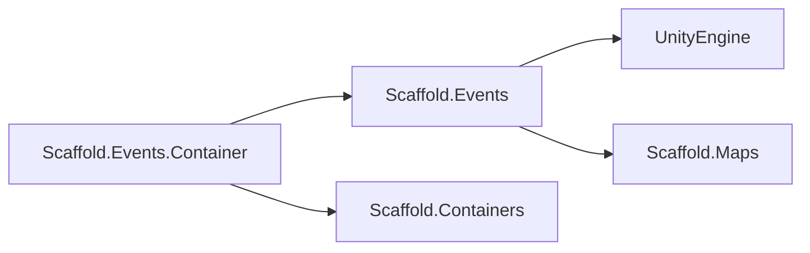

# Events Module

## Summary

The Events module provides Scaffold's in-process message runtime for publish/subscribe events and async request/response flows. `EventsInstaller` now resolves both `IEventBus` and `IRequestBus` to one scoped `ScalableEventBus` instance, so modules can keep using `AddListener`/`RemoveListener`/`Raise` while also using `RequestAsync` without per-event DI registration.

## Bird's Eye View

Module layout (`Assets/Scripts/Infra/Events/`):

- `Runtime/Contracts/`: `ContextEvent`, `ContextRequest<TResponse>`, `IEventBus`, `IRequestBus`, middleware contracts, diagnostics contracts.
- `Runtime/Implementation/`: `ScalableEventBus`, `NoOpEventDiagnosticsSink`, and migration-only `EventController`.
- `Container/`: DI integration (`EventsInstaller`).
- `Samples/`: usage examples (`EventsUseCases.cs`).
- `Tests/`: EditMode coverage for listener compatibility, hierarchy dispatch, requests, middleware order, and diagnostics hooks.

External dependency graph:



## Runtime Behavior

### Listener dispatch (`IEventBus`)

`ScalableEventBus` supports generic and open-type registration through `AddListener`/`RemoveListener`. Dispatch is deterministic and includes:

- Exact handlers for the concrete runtime event type.
- Hierarchy handlers where declared type is assignable from the runtime type (base/abstract listeners receive derived events).

If one listener throws, remaining listeners still run. Failures are reported through diagnostics.

### Request dispatch (`IRequestBus`)

`RequestAsync` routes by exact runtime request type. Handlers can be registered via generic or open-type APIs:

- Generic: `AddRequestHandler<TRequest, TResponse>(...)`
- Open-type: `AddRequestHandler(Type requestType, Type responseType, ...)`

Error behavior is deterministic:

- No handler: throws `InvalidOperationException`.
- Multiple handlers for one request+response: throws `InvalidOperationException`.
- Handler failure: throws `InvalidOperationException` with inner exception.
- Canceled token: throws `OperationCanceledException` before invoking handler.

### Middleware and diagnostics

`IEventMiddleware` and `IRequestMiddleware` wrap dispatch with stable ordering (first-registered wraps outermost). `IEventDiagnosticsSink` receives event/request instrumentation callbacks. `NoOpEventDiagnosticsSink` is the default registration.

## DI Wiring

`Assets/Scripts/Infra/Events/Container/EventsInstaller.cs` registers:

- `IEventDiagnosticsSink -> NoOpEventDiagnosticsSink` (scoped default)
- `ScalableEventBus` (scoped)
- `IEventBus -> same scoped ScalableEventBus`
- `IRequestBus -> same scoped ScalableEventBus`

The installer resolves middleware collections (`IEnumerable<IEventMiddleware>` and `IEnumerable<IRequestMiddleware>`) when building the bus, so additional middleware registrations are automatically composed.

## Usage

Generic event listener:

```csharp
IEventBus bus = resolver.Resolve<IEventBus>();
bus.AddListener<PlayerDiedEvent>(_ => Debug.Log("Player died"));
bus.Raise(new PlayerDiedEvent());
```

Open-type listener:

```csharp
Action<ContextEvent> handler = _ => Debug.Log("Player died");
bus.AddListener(typeof(PlayerDiedEvent), handler);
bus.RemoveListener(typeof(PlayerDiedEvent), handler);
```

Request/response:

```csharp
IRequestBus requests = resolver.Resolve<IRequestBus>();
requests.AddRequestHandler<LoadScoreRequest, int>((request, token) => Awaitable.FromResult(request.Score));
int score = await requests.RequestAsync(new LoadScoreRequest(42));
```

Migration note:

- `EventController` is marked obsolete and is kept only as a temporary compatibility type.
- New and updated modules should resolve `IEventBus`/`IRequestBus` through DI instead of instantiating `EventController` directly.

Reference sample: `Assets/Scripts/Infra/Events/Samples/EventsUseCases.cs`.

## Public API

- `ContextEvent`: base event contract.
- `ContextRequest<TResponse>`: base request contract.
- `IEventBus`: listener add/remove, raise, clear.
- `IRequestBus`: request handler add/remove and `RequestAsync`.
- `IEventMiddleware`: event pipeline wrapper.
- `IRequestMiddleware`: request pipeline wrapper.
- `IEventDiagnosticsSink`: publish/listener/request diagnostics hooks.

## Testing

From Unity Editor:

1. Open `Window > General > Test Runner`.
2. Run EditMode tests in `Scaffold.Events.Tests`.
3. Run dependent smoke tests in `Scaffold.Navigation.Tests`.

From CLI (run at repository root):

```powershell
"C:\Program Files\Unity\Hub\Editor\6000.3.6f1\Editor\Unity.exe" -batchmode -quit -projectPath "C:\Users\user\Documents\Unity\Scaffold" -runTests -testPlatform EditMode -testFilter "Scaffold.Events.Tests" -testResults "Logs\Events-TestResults.xml"
"C:\Program Files\Unity\Hub\Editor\6000.3.6f1\Editor\Unity.exe" -batchmode -quit -projectPath "C:\Users\user\Documents\Unity\Scaffold" -runTests -testPlatform EditMode -testFilter "Scaffold.Navigation.Tests" -testResults "Logs\Navigation-AfterEventsSwitch.xml"
```

Expected behavior:

- Events tests confirm listener compatibility, hierarchy dispatch, request success/failure, middleware order, and diagnostics callbacks.
- Navigation smoke tests continue passing without event-consumer API changes.

## Related docs and modules

- `Architecture.md`
- `Docs/Containers.md`
- `Docs/Navigation.md`
- `Docs/NetworkMessages.md`
