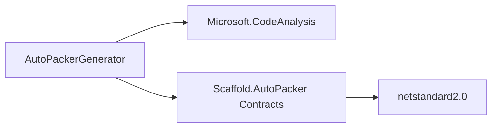
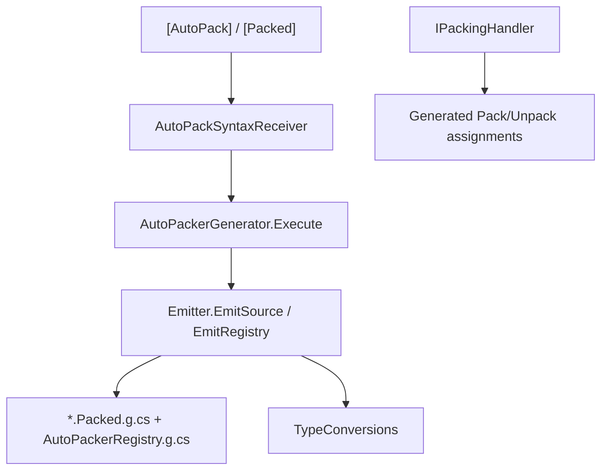

# AutoPacker Module

## Summary

The AutoPacker module provides compile-time Roslyn generation of pack/unpack code for annotated types. Its main effect is reducing repetitive network/serialization boilerplate by generating a `Packed` struct, `Pack(...)` method, and unpack constructor based on `[AutoPack]` and `[Packed]` metadata.

Internally, the generator validates unmanaged packing constraints and emits registry/type conversion helpers during compilation.

## Bird's Eye View

Module layout:

- `Generators/AutoPacker/src/Contracts/`: public attributes/interfaces (`AutoPackAttribute`, `PackedAttribute`, `IPackingHandler`, `IPackable`, `IPackedStruct`).
- `Generators/AutoPacker/src/AutoPackerGenerator/`: Roslyn generator pipeline (`AutoPackerGenerator`, `AutoPackSyntaxReceiver`, `Emitter`, `TypeConversions`).
- `Generators/AutoPacker/`: generator project entry (`AutoPackerGenerator.csproj`).
- `Docs/Generators/AutoPacker.md`: this module documentation.

External dependency graph:



Internal dependency graph:



## Architecture and key behaviors

### 1) Syntax discovery phase

The receiver scans type/field/method syntax, collecting:

- types marked with `[AutoPack]`
- fields marked with `[Packed]`
- extension methods named `Resolve(this IPackingHandler, ...)`

```csharp
if (!HasAttribute(containingType, nameof(AutoPackAttribute)))
    continue;

if (!HasAttribute(fieldSymbol, nameof(PackedAttribute)))
    continue;
```

### 2) Validation phase

Before generation, fields are validated as unmanaged (or mapped to unmanaged target type).

```csharp
if (!typeToCheck.IsUnmanagedType)
{
    var diagnostic = Diagnostic.Create(MustBeUnmanagedDiagnostic, location, fieldSymbol.Name, typeToCheck.ToDisplayString());
    context.ReportDiagnostic(diagnostic);
}
```

### 3) Emission phase

For each valid type, generator emits partial source with:

- default constructor (if needed)
- unpack constructor (`Type(Packed packedData, IPackingHandler handler = null)`)
- `Pack(...)` method
- nested `Packed` struct implementing `IPackedStruct`

```csharp
context.AddSource($"{typeSymbol.Name}.Packed.g.cs", SourceText.From(source, Encoding.UTF8));
```

### 4) Registry generation

The generator emits `AutoPackerRegistry.g.cs` mapping source type -> packed type.

```csharp
sb.AppendLine("    public static List<Dictionary<Type, Type>> GetPackableTypes() => _types;");
```

### 5) Conversion mapping

`TypeConversions` supports known managed-to-packable transforms (for example `string` to `FixedString128Bytes`).

```csharp
private static readonly Dictionary<string, string> Map = new Dictionary<string, string>
{
    { "string", "Unity.Collections.FixedString128Bytes" },
};
```

## How to use

`AutoPacker` is usually consumed by other runtime services (networking, persistence, sync layers) as a conversion boundary between rich domain objects and compact packed payloads.

### 1) Decorate domain types for generation

Mark the source type with `[AutoPack]` and mark only transferable fields with `[Packed]`.

```csharp
using Scaffold.AutoPacker;

[AutoPack]
public partial class PlayerState
{
    [Packed] public int Health;
    [Packed(typeof(int))] public string Alias;
}
```

### 2) Consume generated API from other services

A service can call `Pack()` before transport/storage and reconstruct later from the generated `Packed` struct.

```csharp
public class PlayerSyncService
{
    public IPackedStruct ToPayload(PlayerState state)
    {
        return state.Pack();
    }

    public PlayerState FromPayload(PlayerState.Packed packed)
    {
        return new PlayerState(packed);
    }
}
```

### 3) Add custom conversion with `IPackingHandler`

Use a custom handler when source and packed types need project-specific conversion rules.

```csharp
public class CustomPackingHandler : IPackingHandler
{
    public TTarget Resolve<TSource, TTarget>(TSource source)
    {
        if (source == null) return default;
        if (source is TTarget target) return target;
        return (TTarget)System.Convert.ChangeType(source, typeof(TTarget));
    }
}
```

```csharp
var handler = new CustomPackingHandler();
IPackedStruct packed = state.Pack(handler);
var restored = new PlayerState((PlayerState.Packed)packed, handler);
```

### 4) Use extension `Resolve` methods for specific type pairs

If you define an extension method named `Resolve(this IPackingHandler, SourceType)`, the generator can emit direct extension calls instead of generic `Resolve<TSource, TTarget>(...)` for matching type pairs.

```csharp
public static class PackingExtensions
{
    public static int Resolve(this IPackingHandler handler, UnityEngine.Vector2 source)
    {
        return (int)source.x;
    }
}
```

This is useful when another service expects a specific packed representation and you want explicit, discoverable conversion logic.

## Internal Services

### Syntax receiver

- Main type: `AutoPackSyntaxReceiver`.
- Responsibility: collect candidate types/fields and compatible extension methods for generator emission.

### Source emitter

- Main type: `Emitter`.
- Responsibility: produce generated partial code and registry code with assignment strategy and type conversions.

### Conversion table

- Main type: `TypeConversions`.
- Responsibility: map field types to packed-target representations when direct unmanaged assignment is not available.

## Public api

- `AutoPackAttribute` (`Generators/AutoPacker/src/Contracts/AutoPackAttribute.cs`): marker attribute for source types that should receive generated pack/unpack code.
- `PackedAttribute` (`Generators/AutoPacker/src/Contracts/PackedAttribute.cs`): marker attribute for fields to include in packed payload, with optional `TargetType` override.
- `IPackingHandler` (`Generators/AutoPacker/src/Contracts/IPackingHandler.cs`): conversion contract used by generated assignments during pack/unpack.
- `IPackable` (`Generators/AutoPacker/src/Contracts/IPackable.cs`): contract exposing generated `Pack(...)` behavior.
- `IPackedStruct` (`Generators/AutoPacker/src/Contracts/IPackedStruct.cs`): contract for generated packed representations with runtime packed-type metadata.
- `DefaultPackingHandler` (`Generators/AutoPacker/src/Contracts/DefaultPackingHandler.cs`): fallback conversion handler used when no custom handler is provided.

## How to test

From generator project root (`C:/Users/user/Documents/Unity/Scaffold/Generators/AutoPacker`):

```powershell
dotnet build -c Release
```

Expected result: build succeeds and generator/contracts assemblies compile cleanly.

To validate generation behavior in the Unity project:

1. Ensure annotated types exist in project code (`[AutoPack]` + `[Packed]`).
2. Trigger a compile in Unity/IDE.
3. Confirm generated files are produced by the source generator and diagnostics are clean for managed/unmanaged rules.

## Related docs and modules

- `Architecture.md`
- `Docs/Infra/NetworkMessages.md` (packed payloads can be used in network message flows)
- `Docs/Tools/Types.md` (type metadata and filtering patterns overlap with generator-driven workflows)
- `Plans/Create-Module-Documentation/ExecPlan.md`
- `Generators/AutoPacker/src/AutoPackerGenerator/AutoPackerGenerator.cs`
