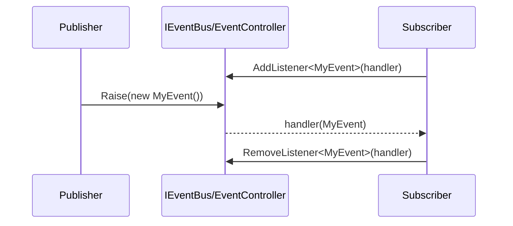

# Scaffold Infra Events

## TL;DR

- Purpose: in-process typed event bus for module decoupling.
- Location: `Assets/Packages/com.scaffold.events/Runtime/` (boundary types under `Runtime/Contracts/`).
- Depends on: `Scaffold.Records` and container abstractions.
- Used by: navigation, MVVM-adjacent flows, app orchestration.
- Runtime/Editor: runtime + container integration.
- Keywords: event bus, context event, publish subscribe.

## Responsibilities

- Owns typed publish/subscribe contract (`IEventBus`).
- Owns in-memory dispatch implementation (`EventController`).
- Owns module DI integration (`EventsInstaller`).
- Does not own persistence, remote messaging, or cross-process transport.
- Boundary: infra messaging utility.

## Public API

| Symbol | Purpose | Inputs | Outputs | Failure behavior |
|---|---|---|---|---|
| `ContextEvent` | Base event payload contract | derived event data | event instance | n/a |
| `IEventBus.AddListener<T>(...)` | Subscribe typed handler | `Action<T>` | subscription registration | duplicate handler add is ignored |
| `IEventBus.RemoveListener<T>(...)` | Unsubscribe typed handler | `Action<T>` | handler removal | missing handler remove is safe no-op |
| `IEventBus.Raise(ContextEvent)` | Publish event | event instance | invokes handlers of concrete event type | no listeners is safe no-op |
| `EventsInstaller` | DI installer | container registry + holder | bus registration | startup fails if container contracts missing |

## Setup / Integration

1. Reference `Scaffold.Events` in consuming asmdef.
2. Register `EventsInstaller` in composition root.
3. Inject `IEventBus` where publish/subscribe is needed.

## How to Use

1. Define an event type derived from `ContextEvent`.
2. Register listeners through `IEventBus.AddListener<T>()`.
3. Publish with `Raise(new MyEvent(...))`.
4. Remove listener when owner lifetime ends.

## Behavior Contracts

- Typed subscriptions are adapted internally to `Action<ContextEvent>` delegates.
- Unsubscribe correctness depends on delegate identity mapping; removing uses the original typed delegate key lookup.
- Removing the last handler for an event type prunes that type entry from the dispatch map.
- Raising an event with no listeners is a safe no-op.
- Duplicate typed listener registration for the same delegate is ignored.

## Examples

### Event Dispatch Flow



### Minimal

```csharp
private record PlayerDiedEvent : ContextEvent;
EventController bus = new EventController();
bus.AddListener<PlayerDiedEvent>(_ => UnityEngine.Debug.Log("received"));
bus.Raise(new PlayerDiedEvent());
```

## Best Practices

- Keep event payloads small and explicit.
- Subscribe/unsubscribe at clear lifecycle boundaries.
- Prefer typed events over string-based channels.
- Use events for decoupling, not for core control flow abuse.

## Anti-Patterns

- Using event bus as shared mutable state.
- Keeping long-lived listeners without cleanup.
- Publishing broad generic payloads that hide intent.

## Testing

- Test assembly: `Scaffold.Events.Tests`.
- Run from repo root:

```powershell
& ".\.agents\scripts\run-editmode-tests.ps1" -AssemblyNames "Scaffold.Events.Tests"
```

- Expected: all tests pass with zero failures.
- Bugfix rule: add/update regression test first, verify fail-before/fix/pass-after.

## AI Agent Context

- Invariants:
  - listener add/remove and raise operations are deterministic and safe when absent.
  - type-based dispatch is preserved.
- Allowed Dependencies:
  - `Scaffold.Records`, container abstractions.
- Forbidden Dependencies:
  - direct UI dependencies and transport/network concerns.
- Change Checklist:
  - verify subscribe/unsubscribe tests.
  - verify raise-without-listeners path.
  - verify DI installer coverage.
- Known Tricky Areas:
  - delegate identity for unsubscribe correctness.

## Related

- `Architecture.md`
- `Docs/Infra/Navigation.md`
- `Docs/Infra/Model.md`
- `Docs/Core/ViewModel.md`
- `Docs/App/View.md`

## Changelog

- Rewritten to AI-first standard with sequence diagram and explicit boundaries.
- Recovered internal dispatch/unsubscribe behavior contracts.

- Added negative-path coverage for null event raise and null open-type handler registration.
- Consolidated `Scaffold.Events.Contracts` + `Scaffold.Events.Runtime` into `Scaffold.Events` and moved boundary types to `Runtime/Contracts/`.
