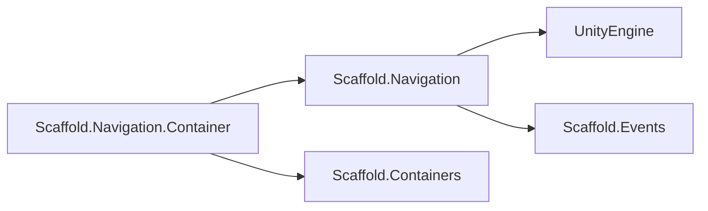
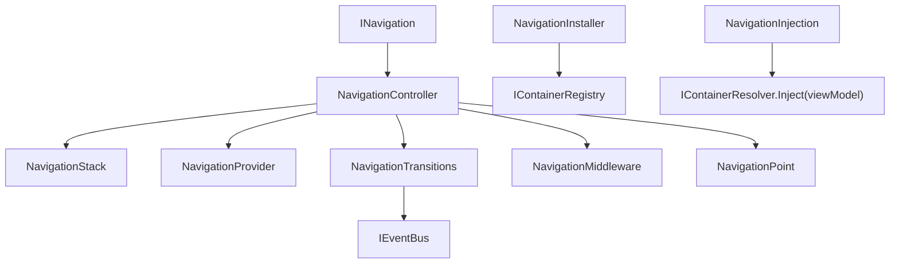

# Navigation Module

## Summary

The Navigation module coordinates view-controller lifecycle and screen transitions in Scaffold. Its main effect is predictable navigation behavior: opening and closing view controllers, maintaining a navigation stack, applying transition rules, and publishing navigation-related events.

Internally, the module composes provider, stack, middleware, and transition services so navigation logic stays centralized and reusable across modules.

## Bird's Eye View

Module layout (`Assets/Scripts/Infra/Navigation/`):

- `Runtime/Contracts/`: navigation and view contracts (`INavigation`, `IViewController`, `IView`, middleware/handler interfaces).
- `Runtime/Implementation/`: controller, stack, provider, transitions, options, schemas, and related runtime types.
- `Container/`: DI integration (`NavigationInstaller`, `NavigationInjection`).
- `Samples/`: usage examples for opening views with `NavigationOptions`.
- `Tests/`: EditMode tests for options and navigation point behavior.

External dependency graph:



Internal dependency graph:



## Architecture and key behaviors

### 1) Opening flow and stack effects

`Open(...)` resolves a `NavigationPoint`, invokes middleware, binds the controller to navigation, and transitions to the new point.

```csharp
public void Open<TController>(TController controller, bool closeCurrent = false, NavigationOptions options = null)
    where TController : IViewController
{
    options ??= new NavigationOptions();
    NavigationPoint point = provider.GetNavigationPoint<TController>(controller, options);
    Open(point, closeCurrent, options);
}
```

Stack behavior when opening:

- `closeCurrent = false`: old current stays in stack; new point is appended and becomes current.
- `closeCurrent = true`: old current is removed before adding the new point.
- `options.CloseAllViews = true`: all stacked points except the current origin are removed/closed before activation.

### 2) Closing flow and stack effects

`Close(controller)` resolves the point from stack. If it is current, navigation performs `Return()`. If not current, it force-removes and closes that point.

```csharp
public void Close<TViewController>(TViewController controller) where TViewController : IViewController
{
    var point = this.stack.Get(controller);
    if (point == null) return;
    ClosePoint(point);
}
```

Stack behavior when closing:

- Closing current point: stack moves to previous point via `Return()`.
- Closing non-current point: target point is removed in place, current remains unchanged.

### 3) Return flow and stack effects

`Return()` transitions to `PreviousPoint`, removes current from stack (via `GoTo(..., closeCurrent: true, ...)`), and returns the target controller.

```csharp
public IViewController Return()
{
    var targetPoint = this.stack.PreviousPoint;
    var defaultOptions = new NavigationOptions();
    GoTo(targetPoint, true, defaultOptions);
    return targetPoint.ViewModel;
}
```

### 4) Open/Close/Hide/Focus behavior differences

Navigation ultimately drives `IView` methods based on transition conditions.

```csharp
void IView.Open();
void IView.Close();
void IView.Hide();
void IView.Focus();
```

Behavior intent:

- `Open`: activates first-time or reopening display path for target point.
- `Close`: finalizes and closes view; non-scene views may be destroyed.
- `Hide`: keeps point in stack but hides visual state when another screen overlays it.
- `Focus`: re-activates a view that is already open when revisited.

### 5) Timing/order between close and open

Transitions run in a queue; each transition composes hide/close/open sequences and runs asynchronously.

```csharp
public void DoTransition(NavigationPoint from, NavigationPoint to, bool closeCurrent)
{
    var transitionData = new ViewTransitionData(from, to, closeCurrent);
    pendingTransitions.Enqueue(transitionData);
    if (!runningTransition)
    {
        RunTransitions();
    }
}
```

Default sequence timing:

- If there is a `from` point:
- close-current path: closing sequence runs before opening sequence.
- non-close path: hiding sequence runs before opening sequence.
- If there is a `to` point: opening sequence runs after previous sequence completes.
- Sequence boundaries emit events like `BeforeViewCloseEvent`, `AfterViewCloseEvent`, `BeforeViewOpenEvent`, `AfterViewOpenEvent`.

### 6) ViewConfig and view resolution

`ViewConfig` maps controller type -> view type + prefab/asset and can hold attached schemas used by transitions/options.

```csharp
public Type ViewType => viewType.Type;
public Type ControllerType => controllerType.Type;
```

`NavigationProvider` resolves points in this order:

- Reuse context views found under `viewHolder` (scene-bound views).
- Instantiate `ViewAsset` from `ViewConfig` when no context view exists.
- Resolve default `NavigationOptions` from `NavigationOptionsSchema` if available.

### 7) Transition schemas and handlers

Transition behavior is schema-driven and can be default, code-based, animator-based, or template placeholder depending on schema type.

```csharp
public interface IViewTransitionHandler
{
    Awaitable DoTransition(ViewTransitionData transitionData, TransitionDirection direction);
}

public interface IViewAnimationHandler
{
    Awaitable AnimateView(AnimationType direction);
}
```

Handler model by schema:

`TransitionViewSchema.Handler`

- `Default`: run the built-in close/hide/open transition flow.
- `Code`: call `IViewTransitionHandler.DoTransition(...)` on the target view.
- `Template`: reserved placeholder; not implemented in current runtime.

`AnimationViewSchema.Handler`

- `Animator`: play configured animator state (`AnimationName`) and wait for completion.
- `Code`: call `IViewAnimationHandler.AnimateView(...)` on the target view.
- `Template`: reserved placeholder; not implemented in current runtime.

## How to use

### Create a view controller

Implement `IViewController`.

```csharp
public class InventoryController : IViewController
{
    public void Bind(INavigation navigation)
    {
        // Keep navigation reference if needed.
    }

    public void Close()
    {
        // Optional local close behavior.
    }
}
```

### Create a view

Implement `IView`.

```csharp
public class InventoryView : UnityEngine.MonoBehaviour, IView
{
    public UnityEngine.GameObject gameObject => base.gameObject;
    public ViewState State => ViewState.Closed;
    public ViewType Type => ViewType.Screen;

    public void Bind(IViewController controller) { }
    public void Open() { }
    public void Close() { }
    public void Focus() { }
    public void Hide() { }
    public void Order(int depth) { }
}
```

### Configure binding between controller and view through ViewConfig

The `IView -> IViewController` bind happens through `ViewConfig` lookup:

1. `NavigationSettings.GetViewConfig(typeof(MyController))` resolves the `ViewConfig`.
2. `NavigationProvider` uses that `ViewConfig` to get or instantiate the `IView`.
3. During activation, if the view is closed, navigation calls `to.View.Bind(to.ViewModel)`.

```csharp
// NavigationProvider: controller -> ViewConfig -> NavigationPoint(view, controller)
ViewConfig config = settings.GetViewConfig(typeof(TController));
return new NavigationPoint(view, controller, config, isSceneView, options);

// NavigationTransitions: bind controller to view on first open
if (to.View.State is ViewState.Closed)
{
    to.View.Bind(to.ViewModel);
}
```

### Open and close through INavigation

```csharp
INavigation navigation = GetNavigation();
var options = new NavigationOptions { CloseAllViews = false };
var controller = new InventoryController();

navigation.Open(controller, closeCurrent: false, options: options);
navigation.Close(controller);
```

### IView method callbacks and when they are called

- `Bind(IViewController controller)`: called before first open when the target view state is `Closed`.
- `Open()`: called when a point becomes active and the view is not already in `Open` state.
- `Focus()`: called when a point becomes active and the view is already open.
- `Hide()`: called when the previous point should remain in stack but not be visible.
- `Close()`: called when a point is closed/removed by close or close-current flows.
- `Order(int depth)`: called when navigation sets the point depth.

Reference sample: `Assets/Scripts/Infra/Navigation/Samples/NavigationUseCases.cs`.

## Internal Services

### Middleware orchestration

- Main types: `INavigationMiddleware`, `INavigationOpenHandler`, `NavigationMiddleware`.
- Responsibility: execute middleware hooks (currently open handlers) during navigation open flow.
- Container integration: `NavigationInjection` implements `INavigationOpenHandler` and injects dependencies into opened controllers.

### Transition engine

- Main types: `NavigationTransitions`, `TransitionViewSchema`, `AnimationViewSchema`, `IViewTransitionHandler`, `IViewAnimationHandler`, `ViewTransitionData`.
- Responsibility: queue transitions, resolve schema handlers, run close/hide/open ordering, and publish transition lifecycle events.

### Stack/provider internals

- Main types: `NavigationStack`, `NavigationProvider`, `NavigationPoint`, `NavigationSettings`, `ViewConfig`.
- Responsibility: map controllers to view definitions, reuse or instantiate views, track stack state, and hold per-point lifecycle/render metadata.

## Public api

- `INavigation` (`Assets/Scripts/Infra/Navigation/Runtime/Contracts/INavigation.cs`): public navigation service for opening/closing/returning view controllers.
- `IViewController` (`Assets/Scripts/Infra/Navigation/Runtime/Contracts/IViewController.cs`): controller contract bound to navigation lifecycle.
- `IView` (`Assets/Scripts/Infra/Navigation/Runtime/Contracts/IView.cs`): view contract for bind/open/close/focus/hide/order operations.
- `INavigationMiddleware` (`Assets/Scripts/Infra/Navigation/Runtime/Contracts/INavigationMiddleware.cs`): base middleware contract for navigation extension points.
- `INavigationOpenHandler` (`Assets/Scripts/Infra/Navigation/Runtime/Contracts/INavigationOpenHandler.cs`): middleware hook contract invoked on view-controller open.
- `IViewTransitionHandler` (`Assets/Scripts/Infra/Navigation/Runtime/Contracts/IViewTransitionHandler.cs`): custom code-transition handler contract.
- `IViewAnimationHandler` (`Assets/Scripts/Infra/Navigation/Runtime/Contracts/IViewAnimationHandler.cs`): custom code-animation handler contract.
- `NavigationController` (`Assets/Scripts/Infra/Navigation/Runtime/Implementation/NavigationController.cs`): default runtime implementation of `INavigation`.
- `NavigationOptions` (`Assets/Scripts/Infra/Navigation/Runtime/Implementation/NavigationOptions.cs`): optional open behavior flags (render override, close-all behavior).
- `NavigationPoint` (`Assets/Scripts/Infra/Navigation/Runtime/Implementation/NavigationPoint.cs`): runtime view/controller pairing with stack depth and lifecycle metadata.
- `NavigationSettings` (`Assets/Scripts/Infra/Navigation/Runtime/Implementation/NavigationSettings.cs`): lookup registry from controller/view type to `ViewConfig`.
- `ViewConfig` (`Assets/Scripts/Infra/Navigation/Runtime/Implementation/ViewConfig.cs`): ScriptableObject mapping view/controller types plus schemas and asset reference.
- `ViewState` (`Assets/Scripts/Infra/Navigation/Runtime/Enums/ViewState.cs`): enum describing runtime state of a view.
- `ViewType` (`Assets/Scripts/Infra/Navigation/Runtime/Enums/ViewType.cs`): enum describing view classification for navigation behavior.
- `NavigationInstaller` (`Assets/Scripts/Infra/Navigation/Container/NavigationInstaller.cs`): container installer for `INavigation` and navigation injection middleware registration.

## How to test

From Unity Editor:

1. Open `Window > General > Test Runner`.
2. Run EditMode tests for `Scaffold.Navigation.Tests`.
3. Expected result: `NavigationTests` passes for default `NavigationOptions`, `NavigationPoint.Dispose()`, and `IsSceneView` constructor behavior.

From Unity CLI (headless pattern):

```powershell
# Run from repository root; adjust Unity executable path for your machine.
Unity.exe -batchmode -quit -projectPath "C:\Users\user\Documents\Unity\Scaffold" -runTests -testPlatform EditMode -testResults "Logs\Navigation-TestResults.xml"
```

Expected result: run completes successfully and includes passing tests for `Scaffold.Navigation.Tests`.

## Related docs and modules

- `Architecture.md`
- `Docs/Infra/Containers.md` (navigation service registration through installers)
- `Docs/Infra/Events.md` (transition pipeline publishes navigation lifecycle events)
- `Docs/Core/MVVM.md` (MVVM view/viewmodel lifecycle commonly driven via `INavigation`)
- `Docs/Infra/NetworkMessages.md` (integration points where navigation can react to incoming messages)
