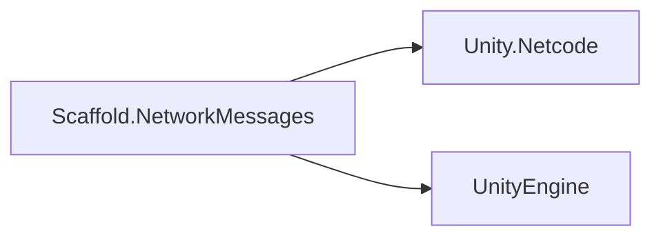
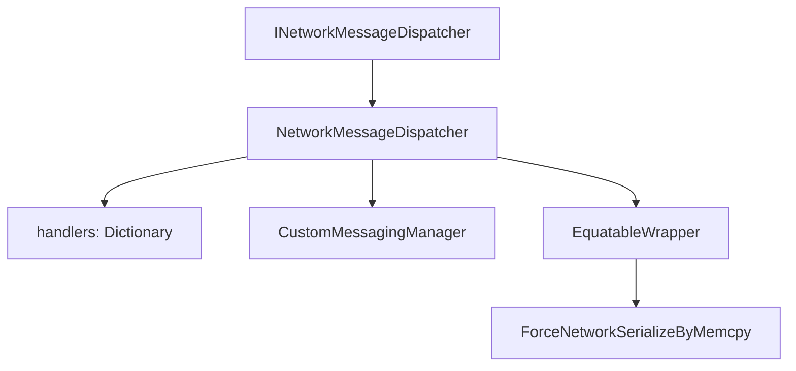

# NetworkMessages Module

## Summary

The NetworkMessages module provides strongly typed, unmanaged message routing over Unity Netcode custom messaging. Its main effect is a simple API for registering handlers and sending structs between server and clients without forcing every payload type to implement custom serialization logic.

Internally, the dispatcher bridges typed handlers to named message channels and wraps payloads for memcpy-based network serialization.

## Bird's Eye View

Module layout (`Assets/Scripts/Infra/NetworkMessages/`):

- `Runtime/Contracts/`: dispatcher contract (`INetworkMessageDispatcher`).
- `Runtime/Implementation/`: Netcode-backed dispatcher (`NetworkMessageDispatcher`).
- `Runtime/Models/`: serialization support model (`EquatableWrapper<T>`).
- `Samples/`: role-aware sample flow for server/client sends and rebroadcast.
- `Tests/`: EditMode tests for wrapper equality/value behavior.

External dependency graph:



Internal dependency graph:



## Architecture and key behaviors

### 1) Typed registration and message-name routing

Handlers are registered per payload type `T`, then bound to named-message channels using `typeof(T).FullName`.

```csharp
public void RegisterHandler<T>(Action<ulong, T> handler) where T : unmanaged
{
    string messageName = typeof(T).FullName;
    handlers[typeof(T)] = handler;
    RegisterMessagingHandler<T>(messageName);
}
```

### 2) Send flow to server/client(s)

All send methods validate the messaging manager, write payload to `FastBufferWriter`, and dispatch by named message.

```csharp
public void SendToServer<T>(T message) where T : unmanaged
{
    using var writer = CreateWriter(message);
    messaging.SendNamedMessage(typeof(T).FullName, NetworkManager.ServerClientId, writer);
}
```

### 3) Receive + typed dispatch flow

Incoming payloads are deserialized and routed to the typed handler if available.

```csharp
private void ReceiveMessage<T>(ulong senderClientId, FastBufferReader messagePayload) where T : unmanaged
{
    if (!TryGetHandler<T>(out Action<ulong, T> handler)) return;
    DeserializeAndHandle(senderClientId, messagePayload, handler);
}
```

### 4) Memcpy serialization wrapper

The dispatcher wraps payloads in `EquatableWrapper<T>` and `ForceNetworkSerializeByMemcpy<T>` before writing.

```csharp
EquatableWrapper<T> genericWrapper = new EquatableWrapper<T>(message);
ForceNetworkSerializeByMemcpy<EquatableWrapper<T>> forceSerializable =
    new ForceNetworkSerializeByMemcpy<EquatableWrapper<T>>(genericWrapper);
writer.WriteValueSafe(in forceSerializable);
```

### 5) Lifecycle and cleanup

`Dispose()` unregisters all named handlers and clears the local handler map to prevent stale callbacks.

```csharp
public void Dispose()
{
    if (isDisposed) return;
    isDisposed = true;
    UnregisterAllHandlers();
    handlers.Clear();
}
```

## How to use

### Define an unmanaged payload

```csharp
public struct SampleMessage
{
    public int Id;
    public float Timestamp;
}
```

### Register a typed handler

```csharp
INetworkMessageDispatcher dispatcher = new NetworkMessageDispatcher();
dispatcher.RegisterHandler<SampleMessage>(OnSampleMessage);

void OnSampleMessage(ulong senderClientId, SampleMessage message)
{
    UnityEngine.Debug.Log($"Received {message.Id} from {senderClientId}");
}
```

### Send to server or clients

```csharp
dispatcher.SendToServer(new SampleMessage { Id = 1, Timestamp = UnityEngine.Time.time });
dispatcher.SendToClient(new SampleMessage { Id = 2, Timestamp = UnityEngine.Time.time }, clientId: 3);
dispatcher.SendToClients(new SampleMessage { Id = 3, Timestamp = UnityEngine.Time.time }, clientIds);
```

### Unregister and dispose

```csharp
dispatcher.UnregisterHandler<SampleMessage>();
(dispatcher as System.IDisposable)?.Dispose();
```

Reference sample: `Assets/Scripts/Infra/NetworkMessages/Samples/NetworkMessagingSample.cs`.

## Internal Services

### Handler registry

- Main type: `handlers` dictionary in `NetworkMessageDispatcher`.
- Responsibility: maps payload `Type` to typed callback delegate for receive dispatch.

### Messaging manager integration

- Main type: `CustomMessagingManager` usage inside `NetworkMessageDispatcher`.
- Responsibility: register/unregister named handlers and send payload writers to server/clients.

### Serialization compatibility wrapper

- Main type: `EquatableWrapper<T>`.
- Responsibility: provide `IEquatable` wrapper so unmanaged payloads can be transmitted via `ForceNetworkSerializeByMemcpy<T>`.

## Public api

- `INetworkMessageDispatcher` (`Assets/Scripts/Infra/NetworkMessages/Runtime/Contracts/INetworkMessageDispatcher.cs`): public contract for handler registration and typed message sends.
- `NetworkMessageDispatcher` (`Assets/Scripts/Infra/NetworkMessages/Runtime/Implementation/NetworkMessageDispatcher.cs`): default dispatcher implementation over Unity Netcode custom messaging.
- `EquatableWrapper<T>` (`Assets/Scripts/Infra/NetworkMessages/Runtime/Models/EquatableWrapper.cs`): helper wrapper for equality-compatible memcpy serialization.

## How to test

From Unity Editor:

1. Open `Window > General > Test Runner`.
2. Run EditMode tests for `Scaffold.NetworkMessages.Tests`.
3. Expected result: `NetworkMessagesTests` passes for `EquatableWrapper<T>` equality and value behavior.

From Unity CLI (headless pattern):

```powershell
# Run from repository root; adjust Unity executable path for your machine.
Unity.exe -batchmode -quit -projectPath "C:\Users\user\Documents\Unity\Scaffold" -runTests -testPlatform EditMode -testResults "Logs\NetworkMessages-TestResults.xml"
```

Expected result: run completes successfully and includes passing tests for `Scaffold.NetworkMessages.Tests`.

## Related docs and modules

- `Architecture.md`
- `Docs/Infra/Events.md` (event-driven orchestration often triggers message dispatch)
- `Docs/Infra/Navigation.md` (message reception can drive navigation flows)
- `Docs/Infra/Containers.md` (dispatcher lifecycle may be wired through DI)
- `Docs/Core/MVVM.md` (UI updates may react to network message handlers)
