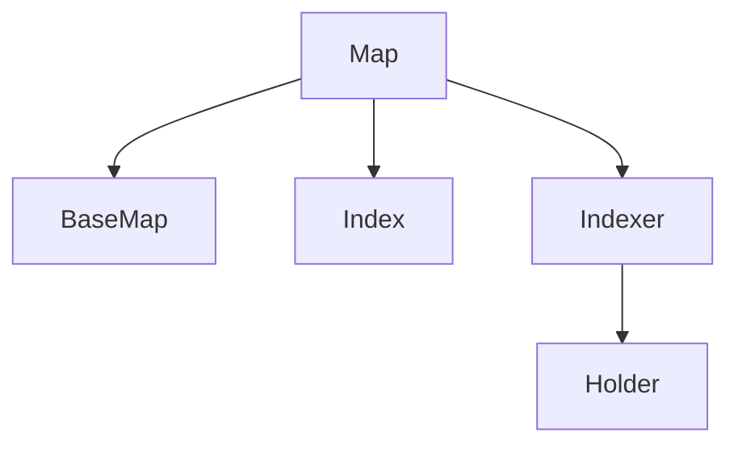

# Maps Module

## Summary

The Maps module provides indexed dictionary-like storage with primary/secondary keys and predicate-based indexers. Its main effect is efficient keyed retrieval plus dynamic grouped views (`Indexer`) over map entries without manual synchronization.

Internally, values are wrapped in holders so updates can preserve index membership and indexers can track/untrack entries consistently.

## Bird's Eye View

Module layout (`Assets/Scripts/Tools/Maps/`):

- `Runtime/`: core map/index/indexer implementation.
- `Samples/`: usage scenarios (`MapIndexerUseCases.cs`).
- `Tests/`: behavior tests for indexing/add/remove/clear (`MapIndexerTests.cs`).

External dependency graph:


Internal dependency graph:



## Architecture and key behaviors

### 1) Two-key map access

`Map` supports indexer access by `(primary, secondary)` tuple.

```csharp
public TValue this[TPrimary primary, TSecondary secondary]
{
    get { return this[CreateIndex(primary, secondary)]; }
    set { /* add/update holder */ }
}
```

### 2) Predicate-based indexers

You can create named indexers to track subsets of entries.

```csharp
public Indexer<TPrimary, TSecondary, TValue> AddIndexer(string name, Func<TPrimary, TSecondary, bool> predicate)
{
    Indexer<TPrimary, TSecondary, TValue> indexer = CreateIndexer(name, predicate);
    RegisterIndexer(indexer);
    return indexer;
}
```

### 3) Auto-tracking on add/remove

Entries are tracked/untracked in all registered indexers automatically.

```csharp
private void TrackEntry(Index<TPrimary, TSecondary> index, Holder<TValue> holder)
{
    foreach (Indexer<TPrimary, TSecondary, TValue> indexer in predicateIndexers.Values)
    {
        indexer.Track(index, holder);
    }
}
```

### 4) Stable membership on value updates

Changing value at existing index keeps index membership determined by keys/predicate.

```csharp
map[index] = "inactive";
map[index] = "active";
```

## How to use

```csharp
Map<string, int, string> map = new Map<string, int, string>();
map.Add("Matheus", 29, "Matheus-29");

Indexer<string, int, string> adults = map.AddIndexer(
    "MatheusAdults",
    (name, age) => name == "Matheus" && age > 10);

IReadOnlyCollection<string> values = adults.Values;
```

Common operations:

- Add/update by composite key.
- Register named indexers for filtered subsets.
- Remove entries and keep indexers synchronized.
- Clear map and all indexers.

Reference sample: `Assets/Scripts/Tools/Maps/Samples/MapIndexerUseCases.cs`.

## Internal Services

### Index structs

- Main types: `Index<TPrimary>`, `Index<TPrimary,TSecondary>`.
- Responsibility: stable hash/equality for map key identity.

### Holder indirection

- Main type: `Holder<TValue>`.
- Responsibility: maintain mutable value references tracked by indexers.

### Indexer tracking engine

- Main type: `Indexer<TPrimary,TSecondary,TValue>`.
- Responsibility: predicate evaluation and membership tracking (`Track`, `Untrack`, `Rebuild`).

## Public api

- `Map<TPrimary,TSecondary,TValue>` (`Assets/Scripts/Tools/Maps/Runtime/Map.cs`): composite-key map with dynamic predicate indexers.
- `Indexer<TPrimary,TSecondary,TValue>` (`Assets/Scripts/Tools/Maps/Runtime/Indexer.cs`): named filtered view over map entries.
- `Index<TPrimary>` (`Assets/Scripts/Tools/Maps/Runtime/IndexPrimary.cs`): single-key index struct with equality/hash support.
- `Index<TPrimary,TSecondary>` (`Assets/Scripts/Tools/Maps/Runtime/IndexComposite.cs`): composite-key index struct with equality/hash support.
- `BaseMap<TKey,TValue>` (`Assets/Scripts/Tools/Maps/Runtime/BaseMap.cs`): generic base storage abstraction used by `Map`.

## How to test

From Unity Editor:

1. Open `Window > General > Test Runner`.
2. Run EditMode tests for `Scaffold.Maps.Tests`.
3. Expected result: `MapIndexerTests` passes for population, auto-tracking, removal, update stability, and clear behavior.

From Unity CLI (headless pattern):

```powershell
Unity.exe -batchmode -quit -projectPath "C:\Users\user\Documents\Unity\Scaffold" -runTests -testPlatform EditMode -testResults "Logs\Maps-TestResults.xml"
```

Expected result: run completes successfully with passing `Scaffold.Maps.Tests`.

## Related docs and modules

- `Architecture.md`
- `Docs/Types.md` (type-driven utility patterns often pair with indexed maps)
- `Docs/Records.md` (immutable-style data can be indexed via map keys)
- `Plans/create-module-documentation.md`
- `Assets/Scripts/Tools/Maps/Tests/MapIndexerTests.cs`
