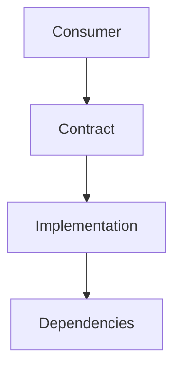

# <Module Name> Module

## Summary
One short paragraph:
- What this module does
- Why it exists
- What problems it solves

## Quick Start
Minimal usage in 30 seconds.

```csharp
// Smallest useful example
```

## When to Use / Not Use
- Use when:
- Avoid when:

## Module Location
- Source: `Assets/Scripts/<Area>/<Module>/`
- Tests: `Assets/Scripts/<Area>/<Module>/Tests/`
- Samples: `Assets/Scripts/<Area>/<Module>/Samples/`

## Public API
| Type | Path | Purpose |
|---|---|---|
| `IModuleService` | `.../Contracts/IModuleService.cs` | Main consumer-facing contract |
| `ModuleService` | `.../Implementation/ModuleService.cs` | Default implementation |

## Architecture Overview
Short explanation of key parts and flow.



## Key Behaviors
### 1) <Behavior Name>
What happens, and why it matters.

```csharp
// Representative snippet
```

### 2) <Behavior Name>
...

## Usage Patterns
### Basic usage

```csharp
// Typical usage pattern
```

### Advanced usage (optional)

```csharp
// Optional extension/customization
```

## Configuration
- Required config:
- Optional config:
- Defaults:

```ini
# Example .editorconfig / settings
```

## Error Handling & Edge Cases
- Common failures:
- Expected fallback behavior:
- Constraints/limits:

## Performance Notes
- Big-O or practical cost notes
- Allocation/GC considerations (if relevant)

## Testing
### Unity Test Runner
1. Open `Window > General > Test Runner`
2. Run `<Module>.Tests` EditMode/PlayMode

### Headless
```powershell
Unity.exe -batchmode -quit -projectPath "C:\Users\user\Documents\Unity\Scaffold" -runTests -testPlatform EditMode -testResults "Logs\<Module>-TestResults.xml"
```

Expected result: all `<Module>.Tests` pass.

## Design Decisions
- Decision:
- Tradeoff:
- Why chosen:

## Related Modules
- [Containers](C:\Users\user\Documents\Unity\Scaffold\Docs\Containers.md)
- [Events](C:\Users\user\Documents\Unity\Scaffold\Docs\Events.md)
- [Architecture](C:\Users\user\Documents\Unity\Scaffold\Architecture.md)

## Changelog (Optional)
- `YYYY-MM-DD`: Added/changed/removed...
