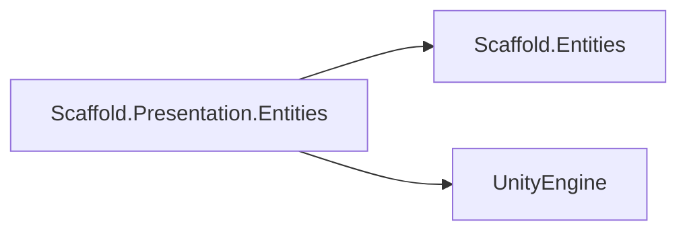

# Presentation Entities Module

## Summary

The Presentation Entities module provides Unity `ScriptableObject` wrappers around core entity classes. It keeps gameplay behavior in the core module and limits this module to Unity serialization and conversion convenience.

This enables Unity authoring workflows without introducing Unity dependencies into `Scaffold.Entities`.

## Bird's Eye View

Module layout (`Assets/Scripts/Presentation/Entities/`):

- `Runtime/`: ScriptableObject wrappers and conversion operators.
- `Samples/`: wrapper usage example (`PresentationEntitiesUseCases.cs`).
- `Tests/`: EditMode wrapper conversion tests (`PresentationEntitiesTests.cs`).

Dependency graph:



## Architecture and key behaviors

### 1) Wrapper-per-core-structure

Each core structure has one wrapper asset class with a single `Value` field.

```csharp
public sealed class EntityDefinitionAsset : ScriptableObject
{
    public EntityDefinition Value = new EntityDefinition();
}
```

### 2) Conversion operators

Wrappers expose implicit conversions to reduce boilerplate.

```csharp
public static implicit operator EntityDefinition(EntityDefinitionAsset asset)
{
    if (asset == null) { return null; }
    return asset.Value;
}
```

### 3) Generic instance wrapper

`EntityInstanceAsset` wraps `EntityInstance<EntityDefinition>` for Unity-side usage.

```csharp
public EntityInstance<EntityDefinition> Value = new EntityInstance<EntityDefinition>();
```

### 4) Polymorphic modifier support

`EntityModifierAsset` stores modifier values using `SerializeReference` to preserve concrete modifier subtype behavior.

```csharp
[SerializeReference] public EntityModifier Value;
```

## How to use

```csharp
EntityDefinition definition = new EntityDefinition();
definition.Id = "orc_definition";

EntityDefinitionAsset definitionAsset = definition;
EntityDefinition loadedDefinition = definitionAsset;

EntityInstance<EntityDefinition> instance = new EntityInstance<EntityDefinition>();
instance.Id = "orc_instance";
instance.Definition = loadedDefinition;

EntityInstanceAsset instanceAsset = instance;
EntityInstance<EntityDefinition> loadedInstance = instanceAsset;
```

## Internal Services

### Asset creation

Conversion from core to wrapper uses `ScriptableObject.CreateInstance<T>()`.

### Boundary enforcement

No modifier execution, registry behavior, or attribute resolution lives in this module.

## Public api

- `EntityAttributeAsset` (`Assets/Scripts/Presentation/Entities/Runtime/EntityAttributeAsset.cs`): wrapper for `EntityAttribute`.
- `EntityModifierAsset` (`Assets/Scripts/Presentation/Entities/Runtime/EntityModifierAsset.cs`): wrapper for abstract `EntityModifier`.
- `EntityDefinitionAsset` (`Assets/Scripts/Presentation/Entities/Runtime/EntityDefinitionAsset.cs`): wrapper for `EntityDefinition`.
- `EntityInstanceAsset` (`Assets/Scripts/Presentation/Entities/Runtime/EntityInstanceAsset.cs`): wrapper for `EntityInstance<EntityDefinition>`.

## How to test

Run from repository root:

```powershell
& ".\.agents\scripts\run-editmode-tests.ps1"
& ".\.agents\scripts\check-analyzers.ps1"
```

Expected behavior: wrapper tests pass and analyzer script reports no blockers/diagnostics for new files.

## Related docs and modules

- `Architecture.md`
- `Docs/Core/Entities.md`
- `Plans/entity-system-execplan.md`
