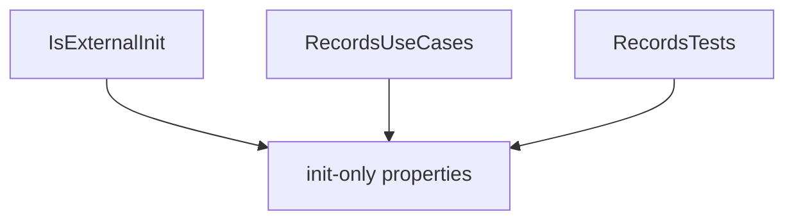

# Records Module

## Summary

The Records module provides compatibility support for `init`-style property initialization in environments where the compiler/runtime expects `IsExternalInit`. Its main effect is enabling record-like object-initializer ergonomics without requiring newer runtime support in every target context.

Internally, the module is intentionally minimal and centered on a single shim type.

## Bird's Eye View

Module layout (`Assets/Scripts/Tools/Records/`):

- `Runtime/`: compatibility shim (`IsExternalInit`).
- `Samples/`: init-property usage examples.
- `Tests/`: init-property behavior validation.

External dependency graph:


Internal dependency graph:



## Architecture and key behaviors

### 1) Compatibility shim

The module defines `IsExternalInit` so `init` accessors compile in target environments that need this type.

```csharp
namespace System.Runtime.CompilerServices
{
    public static class IsExternalInit { }
}
```

### 2) Init property usage pattern

Consumer structs/classes can use object initializer syntax with `init` setters.

```csharp
private struct PersonRecord
{
    public string Name { get; init; }
    public int Age { get; init; }
}
```

### 3) Validation behavior

Tests validate that values assigned through object initializers are retained.

```csharp
PersonRecord person = new PersonRecord { Name = "Alice", Age = 30 };
Assert.AreEqual("Alice", person.Name);
```

## How to use

When you need `init`-only property initialization compatibility in this project, keep the Records module referenced and define/init properties normally:

```csharp
private struct Settings
{
    public string Mode { get; init; }
}

Settings s = new Settings { Mode = "Fast" };
```

Reference sample: `Assets/Scripts/Tools/Records/Samples/RecordsUseCases.cs`.

## Internal Services

### Compiler compatibility shim

- Main type: `System.Runtime.CompilerServices.IsExternalInit`.
- Responsibility: satisfy compiler/runtime expectation for `init` accessor support.

## Public api

- `IsExternalInit` (`Assets/Scripts/Tools/Records/Runtime/IsExternalInit.cs`): compatibility type enabling `init` accessors in target environments where it is missing.

## How to test

From Unity Editor:

1. Open `Window > General > Test Runner`.
2. Run EditMode tests for `Scaffold.Records.Tests`.
3. Expected result: `RecordsTests` passes, confirming init-property assignment persists expected values.

From Unity CLI (headless pattern):

```powershell
Unity.exe -batchmode -quit -projectPath "C:\Users\user\Documents\Unity\Scaffold" -runTests -testPlatform EditMode -testResults "Logs\Records-TestResults.xml"
```

Expected result: run completes successfully with passing `Scaffold.Records.Tests`.

## Related docs and modules

- `Architecture.md`
- `Docs/Types.md` (type metadata and reflection utilities can consume record-like models)
- `Docs/Maps.md` (record-like values can be stored in map indexes)
- `Plans/create-module-documentation.md`
- `Assets/Scripts/Tools/Records/Tests/RecordsTests.cs`
