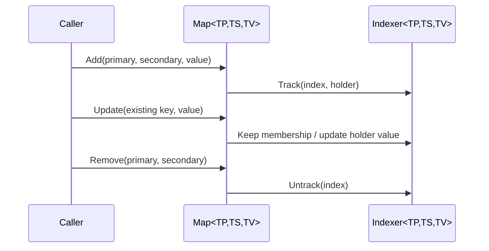

# Scaffold Tools Maps

## TL;DR

- Purpose: composite-key map with dynamic predicate indexers.
- Location: `Assets/Packages/com.scaffold.maps/`.
- Depends on: `Scaffold.Records`.
- Used by: modules requiring indexed grouped lookups.
- Runtime/Editor: runtime with samples/tests.
- Keywords: map, indexer, composite key, filtered views.

## Responsibilities

- Owns two-key map storage and retrieval.
- Owns dynamic indexer registration by predicates.
- Owns automatic track/untrack behavior for indexers.
- Does not own persistence, query language, or business-specific filtering policy.

## Public API

| Symbol | Purpose | Inputs | Outputs | Failure behavior |
|---|---|---|---|---|
| `Map<TPrimary,TSecondary,TValue>` | Composite-key value store | keys + value | get/set by pair and indexer support | missing keys follow map semantics (guard/not found) |
| `Indexer<TPrimary,TSecondary,TValue>` | Predicate-based filtered view | predicate + tracked entries | values collection | empty when no matching keys |
| `Index<TPrimary>` | Single key index struct | primary key | stable hash/equality key | n/a |
| `Index<TPrimary,TSecondary>` | Composite key index struct | primary + secondary keys | stable hash/equality key | n/a |
| `BaseMap<TKey,TValue>` | Base map abstraction | generic key/value | base storage behavior | n/a |

## Setup / Integration

1. Reference `Scaffold.Maps`.
2. Create `Map<TPrimary,TSecondary,TValue>`.
3. Register optional indexers for grouped slices.
4. Use indexers to read filtered values without manual sync code.

## How to Use

1. Add entries with primary/secondary keys.
2. Register named indexer predicates.
3. Read from map directly or from indexer views.
4. Remove/clear entries and rely on auto-sync.

## Examples

### Tracking Flow



### Minimal

```csharp
Map<string, int, string> map = new Map<string, int, string>();
map.Add("Matheus", 29, "Matheus-29");
Indexer<string, int, string> adults = map.AddIndexer("Adults", (name, age) => age >= 18);
IReadOnlyCollection<string> values = adults.Values;
```

## Best Practices

- Keep indexer predicates deterministic and side-effect free.
- Use explicit indexer names for debugging clarity.
- Prefer map/indexer APIs over duplicating filtered caches.

## Anti-Patterns

- Mutating predicate logic based on external unstable state.
- Rebuilding manual mirrored collections on each change.
- Using map as global mutable bag without clear ownership.

## Testing

- Test assembly: `Scaffold.Maps.Tests`.
- Run from repo root:

```powershell
& ".\.agents\scripts\run-editmode-tests.ps1" -AssemblyNames "Scaffold.Maps.Tests"
```

- Expected: all tests pass with zero failures.
- Bugfix rule: add/update regression test first, verify fail-before/fix/pass-after.

## AI Agent Context

- Invariants:
  - index equality/hash remains stable.
  - indexer membership reflects key predicate, not value-only updates.
  - remove/clear operations fully untrack entries.
- Allowed Dependencies:
  - `Scaffold.Records`.
- Forbidden Dependencies:
  - module-specific app logic or UI concerns.
- Change Checklist:
  - verify add/update/remove/clear tests.
  - verify indexer auto-tracking tests.
- Known Tricky Areas:
  - updating existing keys and preserving membership behavior.

## Related

- `Architecture.md`
- `Docs/Tools/Types.md`
- `Docs/Tools/Records.md`

## Changelog

- Rewritten to AI-first standard with map/indexer tracking sequence diagram.

- Added map/indexer coverage for missing-indexer lookup and null predicate guard on `AddIndexer`.
