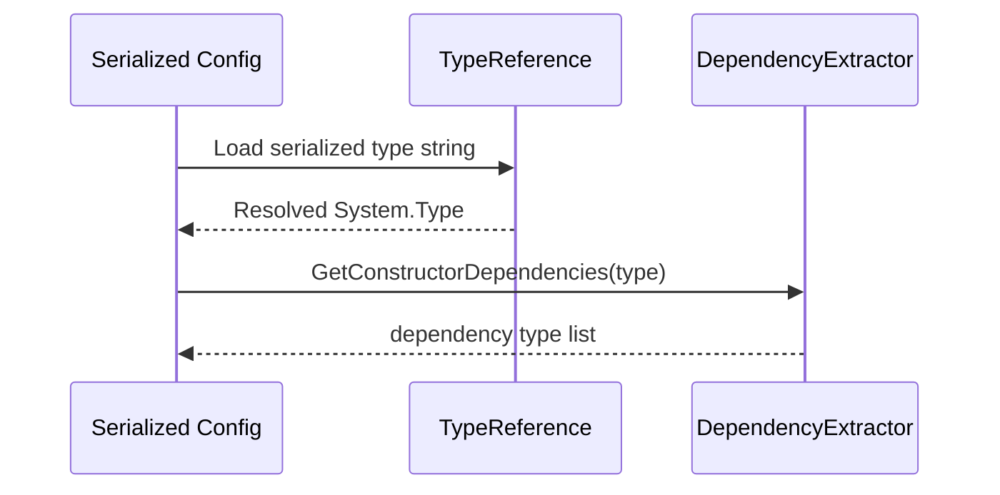

# Scaffold Tools Types

## TL;DR

- Purpose: type metadata utilities for runtime/editor workflows.
- Location: `Assets/Scripts/Tools/Types/`.
- Depends on: base runtime libs (+ Newtonsoft in runtime, UnityEditor in editor asmdef).
- Used by: navigation configs, dependency analysis, inspector type selection.
- Runtime/Editor: both runtime and editor.
- Keywords: typereference, reflection, dependency extractor, editor drawers.

## Responsibilities

- Owns serializable `TypeReference` representation.
- Owns constructor dependency extraction (`IDependencyExtractor`).
- Owns derived-type discovery helpers (`TypeUtility`).
- Owns editor drawers for constrained type selection.
- Does not own module dependency policy or DI container behavior.

## Public API

| Symbol | Purpose | Inputs | Outputs | Failure behavior |
|---|---|---|---|---|
| `TypeReference` | Persist and resolve `System.Type` | type or serialized backing string | resolved `Type` | unresolved or invalid serialization resolves null/guarded path |
| `TypeUtility` | Find assignable derived types | base type + flags | `IEnumerable<Type>` | returns empty set when none found |
| `IDependencyExtractor` | Constructor dependency contract | target `Type` | constructor dependency type list | empty result when no dependencies |
| `DependencyExtractor` | Cached dependency extractor | target `Type` | cached dependency set | guards unsupported or invalid inputs |
| `TypeReferenceFilterAttribute` | Restrict selectable type set | base type metadata | filtered inspector candidates | n/a |
| `TypeSelectionAttribute` | Enable derived-type managed reference selection | base type metadata | inspector selection support | n/a |

## Setup / Integration

1. Reference `Scaffold.Types` runtime asmdef where type helpers are needed.
2. Use `TypeReference` fields in serializable configs.
3. For editor selection UX, reference `Scaffold.Types.Editor` in editor-only asmdefs.

## How to Use

1. Store type metadata through `TypeReference`.
2. Resolve concrete type when needed at runtime.
3. Use dependency extractor for constructor analysis scenarios.
4. Apply filter/selection attributes for inspector usability.

## Behavior Contracts

- `TypeReference` stores serialized type identity and lazily resolves `Type` on access.
- `DependencyExtractor` constructor selection prioritizes `[Inject]`-annotated constructor when present; otherwise falls back to highest-parameter constructor.
- Dependency extraction results are cached by analyzed `Type` for stable repeated access performance.
- `TypeUtility` scans loaded assemblies for assignable types and can include/exclude abstract candidates by option.
- Editor drawers (`TypeReferenceDrawer`, `TypeSelectionAttributeDrawer`) convert metadata attributes into constrained inspector selection flows.

## Examples

### Type Resolution Flow



### Minimal

```csharp
TypeReference selected = new TypeReference(typeof(string));
Type resolved = selected.Type;
IDependencyExtractor extractor = new DependencyExtractor();
IEnumerable<Type> deps = extractor.GetConstructorDependencies(typeof(MyService));
```

## Best Practices

- Keep runtime and editor dependencies separated by asmdef.
- Cache reflection-intensive operations.
- Restrict inspector type choices with explicit base types.

## Anti-Patterns

- Serializing raw assembly-qualified strings manually across modules.
- Running full assembly scans repeatedly in hot paths.
- Mixing editor-only APIs into runtime code.

## Testing

- Test assembly: `Scaffold.Types.Tests`.
- Run from repo root:

```powershell
& ".\.agents\scripts\run-editmode-tests.ps1" -AssemblyNames "Scaffold.Types.Tests"
```

- Expected: all tests pass with zero failures.
- Bugfix rule: add/update regression test first, verify fail-before/fix/pass-after.

## AI Agent Context

- Invariants:
  - serialized type references resolve deterministically.
  - dependency extraction is stable per analyzed type.
- Allowed Dependencies:
  - runtime libs and editor libs in editor-only assembly.
- Forbidden Dependencies:
  - cross-module policy enforcement inside this utility module.
- Change Checklist:
  - verify type serialization tests.
  - verify dependency extraction tests.
  - verify editor/runtime boundary is preserved.
- Known Tricky Areas:
  - assembly reload and renamed/moved type compatibility.

## Related

- `Architecture.md`
- `Docs/Tools/Maps.md`
- `Docs/Testing.md`

## Changelog

- Rewritten to AI-first standard with type-resolution sequence diagram.
- Recovered constructor selection, caching, and editor drawer behavior contracts.

- Added dependency extractor coverage for `[Inject]` constructor preference and null type guard.
