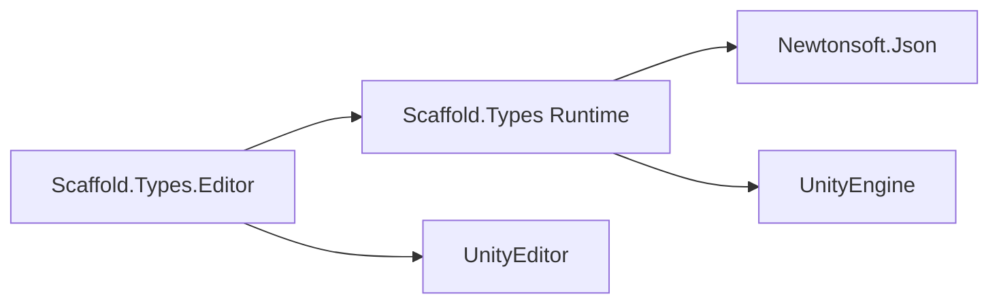
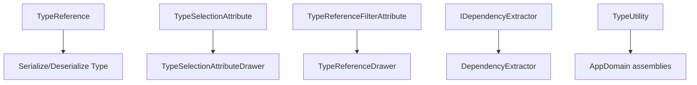

# Types Module

## Summary

The Types module provides runtime and editor utilities for working with `System.Type` safely in Unity workflows. Its main effect is enabling serialized type references, filtered type selection, and constructor dependency inspection without scattering reflection logic across feature modules.

Internally, the module combines runtime type metadata classes with editor drawers to make type-driven configuration practical in inspectors.

## Bird's Eye View

Module layout (`Assets/Scripts/Tools/Types/`):

- `Runtime/Contracts/`: dependency extraction contract.
- `Runtime/Implementation/`: dependency extraction implementation.
- `Runtime/`: serialized type wrappers, utility, and selection/filter attributes.
- `Editor/`: inspector drawers for type selection/reference UX.
- `Samples/`: usage examples (`TypesUseCases.cs`).
- `Tests/`: dependency extractor behavior tests (`TypesTests.cs`).

External dependency graph:



Internal dependency graph:



## Architecture and key behaviors

### 1) Serialized type reference

`TypeReference` stores type identity as serialized JSON and lazily resolves `Type` on access.

```csharp
[SerializeField] private string serializedType;

public Type Type
{
    get
    {
        if (type == null && !string.IsNullOrWhiteSpace(serializedType))
        {
            var settings = new JsonSerializerSettings { TypeNameHandling = TypeNameHandling.All };
            type = JsonConvert.DeserializeObject<Type>(serializedType, settings);
        }
        return type;
    }
}
```

### 2) Constructor dependency extraction

`DependencyExtractor` finds the best constructor (`[Inject]` or max-params fallback) and returns parameter types.

```csharp
public IEnumerable<Type> GetConstructorDependencies(Type type)
{
    return cache.GetOrAdd(type, AnalyzeDependencies);
}
```

### 3) Type discovery utility

`TypeUtility` scans assemblies for derived concrete types.

```csharp
return AppDomain.CurrentDomain.GetAssemblies()
    .SelectMany(s => s.GetTypes())
    .Where(p => type.IsAssignableFrom(p) && (!p.IsAbstract || includeAbstract) && !p.IsInterface);
```

### 4) Editor selection/drawer pipeline

Editor drawers convert attributes into inspector dropdowns and managed-reference selectors.

```csharp
[CustomPropertyDrawer(typeof(TypeReference))]
public class TypeReferenceDrawer : PropertyDrawer { ... }
```

## How to use

### Use TypeReference for serialized type fields

```csharp
[UnityEngine.SerializeField]
private TypeReference selectedType;

selectedType = new TypeReference(typeof(string));
System.Type resolved = selectedType.Type;
```

### Extract constructor dependencies

```csharp
IDependencyExtractor extractor = new DependencyExtractor();
IEnumerable<System.Type> deps = extractor.GetConstructorDependencies(typeof(MyService));
```

### Add inspector filtering/selection attributes

```csharp
[TypeReferenceFilter(typeof(MyBaseType))]
[SerializeField] private TypeReference filteredType;

[TypeSelection(typeof(MyBaseType))]
[SerializeReference] private object selectedImplementation;
```

Reference sample: `Assets/Scripts/Tools/Types/Samples/TypesUseCases.cs`.

## Internal Services

### JSON type serialization bridge

- Main type: `TypeReference`.
- Responsibility: persist type identity as serialized string and restore at runtime safely.

### Dependency analysis engine

- Main types: `IDependencyExtractor`, `DependencyExtractor`.
- Responsibility: inspect constructors and compute dependency type lists with caching.

### Editor drawer infrastructure

- Main types: `TypeReferenceDrawer`, `TypeSelectionAttributeDrawer`, `DerivedTypeDropdown`.
- Responsibility: render and update type-selection UI in editor inspectors.

## Public api

- `TypeReference` (`Assets/Scripts/Tools/Types/Runtime/TypeReference.cs`): serializable wrapper around `System.Type` with lazy JSON-backed resolution.
- `TypeUtility` (`Assets/Scripts/Tools/Types/Runtime/TypeUtility.cs`): helper for discovering derived runtime types across loaded assemblies.
- `TypeReferenceFilterAttribute` (`Assets/Scripts/Tools/Types/Runtime/TypeReferenceFilterAttribute.cs`): attribute to constrain selectable types for `TypeReference` fields.
- `TypeSelectionAttribute` (`Assets/Scripts/Tools/Types/Runtime/TypeSelectionAttribute.cs`): attribute enabling derived-type selection for managed reference fields.
- `IDependencyExtractor` (`Assets/Scripts/Tools/Types/Runtime/Contracts/IDependencyExtractor.cs`): contract for constructor dependency introspection.
- `DependencyExtractor` (`Assets/Scripts/Tools/Types/Runtime/Implementation/DependencyExtractor.cs`): cached implementation of constructor dependency extraction logic.

## How to test

From Unity Editor:

1. Open `Window > General > Test Runner`.
2. Run EditMode tests for `Scaffold.Types.Tests`.
3. Expected result: `TypesTests` passes for dependency extraction with zero/single/multiple constructor dependencies.

From Unity CLI (headless pattern):

```powershell
Unity.exe -batchmode -quit -projectPath "C:\Users\user\Documents\Unity\Scaffold" -runTests -testPlatform EditMode -testResults "Logs\Types-TestResults.xml"
```

Expected result: run completes successfully with passing `Scaffold.Types.Tests`.

## Related docs and modules

- `Architecture.md`
- `Docs/Containers.md` (dependency extraction utilities are relevant to DI/composition)
- `Docs/Navigation.md` (`ViewConfig` uses type reference patterns)
- `Docs/AutoPacker.md` (generator/type metadata workflows)
- `Plans/create-module-documentation.md`
