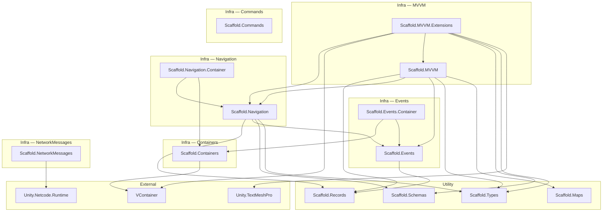

# Infra Module Dependency Tree

## Visual Overview



---

## Per-Module Breakdown

### Containers

| Assembly | Depends On | Why |
|----------|-----------|-----|
| **Scaffold.Containers** | VContainer | Wraps VContainer to provide project-specific DI abstractions |

> Leaf module — no Infra dependencies; only depends on the external DI framework.

---

### Events

| Assembly | Depends On | Why |
|----------|-----------|-----|
| **Scaffold.Events** | Scaffold.Records | Event payloads are defined as immutable records |
| **Scaffold.Events.Container** | Scaffold.Events | Registers event-system services into the DI container |
| **Scaffold.Events.Container** | Scaffold.Containers | Uses Containers API to perform DI registration |

---

### Navigation

| Assembly | Depends On | Why |
|----------|-----------|-----|
| **Scaffold.Navigation** | Scaffold.Types | Uses shared type primitives (e.g. `Optional`, identifiers) |
| **Scaffold.Navigation** | Scaffold.Schemas | Screen/route definitions rely on schema types |
| **Scaffold.Navigation** | Scaffold.Events | Publishes/subscribes to navigation-related events |
| **Scaffold.Navigation** | Scaffold.Records | Navigation state objects are immutable records |
| **Scaffold.Navigation.Container** | Scaffold.Navigation | Registers navigation services into the DI container |
| **Scaffold.Navigation.Container** | Scaffold.Containers | Uses Containers API to perform DI registration |

---

### MVVM

| Assembly | Depends On | Why |
|----------|-----------|-----|
| **Scaffold.MVVM** | Scaffold.Maps | Uses map/dictionary utilities for view-model lookups |
| **Scaffold.MVVM** | Scaffold.Types | Uses shared type primitives |
| **Scaffold.MVVM** | Scaffold.Events | ViewModels subscribe to / publish domain events |
| **Scaffold.MVVM** | Scaffold.Navigation | Views integrate with the navigation system for screen transitions |
| **Scaffold.MVVM** | Scaffold.Records | State objects passed to views are immutable records |
| **Scaffold.MVVM.Extensions** | Unity.TextMeshPro | Provides TMP-specific view bindings (text, input fields) |
| **Scaffold.MVVM.Extensions** | Scaffold.Types | Uses shared type primitives in binding helpers |
| **Scaffold.MVVM.Extensions** | Scaffold.Schemas | Bindings reference schema-defined data shapes |
| **Scaffold.MVVM.Extensions** | Scaffold.MVVM | Extends the core MVVM module with concrete Unity UI bindings |
| **Scaffold.MVVM.Extensions** | VContainer | Resolves dependencies for extension view components |
| **Scaffold.MVVM.Extensions** | Scaffold.Navigation | Some extensions bind navigation actions in views |

---

### NetworkMessages

| Assembly | Depends On | Why |
|----------|-----------|-----|
| **Scaffold.NetworkMessages** | Unity.Netcode.Runtime | Serializes/deserializes messages over Netcode's transport layer |

> Leaf module — no Infra dependencies; only depends on the external networking framework.

---

### Commands

| Assembly | Depends On | Why |
|----------|-----------|-----|
| **Scaffold.Commands** | - | Defines command service, sender-ordered queueing, and transport contracts |

> Leaf module — no Infra or external package dependencies.

---

## Layered Architecture Summary

```
Layer 0 (no Infra deps)    Containers · Commands · NetworkMessages
Layer 1                     Events  ·  Navigation
Layer 2                     Events.Container  ·  Navigation.Container  ·  MVVM
Layer 3                     MVVM.Extensions
```

- **Layer 0** modules are foundational — they depend only on external packages or Utility assemblies.
- **Layer 1** modules depend on Layer 0 Infra modules + Utility.
- **Layer 2** modules bridge Layer 1 into DI or add cross-cutting concerns.
- **Layer 3** sits at the top, pulling together MVVM + Navigation + DI + UI packages.
