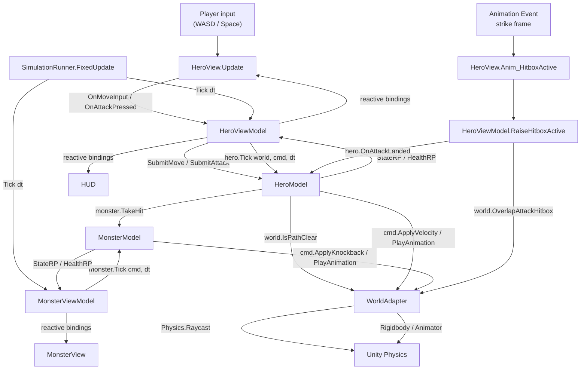

# MVVM + Physics Sketch — Hero vs Monster

A minimal end-to-end sketch of the **Two-Phase Tick + Spatial Query Service + Humble Object** approach for a Unity game with physics-bound gameplay.

**Game**: hero walks (WASD), attacks (Space). Attack plays an animation; an animation event activates a hitbox. If the hitbox overlaps the monster, the monster takes damage and gets knocked back.

---

## Layers

```text
Domain (pure C#)            ViewModel (pure C#)         View (MonoBehaviour)
─────────────────           ───────────────────         ─────────────────────
HeroModel                   HeroViewModel : ITickable   HeroView    ─► HeroViewModel
MonsterModel                MonsterViewModel: ITickable MonsterView ─► MonsterViewModel
MoveIntent / AttackIntent   ReactiveProperty<>          SimulationRunner
                                                        WorldAdapter (impl IWorldQueries
IWorldQueries  ◄─────────────────── injected ──────────  + ICharacterCommands)
ICharacterCommands ◄───────────────────────────────────  EntityRef on each GameObject
```

**Strict authority split**
- **Model** owns: state, health, intent, rules. No public setters. Knows nothing about Unity.
- **ViewModel** owns: tick orchestration, ports (`IWorldQueries`, `ICharacterCommands`), reactive state surface. The only thing the View talks to.
- **View** owns: input forwarding, animation event forwarding, reactive subscriptions. **Never references the Model.**
- **WorldAdapter** owns: the `EntityId → Transform / Rigidbody / Animator` registry, and implements the ports against Unity. Single instance.
- **SimulationRunner** owns: the `FixedUpdate` heartbeat. Ticks all `ITickable` ViewModels in a defined order.

---

## Flow



---

## Snippets

### Domain — Ports

```csharp
public interface IWorldQueries
{
    bool                       IsPathClear(EntityId who, Vector3 dir, float distance);
    IReadOnlyList<EntityId>    OverlapAttackHitbox(EntityId attacker);
}

public interface ICharacterCommands
{
    void ApplyVelocity (EntityId id, Vector3 velocity);
    void ApplyKnockback(EntityId id, Vector3 impulse);
    void PlayAnimation (EntityId id, AnimId anim);
}

public readonly struct EntityId { public readonly int Value; /* ... */ }
public enum AnimId { Idle, Walk, Attack, Hit, Die }
public interface ITickable { void Tick(float dt); }
```

### Domain — HeroModel (no position, no public setters)

```csharp
public enum HeroState { Idle, Walking, Attacking }

public class HeroModel
{
    public EntityId Id { get; }
    public HeroState State    { get; private set; }
    public Vector3   FacingDir { get; private set; } = Vector3.forward;

    public ReactiveProperty<HeroState> StateRP = new(HeroState.Idle);

    Vector2 _moveInput;
    bool    _attackPressed;
    float   _attackTimer;

    const float Speed          = 4f;
    const float AttackDuration = 0.5f;

    public HeroModel(EntityId id) { Id = id; }

    public void SubmitMove(Vector2 dir) => _moveInput = dir;
    public void SubmitAttack()          => _attackPressed = true;

    public void Tick(IWorldQueries world, ICharacterCommands cmd, float dt)
    {
        if (State == HeroState.Attacking)
        {
            _attackTimer -= dt;
            cmd.ApplyVelocity(Id, Vector3.zero);
            if (_attackTimer <= 0f) Transition(HeroState.Idle);
        }
        else if (_attackPressed)
        {
            Transition(HeroState.Attacking);
            _attackTimer = AttackDuration;
            cmd.ApplyVelocity(Id, Vector3.zero);
            cmd.PlayAnimation(Id, AnimId.Attack);
        }
        else
        {
            var desired = new Vector3(_moveInput.x, 0, _moveInput.y) * Speed;
            if (desired.sqrMagnitude > 0.01f && !world.IsPathClear(Id, desired.normalized, 0.4f))
                desired = Vector3.zero;

            cmd.ApplyVelocity(Id, desired);
            if (_moveInput.sqrMagnitude > 0.01f)
                FacingDir = new Vector3(_moveInput.x, 0, _moveInput.y).normalized;

            Transition(desired == Vector3.zero ? HeroState.Idle : HeroState.Walking);
        }

        _attackPressed = false;
    }

    public void OnAttackLanded(MonsterModel target)
        => target.TakeHit(damage: 10, knockbackDir: FacingDir, force: 8f);

    void Transition(HeroState s) { if (State == s) return; State = s; StateRP.Value = s; }
}
```

### Domain — MonsterModel

```csharp
public enum MonsterState { Idle, Hit, Dead }

public class MonsterModel
{
    public EntityId Id { get; }
    public MonsterState State  { get; private set; }
    public int          Health { get; private set; } = 50;

    public ReactiveProperty<MonsterState> StateRP  = new(MonsterState.Idle);
    public ReactiveProperty<int>          HealthRP = new(50);

    Vector3 _pendingKnockback;
    float   _hitTimer;

    public MonsterModel(EntityId id) { Id = id; }

    public void TakeHit(int damage, Vector3 knockbackDir, float force)
    {
        if (State == MonsterState.Dead) return;
        Health -= damage;
        HealthRP.Value = Health;
        _pendingKnockback = knockbackDir.normalized * force;
        _hitTimer = 0.4f;
        Transition(Health <= 0 ? MonsterState.Dead : MonsterState.Hit);
    }

    public void Tick(ICharacterCommands cmd, float dt)
    {
        if (_pendingKnockback != Vector3.zero)
        {
            cmd.ApplyKnockback(Id, _pendingKnockback);
            cmd.PlayAnimation(Id, State == MonsterState.Dead ? AnimId.Die : AnimId.Hit);
            _pendingKnockback = Vector3.zero;
        }
        if (State == MonsterState.Hit)
        {
            _hitTimer -= dt;
            if (_hitTimer <= 0f) Transition(MonsterState.Idle);
        }
    }

    void Transition(MonsterState s) { if (State == s) return; State = s; StateRP.Value = s; }
}
```

### ViewModel — the only thing the View sees

```csharp
public class HeroViewModel : ITickable
{
    readonly HeroModel          _hero;
    readonly MonsterModel       _monster;          // single-target sketch
    readonly IWorldQueries      _world;
    readonly ICharacterCommands _cmd;

    public IReadOnlyReactiveProperty<HeroState> State => _hero.StateRP;

    public HeroViewModel(HeroModel hero, MonsterModel monster,
                         IWorldQueries world, ICharacterCommands cmd)
    {
        _hero = hero; _monster = monster; _world = world; _cmd = cmd;
    }

    public void OnMoveInput(Vector2 dir) => _hero.SubmitMove(dir);
    public void OnAttackPressed()        => _hero.SubmitAttack();

    public void RaiseHitboxActive()
    {
        foreach (var id in _world.OverlapAttackHitbox(_hero.Id))
            if (id.Equals(_monster.Id)) _hero.OnAttackLanded(_monster);
    }

    public void Tick(float dt) => _hero.Tick(_world, _cmd, dt);
}

public class MonsterViewModel : ITickable
{
    readonly MonsterModel       _m;
    readonly ICharacterCommands _cmd;

    public IReadOnlyReactiveProperty<MonsterState> State  => _m.StateRP;
    public IReadOnlyReactiveProperty<int>          Health => _m.HealthRP;

    public MonsterViewModel(MonsterModel m, ICharacterCommands cmd) { _m = m; _cmd = cmd; }

    public void Tick(float dt) => _m.Tick(_cmd, dt);
}
```

### View — pure presentation, never touches the Model

```csharp
public class HeroView : MonoBehaviour
{
    HeroViewModel _vm;
    public void Bind(HeroViewModel vm)
    {
        _vm = vm;
        _vm.State.Subscribe(OnStateChanged);
    }

    void Update()
    {
        _vm.OnMoveInput(new Vector2(Input.GetAxisRaw("Horizontal"),
                                    Input.GetAxisRaw("Vertical")));
        if (Input.GetKeyDown(KeyCode.Space)) _vm.OnAttackPressed();
    }

    // Animation event from the strike frame of the attack clip
    public void Anim_HitboxActive() => _vm.RaiseHitboxActive();

    void OnStateChanged(HeroState s) { /* VFX / SFX hooks here if needed */ }
}

public class MonsterView : MonoBehaviour
{
    MonsterViewModel _vm;
    public void Bind(MonsterViewModel vm)
    {
        _vm = vm;
        _vm.State.Subscribe(s => { /* play death VFX, etc. */ });
    }
}
```

### WorldAdapter — single Unity-side adapter for both ports

```csharp
public class EntityRef : MonoBehaviour
{
    public EntityId  Id;
    public Rigidbody Rigidbody;
    public Animator  Animator;
    public Transform HitboxOrigin;
    public Vector3   HitboxHalfExtents = new(0.5f, 0.5f, 0.8f);
    public LayerMask HitboxMask;
}

public class WorldAdapter : MonoBehaviour, IWorldQueries, ICharacterCommands
{
    readonly Dictionary<EntityId, EntityRef> _registry = new();

    public void Register(EntityRef e)   => _registry[e.Id] = e;
    public void Unregister(EntityId id) => _registry.Remove(id);

    // ── IWorldQueries ──
    public bool IsPathClear(EntityId who, Vector3 dir, float distance)
    {
        var t = _registry[who].transform;
        return !Physics.Raycast(t.position + Vector3.up * 0.5f, dir, distance);
    }

    public IReadOnlyList<EntityId> OverlapAttackHitbox(EntityId attacker)
    {
        var e = _registry[attacker];
        var hits = Physics.OverlapBox(
            e.HitboxOrigin.position, e.HitboxHalfExtents,
            e.HitboxOrigin.rotation, e.HitboxMask);

        var result = new List<EntityId>(hits.Length);
        foreach (var c in hits)
            if (c.TryGetComponent<EntityRef>(out var er)) result.Add(er.Id);
        return result;
    }

    // ── ICharacterCommands ──
    public void ApplyVelocity(EntityId id, Vector3 v)
    {
        var rb = _registry[id].Rigidbody;
        rb.linearVelocity = new Vector3(v.x, rb.linearVelocity.y, v.z);
    }
    public void ApplyKnockback(EntityId id, Vector3 impulse)
        => _registry[id].Rigidbody.AddForce(impulse, ForceMode.Impulse);

    public void PlayAnimation(EntityId id, AnimId a)
        => _registry[id].Animator.SetTrigger(a.ToString());
}
```

### SimulationRunner — single FixedUpdate heartbeat

```csharp
public class SimulationRunner : MonoBehaviour
{
    readonly List<ITickable> _tickables = new();
    public void Register(ITickable t)   => _tickables.Add(t);
    public void Unregister(ITickable t) => _tickables.Remove(t);

    void FixedUpdate()
    {
        var dt = Time.fixedDeltaTime;
        for (int i = 0; i < _tickables.Count; i++) _tickables[i].Tick(dt);
    }
}
```

### Composition root (sketch — your DI of choice)

```csharp
public class GameBootstrap : MonoBehaviour
{
    [SerializeField] WorldAdapter      world;
    [SerializeField] SimulationRunner  runner;
    [SerializeField] HeroView          heroView;
    [SerializeField] MonsterView       monsterView;
    [SerializeField] EntityRef         heroRef;
    [SerializeField] EntityRef         monsterRef;

    void Awake()
    {
        world.Register(heroRef);
        world.Register(monsterRef);

        var hero    = new HeroModel(heroRef.Id);
        var monster = new MonsterModel(monsterRef.Id);

        var heroVm    = new HeroViewModel(hero, monster, world, world);
        var monsterVm = new MonsterViewModel(monster, world);

        heroView.Bind(heroVm);
        monsterView.Bind(monsterVm);

        runner.Register(heroVm);     // hero ticks first
        runner.Register(monsterVm);  // monster reacts to hero's effects same frame
    }
}
```

---

## End-to-end: a successful attack

| # | When                       | Layer | What happens |
|---|----------------------------|-------|--------------|
| 1 | Frame N, `Update`          | View  | Player presses Space → `HeroView` → `vm.OnAttackPressed()` → `model._attackPressed = true`. |
| 2 | Frame N, `FixedUpdate`     | Runner→VM→Model | `SimulationRunner` ticks `HeroViewModel` → `HeroModel.Tick`. Sees attack intent → `Idle → Attacking`, calls `cmd.ApplyVelocity(0)` + `cmd.PlayAnimation(Attack)`. |
| 3 | Frame N, `FixedUpdate`     | Adapter | `WorldAdapter` zeros Rigidbody velocity and triggers Animator. |
| 4 | Frame N+k, anim event      | View  | Strike frame fires `Anim_HitboxActive` → `vm.RaiseHitboxActive`. |
| 5 | Same frame                 | VM    | `HeroViewModel` calls `world.OverlapAttackHitbox(heroId)` → finds `monsterId` → `hero.OnAttackLanded(monster)` → `MonsterModel.TakeHit(...)`. `HealthRP` fires. |
| 6 | Next `FixedUpdate`         | Runner→VM→Model | `SimulationRunner` ticks `MonsterViewModel` → `MonsterModel.Tick` sees `_pendingKnockback` → `cmd.ApplyKnockback(impulse)` + `cmd.PlayAnimation(Hit)`. |
| 7 | Same frame                 | Adapter | `WorldAdapter` adds impulse to Monster Rigidbody, triggers hit clip. |
| 8 | Continuously               | VM/UI | HUD bound to `MonsterViewModel.Health` updates automatically. |

---

## Why the anti-patterns die

- **Smart View** — View only forwards input and animation events. Every decision (does the hit count? what's the new state?) lives in the Model.
- **Mirror world** — Model carries no transform. Position lives only in Unity; the `WorldAdapter` answers spatial questions on the model's behalf.
- **View → Model coupling** — View holds `HeroViewModel`, never `HeroModel`. Replacing the rendering layer (e.g. for a server-side headless run) means swapping the View, not the Model.
- **Tick driven by the wrong thing** — `SimulationRunner` is the heartbeat. View `FixedUpdate` is reserved for presentation reactions, not simulation steps. Tick order is explicit and testable.

## Where to escalate later

- Need predictive AI / trajectory previews? Add a second `PhysicsScene`; a second `WorldAdapter` instance binds to it. `IWorldQueries` doesn't change.
- Going networked-authoritative? Run `SimulationRunner` headlessly on the server with a server-side `WorldAdapter`. Models and ViewModels port unchanged.
- Need deterministic playback? `ITickable` + ordered registration already gives you a deterministic sim, provided ports are deterministic.
