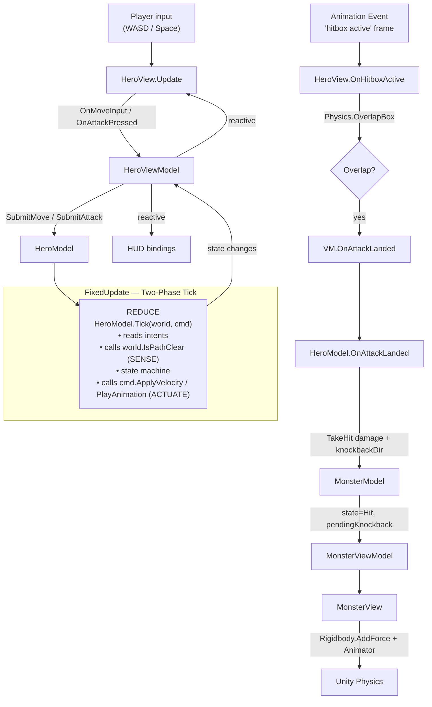

# MVVM + Physics Sketch — Hero vs Monster

A minimal end-to-end sketch of the **Two-Phase Tick + Spatial Query Service + Humble Object** approach for a Unity game with physics-bound gameplay.

**Game**: hero walks (WASD), attacks (Space). Attack plays an animation; an animation event activates a hitbox. If the hitbox overlaps the monster, the monster takes damage and gets knocked back.

---

## Layers

```
Domain (pure C#)            ViewModel (pure C#)         View (MonoBehaviour)
─────────────────           ───────────────────         ─────────────────────
HeroModel                   HeroViewModel               HeroView
MonsterModel                MonsterViewModel            MonsterView
MoveIntent / AttackIntent   ReactiveProperty<>          (animation events)
IWorldQueries     ◄────────── implemented by ──────────► HeroView
ICharacterCommands ◄───────── implemented by ──────────► HeroView / MonsterView
```

**Authority split**
- **Model** owns: state, health, intent, rules.
- **View** owns: transform, Rigidbody, Animator. Senses the world; actuates the model's decisions.
- **ViewModel** owns: reactive bindings between them.

---

## Flow



---

## Snippets

### Ports — Domain interfaces

```csharp
public interface IWorldQueries
{
    bool IsPathClear(Vector3 from, Vector3 dir, float distance);
}

public interface ICharacterCommands
{
    void ApplyVelocity(EntityId id, Vector3 velocity);
    void ApplyKnockback(EntityId id, Vector3 impulse);
    void PlayAnimation(EntityId id, AnimId anim);
}

public readonly struct EntityId { public readonly int Value; /* ... */ }
public enum AnimId { Idle, Walk, Attack, Hit, Die }
```

### Domain — HeroModel

```csharp
public enum HeroState { Idle, Walking, Attacking }

public class HeroModel
{
    public EntityId Id { get; }
    public HeroState State { get; private set; }
    public Vector3 FacingDir { get; private set; } = Vector3.forward;
    public Vector3 Position { get; set; }   // mirrored in from view each tick

    public ReactiveProperty<HeroState> StateRP = new(HeroState.Idle);

    Vector2 _moveInput;
    bool    _attackPressed;
    float   _attackTimer;

    const float Speed = 4f;
    const float AttackDuration = 0.5f;

    public void SubmitMove(Vector2 dir)   => _moveInput = dir;
    public void SubmitAttack()            => _attackPressed = true;

    public void Tick(IWorldQueries world, ICharacterCommands cmd, float dt)
    {
        if (State == HeroState.Attacking)
        {
            _attackTimer -= dt;
            cmd.ApplyVelocity(Id, Vector3.zero);
            if (_attackTimer <= 0f) Transition(HeroState.Idle);
        }
        else
        {
            if (_attackPressed)
            {
                Transition(HeroState.Attacking);
                _attackTimer = AttackDuration;
                cmd.ApplyVelocity(Id, Vector3.zero);
                cmd.PlayAnimation(Id, AnimId.Attack);
            }
            else
            {
                var desired = new Vector3(_moveInput.x, 0, _moveInput.y) * Speed;
                if (desired.sqrMagnitude > 0.01f
                    && !world.IsPathClear(Position, desired.normalized, 0.4f))
                {
                    desired = Vector3.zero;
                }
                cmd.ApplyVelocity(Id, desired);
                if (_moveInput.sqrMagnitude > 0.01f) FacingDir = new Vector3(_moveInput.x, 0, _moveInput.y).normalized;
                Transition(desired == Vector3.zero ? HeroState.Idle : HeroState.Walking);
            }
        }

        _attackPressed = false;
    }

    public void OnAttackLanded(MonsterModel target)
    {
        target.TakeHit(damage: 10, knockbackDir: FacingDir, force: 8f);
    }

    void Transition(HeroState s) { if (State == s) return; State = s; StateRP.Value = s; }
}
```

### Domain — MonsterModel

```csharp
public enum MonsterState { Idle, Hit, Dead }

public class MonsterModel
{
    public EntityId Id { get; }
    public MonsterState State { get; private set; }
    public int Health { get; private set; } = 50;

    public ReactiveProperty<MonsterState> StateRP = new(MonsterState.Idle);
    public ReactiveProperty<int>          HealthRP = new(50);

    Vector3 _pendingKnockback;
    float   _hitTimer;

    public void TakeHit(int damage, Vector3 knockbackDir, float force)
    {
        if (State == MonsterState.Dead) return;
        Health -= damage;
        HealthRP.Value = Health;
        _pendingKnockback = knockbackDir.normalized * force;
        _hitTimer = 0.4f;
        Transition(Health <= 0 ? MonsterState.Dead : MonsterState.Hit);
    }

    public void Tick(ICharacterCommands cmd, float dt)
    {
        if (_pendingKnockback != Vector3.zero)
        {
            cmd.ApplyKnockback(Id, _pendingKnockback);
            cmd.PlayAnimation(Id, State == MonsterState.Dead ? AnimId.Die : AnimId.Hit);
            _pendingKnockback = Vector3.zero;
        }

        if (State == MonsterState.Hit)
        {
            _hitTimer -= dt;
            if (_hitTimer <= 0f) Transition(MonsterState.Idle);
        }
    }

    void Transition(MonsterState s) { if (State == s) return; State = s; StateRP.Value = s; }
}
```

### ViewModel

```csharp
public class HeroViewModel
{
    readonly HeroModel    _hero;
    readonly MonsterModel _monster;   // single-target for sketch

    public IReadOnlyReactiveProperty<HeroState> State => _hero.StateRP;

    public HeroViewModel(HeroModel hero, MonsterModel monster)
    {
        _hero = hero; _monster = monster;
    }

    public void OnMoveInput(Vector2 dir) => _hero.SubmitMove(dir);
    public void OnAttackPressed()        => _hero.SubmitAttack();

    public void OnAttackLanded(EntityId target)
    {
        if (target.Equals(_monster.Id)) _hero.OnAttackLanded(_monster);
    }
}

public class MonsterViewModel
{
    readonly MonsterModel _m;
    public IReadOnlyReactiveProperty<MonsterState> State  => _m.StateRP;
    public IReadOnlyReactiveProperty<int>          Health => _m.HealthRP;
    public MonsterViewModel(MonsterModel m) { _m = m; }
}
```

### View — HeroView (the Humble Object)

```csharp
public class HeroView : MonoBehaviour, IWorldQueries, ICharacterCommands
{
    [SerializeField] Rigidbody _rb;
    [SerializeField] Animator  _animator;
    [SerializeField] Transform _hitboxOrigin;
    [SerializeField] Vector3   _hitboxHalfExtents = new(0.5f, 0.5f, 0.8f);
    [SerializeField] LayerMask _enemyMask;

    HeroModel       _model;
    HeroViewModel   _vm;

    // Composition root would inject these; shown inline for the sketch.
    public void Bind(HeroModel m, HeroViewModel vm) { _model = m; _vm = vm; }

    void Update()
    {
        var move = new Vector2(Input.GetAxisRaw("Horizontal"), Input.GetAxisRaw("Vertical"));
        _vm.OnMoveInput(move);
        if (Input.GetKeyDown(KeyCode.Space)) _vm.OnAttackPressed();
    }

    void FixedUpdate()
    {
        _model.Position = _rb.position;                 // sync truth into model
        _model.Tick(this, this, Time.fixedDeltaTime);   // SENSE + REDUCE + ACTUATE
        // Face the model's facing dir
        if (_model.FacingDir.sqrMagnitude > 0.01f)
            _rb.MoveRotation(Quaternion.LookRotation(_model.FacingDir));
    }

    // ── IWorldQueries ──
    public bool IsPathClear(Vector3 from, Vector3 dir, float distance)
        => !Physics.Raycast(from + Vector3.up * 0.5f, dir, distance);

    // ── ICharacterCommands ──
    public void ApplyVelocity(EntityId id, Vector3 v)
    {
        var keepY = _rb.linearVelocity.y;
        _rb.linearVelocity = new Vector3(v.x, keepY, v.z);
    }
    public void ApplyKnockback(EntityId id, Vector3 impulse) => _rb.AddForce(impulse, ForceMode.Impulse);
    public void PlayAnimation(EntityId id, AnimId a)         => _animator.SetTrigger(a.ToString());

    // ── Animation Event (called by Animator at the strike frame) ──
    public void Anim_HitboxActive()
    {
        var hits = Physics.OverlapBox(
            _hitboxOrigin.position, _hitboxHalfExtents,
            _hitboxOrigin.rotation, _enemyMask);

        foreach (var col in hits)
            if (col.TryGetComponent<EntityRef>(out var er))
                _vm.OnAttackLanded(er.Id);
    }
}
```

### View — MonsterView

```csharp
public class MonsterView : MonoBehaviour, ICharacterCommands
{
    [SerializeField] Rigidbody _rb;
    [SerializeField] Animator  _animator;

    MonsterModel     _model;
    MonsterViewModel _vm;

    public void Bind(MonsterModel m, MonsterViewModel vm) { _model = m; _vm = vm; }

    void FixedUpdate() => _model.Tick(this, Time.fixedDeltaTime);

    public void ApplyVelocity(EntityId id, Vector3 v)        { /* unused for this enemy */ }
    public void ApplyKnockback(EntityId id, Vector3 impulse) => _rb.AddForce(impulse, ForceMode.Impulse);
    public void PlayAnimation(EntityId id, AnimId a)         => _animator.SetTrigger(a.ToString());
}
```

### Glue — `EntityRef` on the Unity side

```csharp
// Lives on the same GameObject as the collider.
public class EntityRef : MonoBehaviour { public EntityId Id; }
```

---

## End-to-end: a successful attack

| # | When                     | Layer | What happens |
|---|--------------------------|-------|--------------|
| 1 | Frame N, `Update`        | View  | Player presses Space → `HeroView.Update` → `vm.OnAttackPressed()` → `model._attackPressed = true`. |
| 2 | Frame N, `FixedUpdate`   | Model | `HeroModel.Tick` sees attack intent → `Idle → Attacking`, calls `cmd.ApplyVelocity(0)` + `cmd.PlayAnimation(Attack)`. |
| 3 | Frame N, `FixedUpdate`   | View  | `HeroView.ApplyVelocity` zeroes Rigidbody; `PlayAnimation` triggers Animator. |
| 4 | Frame N+k, anim event    | View  | Strike frame fires `Anim_HitboxActive` → `Physics.OverlapBox` → finds Monster's `EntityRef` → `vm.OnAttackLanded(monsterId)`. |
| 5 | Same frame               | Model | `HeroViewModel` → `HeroModel.OnAttackLanded` → `MonsterModel.TakeHit(10, FacingDir, 8f)` → `state=Hit`, `_pendingKnockback` set, `HealthRP` fires. |
| 6 | Next `FixedUpdate`       | Model | `MonsterModel.Tick` → `cmd.ApplyKnockback(impulse)` + `cmd.PlayAnimation(Hit)`. |
| 7 | Next `FixedUpdate`       | View  | `MonsterView.AddForce` pushes the Rigidbody; Animator plays hit clip. |
| 8 | Continuously             | VM/UI | HUD health bar bound to `MonsterViewModel.Health` updates automatically. |

---

## Why the anti-patterns die

- **Smart View** — never happens. The view senses (raycast, overlap) and actuates (velocity, force, animation), but every *decision* (does the hit count? does damage apply? what's the new state?) lives in the Model.
- **Mirror world** — never happens. The Model does **not** maintain a parallel transform. `HeroModel.Position` is a one-way mirror written *from* the Rigidbody at the start of each tick — used only as the origin for spatial queries. Knockback is an *impulse the Model emits*, not a position the Model integrates.

## Where to escalate later

- Need predictive AI / trajectory previews? Add a second `PhysicsScene` and let the model own that scene's queries — `IWorldQueries` doesn't change.
- Going networked-authoritative? The same ports map onto Netcode for Entities or a server-side simulation; Unity-side adapters change, model code doesn't.
