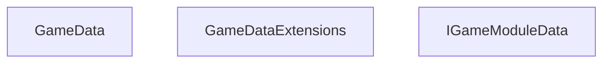

<!-- hash: 5b934836dee5d7613efaab40b03fc09b -->
# GameModule Documentation

This document details the purpose and relations of the components in `/Core/GameModule`.

## Component Overview

### `GameData` (class)
- **Description**: Data container holding state and properties for game data.
- **Namespace**: `GameModuleDTO.GameModule`
- **Methods**: `GetModules`, `AddModuleData`, `AddModules`

### `GameDataExtensions` (class)
- **Description**: Provides utility extension methods for game data extensions.
- **Namespace**: `Global`

### `IGameModuleData` (interface)
- **Description**: Data container holding state and properties for igame module data.
- **Namespace**: `GameModuleDTO.GameModule`
- **Properties**: `StaticKey`, `Key`

## Dependency & Behavior Schema

[Back to Parent](../CoreRead.md)
