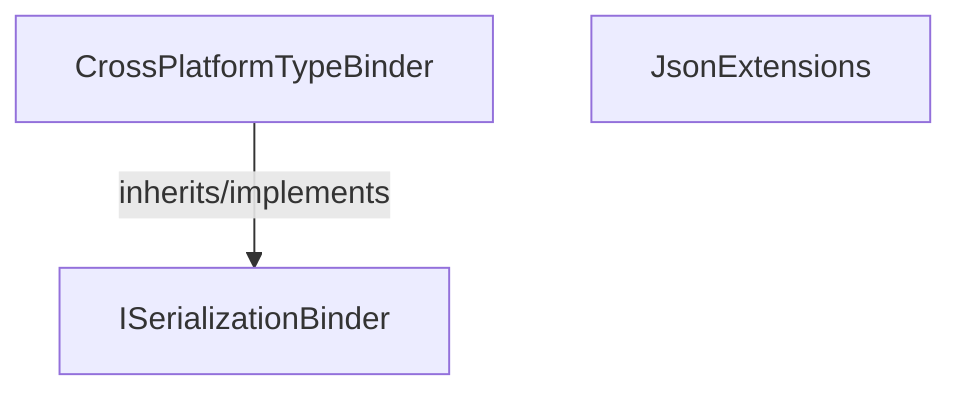

<!-- hash: 2d5191f63cccd311a37dc7832a5fa4af -->
# Json Documentation

This document details the purpose and relations of the components in `/Core/Json`.

## Component Overview

### `CrossPlatformTypeBinder` (class)
- **Description**: Handles core data and operations for cross platform type binder within the architecture.
- **Namespace**: `GameModuleDTO.Json`
- **Inherits/Implements**: `ISerializationBinder`
- **Methods**: `BindToType`, `BindToName`

### `JsonExtensions` (class)
- **Description**: Provides utility extension methods for json extensions.
- **Namespace**: `GameModuleDTO.Json`
- **Methods**: `ToJson`

## Dependency & Behavior Schema

[Back to Parent](../CoreRead.md)
