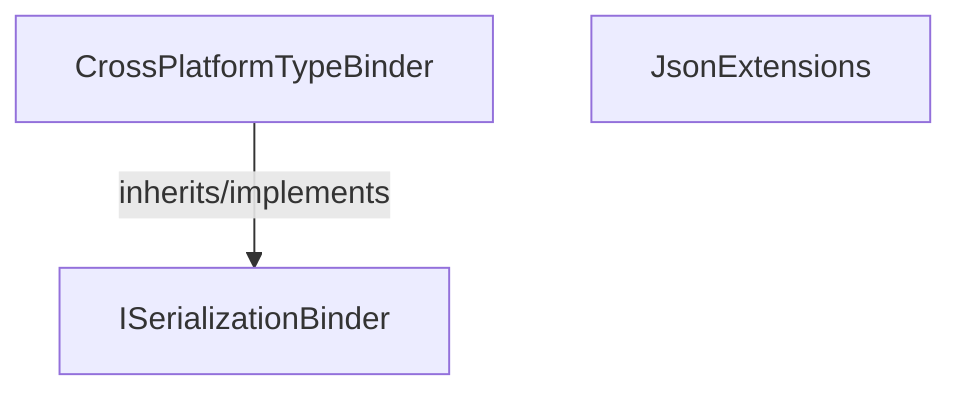

<!-- hash: 6262858e41bd1e7313d47cb015fdd97d -->
# Json Documentation

This document details the purpose and relations of the components in `/GameModuleDTO/Core/Json`.

## Component Overview

### `CrossPlatformTypeBinder` (class)
- **Description**: Provides cross-platform JSON type binding for seamless serialization across boundaries.
- **Namespace**: `GameModuleDTO.Json`
- **Inherits/Implements**: `ISerializationBinder`
- **Methods**: `BindToName`, `BindToType`

### `JsonExtensions` (class)
- **Description**: Provides extension utilities for processing JSON payloads safely across network boundaries.
- **Namespace**: `GameModuleDTO.Json`
- **Methods**: `ToJson`

## Dependency & Behavior Schema

[Back to Parent](../CoreRead.md)
