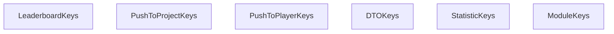

<!-- hash: e0f919d41cb832f3bdeb9b0df7555611 -->
# Keys Documentation

This document details the purpose and relations of the components in `/GameModuleDTO/Core/Keys`.

## Component Overview

### `LeaderboardKeys` (class)
- **Description**: Defines string constants for various leaderboard tracking tables.
- **Namespace**: `GameModuleDTO.Keys`

### `PushToProjectKeys` (class)
- **Description**: Contains string constants for broadcasting messages across the entire game project instance.
- **Namespace**: `GameModuleDTO.Keys`

### `PushToPlayerKeys` (class)
- **Description**: Groups string constants responsible for individual user notification routing.
- **Namespace**: `GameModuleDTO.Keys`

### `DTOKeys` (class)
- **Description**: Contains string constant definitions for standard data transfer components.
- **Namespace**: `GameModuleDTO.Keys`

### `StatisticKeys` (class)
- **Description**: Defines literal string keys used to identify core player tracking statistics.
- **Namespace**: `GameModuleDTO.Keys`

### `ModuleKeys` (class)
- **Description**: Maintains system-level string constants for core game modules.
- **Namespace**: `GameModuleDTO.Keys`

## Dependency & Behavior Schema

[Back to Parent](../CoreRead.md)
