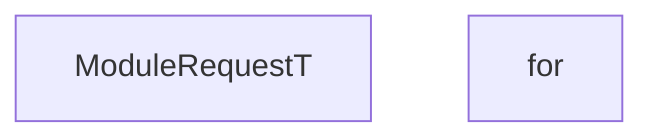

<!-- hash: 5cb7ceb1d89f466f42ce677855e2dee5 -->
# Abstraction Documentation

This document details the purpose and relations of the components in `/GameModuleDTO/Core/ModuleRequest/Abstraction`.

## Component Overview

### `ModuleRequestT` (class)
- **Description**: Represents a strongly-typed module request returning a specific response type.
- **Namespace**: `GameModuleDTO.ModuleRequests`

### `for` (class)
- **Description**: No description provided.
- **Namespace**: `GameModuleDTO.ModuleRequests`
- **Properties**: `ModuleName`, `RetryCall`, `FunctionName`, `AuthKey`, `HasAuth`, `MaxRetries`
- **Methods**: `AssertModule`

### `for` (class)
- **Description**: No description provided.
- **Namespace**: `GameModuleDTO.ModuleRequests`
- **Properties**: `StatusType`, `Message`, `Responses`
- **Methods**: `SetResponseError`, `SetResponseException`, `IsValid`, `IsSuccess`, `SetResponse`, `SetResponseFailure`

## Dependency & Behavior Schema

[Back to Parent](../ModuleRequestRead.md)
