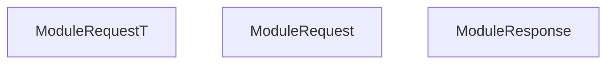

<!-- hash: e45a3948eb26c7f64aad6e72a05bf1e5 -->
# Abstraction Documentation

This document details the purpose and relations of the components in `/Core/ModuleRequest/Abstraction`.

## Component Overview

### `ModuleRequestT` (class)
- **Description**: Handles core data and operations for module request t within the architecture.
- **Namespace**: `GameModuleDTO.ModuleRequests`

### `ModuleRequest` (class)
- **Description**: Represents a data payload for a module request sent to the server. Contains parameters required to execute the request.
- **Namespace**: `GameModuleDTO.ModuleRequests`
- **Properties**: `ModuleName`, `AuthKey`, `HasAuth`, `FunctionName`, `RetryCall`, `MaxRetries`
- **Methods**: `AssertModule`

### `ModuleResponse` (class)
- **Description**: Represents the server's response to a module request. Contains the result data.
- **Namespace**: `GameModuleDTO.ModuleRequests`
- **Properties**: `Responses`, `Message`, `StatusType`
- **Methods**: `SetResponseError`, `SetResponseFailure`, `IsSuccess`, `SetResponseException`, `SetResponse`, `IsValid`

## Dependency & Behavior Schema

[Back to Parent](../ModuleRequestRead.md)
