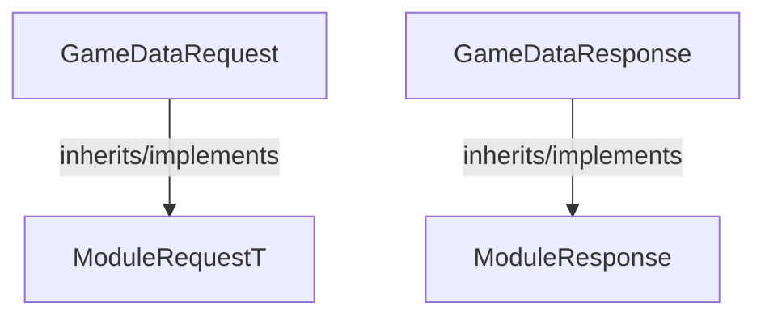

<!-- hash: d0618bf13365da8c79ff3953f876c583 -->
# GameData Documentation

This document details the purpose and relations of the components in `/Core/ModuleRequest/Implementation/GameData`.

## Component Overview

### `GameDataRequest` (class)
- **Description**: Represents a data payload for a game data request sent to the server. Contains parameters required to execute the request.
- **Namespace**: `GameModuleDTO.ModuleRequests`
- **Inherits/Implements**: `ModuleRequestT<GameDataResponse>`
- **Properties**: `ModuleKeys`
- **Methods**: `AssertModule`

### `GameDataResponse` (class)
- **Description**: Represents the server's response to a game data request. Contains the result data.
- **Namespace**: `GameModuleDTO.ModuleRequests`
- **Inherits/Implements**: `ModuleResponse`
- **Properties**: `GameData`
- **Methods**: `IsValid`

## Dependency & Behavior Schema

[Back to Parent](../ImplementationRead.md)
