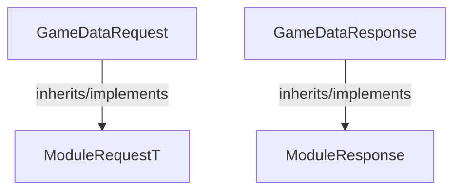

<!-- hash: 22aad6cdabb3b9ae3b707de31fde1880 -->
# GameData Documentation

This document details the purpose and relations of the components in `/GameModuleDTO/Core/ModuleRequest/Implementation/GameData`.

## Component Overview

### `GameDataRequest` (class)
- **Description**: Represents a network request asking for specific module data to execute logic.
- **Namespace**: `GameModuleDTO.ModuleRequests`
- **Inherits/Implements**: `ModuleRequestT<GameDataResponse>`
- **Properties**: `ModuleKeys`
- **Methods**: `AssertModule`

### `GameDataResponse` (class)
- **Description**: Serves as the standard response delivering the gathered game module payload block.
- **Namespace**: `GameModuleDTO.ModuleRequests`
- **Inherits/Implements**: `ModuleResponse`
- **Properties**: `GameData`
- **Methods**: `IsValid`

## Dependency & Behavior Schema

[Back to Parent](../ImplementationRead.md)
