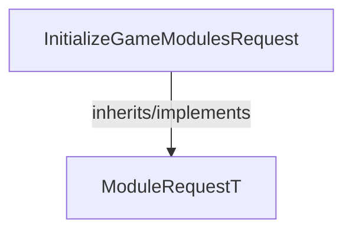

<!-- hash: c6a4d898dce9d6a9f2cdf6fcdc6a5fce -->
# InitializeGameModules Documentation

This document details the purpose and relations of the components in `/GameModuleDTO/Core/ModuleRequest/Implementation/InitializeGameModules`.

## Component Overview

### `InitializeGameModulesRequest` (class)
- **Description**: Defines a request starting the lifecycle for the network modules specifically.
- **Namespace**: `GameModuleDTO.ModuleRequests`
- **Inherits/Implements**: `ModuleRequestT<GameDataResponse>`
- **Methods**: `AssertModule`

## Dependency & Behavior Schema

[Back to Parent](../ImplementationRead.md)
