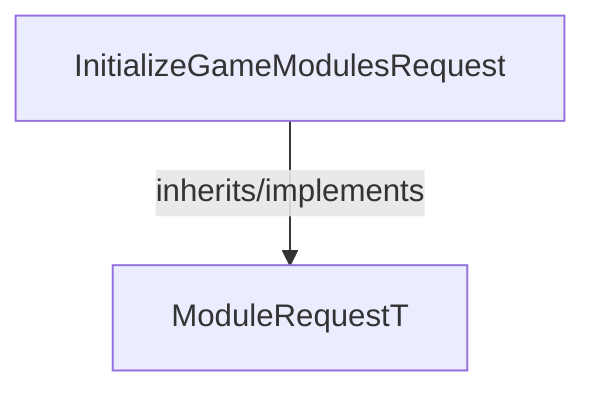

<!-- hash: 5925b1a42d5d4d308fe69cac463ef9f4 -->
# InitializeGameModules Documentation

This document details the purpose and relations of the components in `/Core/ModuleRequest/Implementation/InitializeGameModules`.

## Component Overview

### `InitializeGameModulesRequest` (class)
- **Description**: Represents a data payload for a initialize game modules request sent to the server. Contains parameters required to execute the request.
- **Namespace**: `GameModuleDTO.ModuleRequests`
- **Inherits/Implements**: `ModuleRequestT<GameDataResponse>`
- **Methods**: `AssertModule`

## Dependency & Behavior Schema

[Back to Parent](../ImplementationRead.md)
