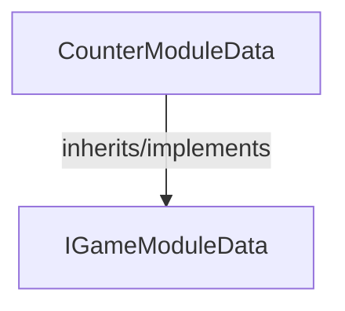

<!-- hash: 15b08a5a04bd89227891bf32fa3ed34d -->
# CounterModule Documentation

This document details the purpose and relations of the components in `/Sample/CounterModule`.

## Sub-Modules

- [Request](Request/RequestRead.md)

## Component Overview

### `CounterModuleData` (class)
- **Description**: Data container holding state and properties for counter module data.
- **Namespace**: `GameModuleDTO.Sample.CounterModule`
- **Inherits/Implements**: `IGameModuleData`
- **Properties**: `Value`, `Key`
- **Methods**: `IncreaseValue`

## Dependency & Behavior Schema

[Back to Parent](../SampleRead.md)
