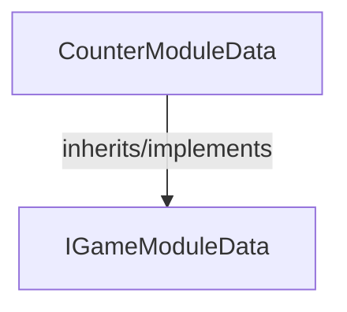

<!-- hash: 42672531d0dea296f5ec0544ebf2d778 -->
# CounterModule Documentation

This document details the purpose and relations of the components in `/GameModuleDTO/Sample/CounterModule`.

## Sub-Modules

- [Request](Request/RequestRead.md)

## Component Overview

### `CounterModuleData` (class)
- **Description**: Sample data model representing a basic network counter configuration.
- **Namespace**: `GameModuleDTO.Sample.CounterModule`
- **Inherits/Implements**: `IGameModuleData`
- **Properties**: `Value`, `Key`
- **Methods**: `IncreaseValue`

## Dependency & Behavior Schema

[Back to Parent](../SampleRead.md)
