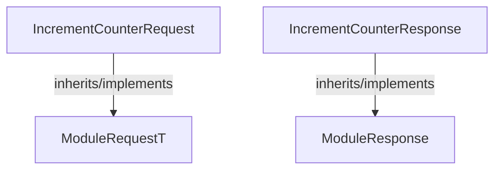

<!-- hash: 1edd460dc08bb8afab8519b8795e08d7 -->
# Request Documentation

This document details the purpose and relations of the components in `/GameModuleDTO/Sample/CounterModule/Request`.

## Component Overview

### `IncrementCounterRequest` (class)
- **Description**: Sample request initiating a numeric counter step progression correctly.
- **Namespace**: `GameModuleDTO.ModuleRequests`
- **Inherits/Implements**: `ModuleRequestT<IncrementCounterResponse>`
- **Methods**: `AssertModule`

### `IncrementCounterResponse` (class)
- **Description**: Sample model returned validating the network integer accumulation natively.
- **Namespace**: `GameModuleDTO.ModuleRequests`
- **Inherits/Implements**: `ModuleResponse`
- **Properties**: `Value`
- **Methods**: `IsValid`

## Dependency & Behavior Schema

[Back to Parent](../CounterModuleRead.md)
