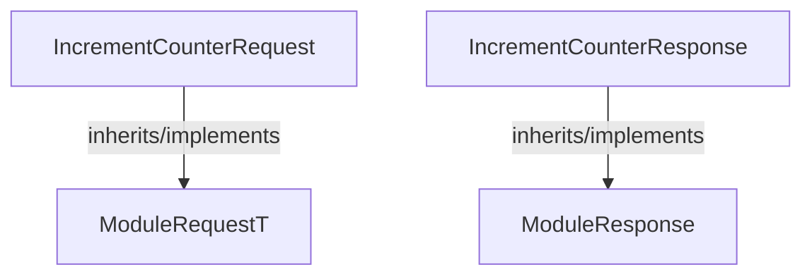

<!-- hash: 4735b4a1ecf349bca9ecb9ba93b9f7c7 -->
# Request Documentation

This document details the purpose and relations of the components in `/Sample/CounterModule/Request`.

## Component Overview

### `IncrementCounterRequest` (class)
- **Description**: Represents a data payload for a increment counter request sent to the server. Contains parameters required to execute the request.
- **Namespace**: `GameModuleDTO.ModuleRequests`
- **Inherits/Implements**: `ModuleRequestT<IncrementCounterResponse>`
- **Methods**: `AssertModule`

### `IncrementCounterResponse` (class)
- **Description**: Represents the server's response to a increment counter request. Contains the result data.
- **Namespace**: `GameModuleDTO.ModuleRequests`
- **Inherits/Implements**: `ModuleResponse`
- **Properties**: `Value`
- **Methods**: `IsValid`

## Dependency & Behavior Schema

[Back to Parent](../CounterModuleRead.md)
