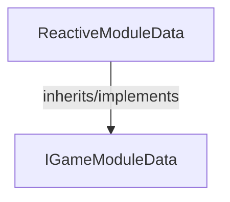

<!-- hash: f88951cf59c0d20344bc58788632af67 -->
# ReactiveModule Documentation

This document details the purpose and relations of the components in `/GameModuleDTO/Sample/ReactiveModule`.

## Sub-Modules

- [Request](Request/RequestRead.md)

## Component Overview

### `ReactiveModuleData` (class)
- **Description**: Sample system modeling dual variable properties for reactive interfaces.
- **Namespace**: `GameModuleDTO.Sample.ReactiveModule`
- **Inherits/Implements**: `IGameModuleData`
- **Properties**: `Key`
- **Methods**: `IncreaseValueA`, `IncreaseValue`

## Dependency & Behavior Schema

[Back to Parent](../SampleRead.md)
